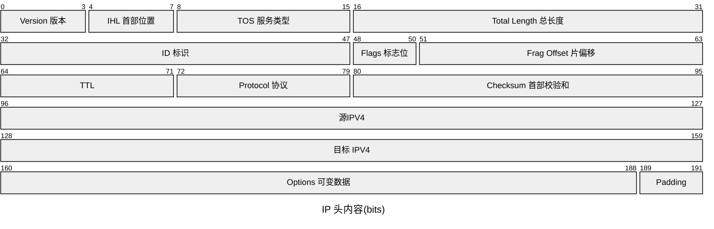
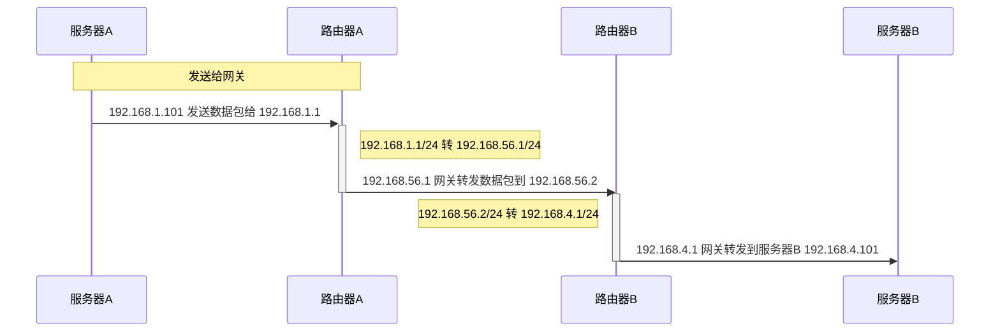

# 网关

## 一、网关是什么

进行网卡配置的时候，除了 IP 地址，还需要配置网关 (Gateway). IP 地址的配置是通过 DHCP。

路由器的多个网口，每一个网口对应一个网关？

网关一般是路由器，它是三层转发的设备。就是把 MAC 头和 IP 头取下来，然后根据里面的内容，决定接下来把数据包往哪里转发的设备。

### 1. MAC 头和 IP 头的数据格式

#### 1.1 示意图

#### 1.2 数据包图

##### 1.2.1 MAC 头

##### 1.2.2 IP 头

## 二、静态路由

静态路由就是在路由器上，配置一条一条规则。

### 1. 转发网关

**转发网关：不改变 ip 地址的网关。**

下面来看一个具体的分析，从服务器 A(`192.168.1.101`) 发往服务器 B(`192.168.4.101`).
IP 地址不同。

#### 1.1 转发网关示意图

#### 1.2 转发网关过程

##### 1.2.1 服务器 A 到路由器 A

服务器 A 和服务器 B 不是处于一个网段的，所以发送包的时候需要先发到网关。
网关是静态配置好的，就是 `192.168.1.1`.
服务器 A 发送 ARP 协议获取网关的 MAC 地址，然后发送数据包。
数据包包括：
* 源 MAC 地址：服务器 A 的 MAC
* 目标 MAC 地址：`192.168.1.1` 这个网口的 MAC
* 源 IP 地址：`192.168.1.101`
* 目标 IP 地址：`192.168.4.101`

##### 1.2.2 路由器 A 到路由器 B

路由器 A 配置了静态路由之后，要访问 `192.168.4.0/24`, 会从 `192.168.56.1` 这个口出去，下一跳是 `192.168.56.2` 的路由器 B。
路由器 A 会根据这条已配置的路由，把数据包从 `192.168.56.1` 发出去给 `192.168.56.2`. 路由器 A 会发送 ARP 协议来获取 `192.168.56.2`的 MAC 地址。
数据包的内容包括：
* 源 MAC 地址： `192.168.56.1` 的 MAC
* 目标 MAC 地址： `192.168.56.2` 的 MAC
* 源 IP 地址：`192.168.1.101`
* 目标 IP 地址：`192.168.4.101`

##### 1.2.3 路由器 B 到服务器 B

路由器 B 匹配到和自己一致的 MAC 之后，根据已配置的静态路由，要访问  `192.168.4.0/24`, 会从 `192.168.4.1` 出去，并且已经和目标 IP 处于同一网段，不需要再转发了，直接发给 `192.168.4.101`。同样，它也会先获取目标 IP 的 MAC 地址。
发送的数据包内容:
* 源 MAC 地址： `192.168.4.1` 的 MAC
* 目标 MAC 地址： `192.168.4.101` 的 MAC
* 源 IP 地址：`192.168.1.101`
* 目标 IP 地址：`192.168.4.101`

服务器 B 收到数据包，发现 MAC 地址一致，就会把包收进来解析。

#### 1.3 转发网关时序图

**这里的 IP 在三个局域网内的都保持不变的，也就是在三个网段传输包，IP 地址都是不变的。**

### 2. NAT 网关

NAT(Network Address Translation) 网关：会改变 ip 地址的网关。

下面来看一个具体的分析，从服务器 A(`192.168.1.101`) 发往服务器 B(`192.168.1.101`).
IP 地址相同。

#### 2.1 NAT 网关示意图

#### 2.2 NAT 网关过程

局域网是各自独立的，各自分配的 IP，所以肯定会出现 IP 相同的情况。但在中间的局域网里，IP 是不同的地址。
目标服务器 B 在中间局域网有着另外的地址   `192.168.56.2`. 在服务器 B 的网关上，会记住这一规则，`192.168.1.101` 对应 `192.168.56.2`.

##### 2.2.1 服务器 A 到路由器 A

服务器 A 发送 ARP 协议获取网关的 MAC 地址，然后发送数据包给服务器 B，因为网段不同，也要发给服务器 B 所在的网关，服务器 B 在中间局域网是有另外的公网 IP 的。*至于服务器 A 怎么知道服务器 B 的公网 IP 地址，可以先简单理解为通过域名访问时的 DNS 解析。* 在当前场景下就是  `192.168.56.2`。
数据包包括：
* 源 MAC 地址：服务器 A 的 MAC
* 目标 MAC 地址：`192.168.1.1` 这个网口的 MAC
* 源 IP 地址：`192.168.1.101`
* 目标 IP 地址：`192.168.56.2`

##### 2.2.2 路由器 A 到路由器 B

路由器 A 配置了静态路由之后，要访问 `192.168.56.2/24`, 会从 `192.168.56.1` 这个口出去，下一跳是 `192.168.56.2` 的路由器 B。
路由器 A 会根据这条已配置的路由，把数据包从 `192.168.56.1` 发出去给 `192.168.56.2`. 路由器 A 会发送 ARP 协议来获取 `192.168.56.2`的 MAC 地址。
当服务器 A 发送数据包到中间局域网的时候，也需要一个公网 IP，就是 `192.168.56.1`。也就是源 IP 会改成 `192.168.56.1`.
数据包的内容包括：
* 源 MAC 地址： `192.168.56.1` 的 MAC
* 目标 MAC 地址： `192.168.56.2` 的 MAC
* 源 IP 地址：`192.168.56.1`
* 目标 IP 地址：`192.168.56.2`

##### 2.2.3 路由器 A 到服务器 B

路由器 B 是一个 NAT 网关，它上面配置了，要访问国际身份 `192.168.56.2` 对应的内网 IP 是 `192.168.1.101`，于是改为访问 `192.168.1.101`。
路由器 B 匹配到和自己一致的 MAC 之后，根据已配置的静态路由，通过 `192.168.1.1` 这个口发给 `192.168.1.101`。它也会先获取目标 IP 的 MAC 地址。
发送的数据包内容:
* 源 MAC 地址： `192.168.1.1` 的 MAC
* 目标 MAC 地址： `192.168.1.101` 的 MAC
* 源 IP 地址：`192.168.56.1`
* 目标 IP 地址：`192.168.1.101`

服务器 B 收到数据包，发现 MAC 地址一致，就会把包收进来解析。

> 对于路由器 B 怎么知道发送的数据包是 `192.168.1.101` 而不是局域网内的其他私有  IP 地址，是因为发送数据包的时候其实除了 IP，还有端口号。路由器是通过端口号匹配的。路由器也即 NAT 网关会存储一份 NAT 映射，用来匹配局域网内的 IP 地址。

#### 2.3 NAT 网关时序图

#### 2.4 NAT 网关应用

NAT 实际上是将内网 ip 转化为公网 ip 的策略。在日常中，这样网关的场景更加常见，例如家用设备通过家用路由器访问外面的网站（邻居家的网络），数据包发送的时候，就需要通过 NAT 转为运营商的地址。因为家里的网段都是 `192.168.1.x`. 办公室的场景也是类似，会共用 1-2 个出口地址。

**可以通过这个网站[查看我的 ip](https://www.whatismyip.com/)(指出口IP)。**
我的 IP 是 [112.10.179.\*\*](https://www.whatismyip.com/ip/112.10.179.xx/ "Detailed Information about IP address 112.10.179.xx")
