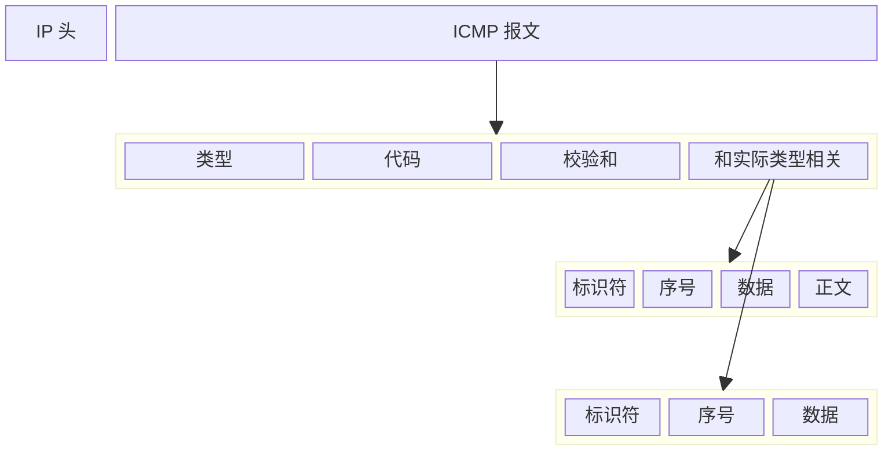

# ICMP 与 Ping

## 一、ICMP(Internet Control Message Protocol)

ICMP 是互联网控制报文协议。

### 1. ICMP 协议的格式

ICMP 是封装在 IP 包里面的，因为传输数据包的时候需要**源地址**和**目标地址**。

#### 1.1 ICMP 数据包

### 2. ICMP 的类型

ICMP 有很多的类型，不同类型的代码也不同。最常用的类型是主动请求，代码是 8，主动请求的应答是 0.
常见的类型有查询报文类型，譬如 ping；以及差错报文类型。

#### 2.1 查询报文类型

ping 是查询报文类型，是一种主动发起请求，并且主动获得应答的 ICMP 类型。
ping 发送的包是符合 ICMP 协议格式的，但它会在后面加上自己的格式。
对 ping 的请求进行主动抓包，称为 ICMP ECHO REQUEST；主动请求的回复，称为 ICMP ECHO REPLY。
比起原生的 ICMP 协议，ping 增加了两个字段：**标识符**和**序号**。
* 标识符用于区分 ping。
* 序号用于判断包发送成功的数量。

#### 2.2 差错报文类型

ICMP 的差错报文有这些类型：
* 终点不可达，代码为 3，而数据包没有送到，有以下几种情况:
	* 网络不可达，代码为 0；
	* 主机不可达，代码为 1；
	* 协议不可达，代码为 2；
	* 端口不可达，代码为 4；
	* 需要分片但设置了不分片，代码为 4.
* 源站抑制，代码为 4，目标是让源站放慢发送速度。
* 时间超时，代码为 11，发送的数据包超过了设定的生存失效；
* 路由重定向，代码为 5，让源站下次发给另一个路由器。

差错报文的结构相对更复杂一些，ICMP 的前 8 字节不变，后面跟上出错的 IP 数据包的 IP 头和 IP 正文的前 8 个字节。

#### 2.3 Ping: 查询报文类型的使用

假定主机 A 的 IP 地址是 `192.168.1.1`，主机 B 的 IP 地址是 `192.168.1.2`，它们都在同一个子网。
现在我们来看主机 A ping 主机 B 的过程。

#### 2.4 Ping 的过程

ping 命令执行的时候，源主机首先会构建一个 ICMP 请求数据包。
ICMP 数据包内包含多个字段。最重要的是两个:
* 第一个是类型字段，对于请求数据包而言该字段为 8；
* 另一个是顺序号，主要用于区分连续 ping 的时候发出的多个数据包。每发出一个请求数据包，顺序号会自动加 1。
	* 为了能够计算往返时间 RTT，它会在报文的数据部分插入发送时间。

接着， 由 ICMP 协议将这个数据包连同地址 `192.168.1.2` 一起交给 IP 层。IP 层将以 `192.168.1.2` 作为目标地址，本机 IP 地址作为源地址，加上一些其他控制信息，构建一个 IP 数据包。

然后，数据包需要加入 MAC 头。
* 如果在本节 ARP 映射表中查找出 IP 地址 `192.168.1.2` 所对应的 MAC 地址，则可以直接使用；
* 如果没有，则需要发送 ARP 协议查询 MAC 地址；

获得 MAC 地址后，由数据链路层构建一个数据帧，目的地址是 IP 层传过来的 MAC 地址，源地址则是本机的 MAC 地址；还要附加上一些控制信息，依据以太网的介质访问规则，将它们传送出去。

**主机 B 收到这个数据帧后，先检查它的目的 MAC 地址，并和本机的 MAC 地址对比。** 如符合，则接收，否则就丢弃。接收后检查该数据帧，将 IP 数据包从帧中提取出来，交给本机的 IP 层。同样，IP 层检查后，将有用的信息提取后交给 ICMP 协议。

主机 B 会构建一个 ICMP 应答包，**应答数据包的类型字段一般为 0**，**顺序号为接收到的请求数据包中的顺序号**，然后再发送给主机 A。

在规定的时间内：
* 源主机 A 如果没有接到 ICMP 的应答包，说明目标主机不可达；
* 如果接收到了 ICMP 应答包，说明目标主机可达；
	* 目标可达时，源主机会检查，用当前时刻减去该数据包最初从源主机上发出的时刻，就是 ICMP 数据包的时间延迟。

上面是最简单的在同一个局域网内使用 ping 的情况。如果是跨网段的情况，还会涉及网关的转发，路由器的转发等，不过对于 ICMP 的头影响并不大，会影响的是根据目标 IP 地址，选择路由的下一跳，还有每经过一个路由器到达一个新的局域网，需要换 MAC 头里面的 MAC 地址。后续的章节会详细说明这些细节。

当遇到中间设备不允许 ping 的情况，可以使用命令 `telnet`，通过其他命令来测试网络是否通。

**ping 这个程序是使用了 ICMP 里面的 ECHO REQUEST 和 ECHO REPLY 类型的。**

#### 2.5 Ping 过程图

### 3. Traceroute: 差错报文类型的使用

Traceroute 是差错报文类型的使用，它会使用  ICMP 的规则，故意制造一些能够产生错误的场景。

#### 3.1 设置 TTL 追踪路由器

Traceroute 的第一个作用就是故意设置特殊的 TTL 值，来追踪去往目的地时沿途经过的路由器。
* **TTL(Time-To-Live)指解析记录在本地DNS服务器中的缓存时间**。

> TTL是网络包里的一个值，它告诉路由器包在网络中太长时间是否需要被丢弃。TTL最初的设想是，设置超时时间，超过此范围则被丢弃。每个路由器要将TTL减去 1，TTL 通常表示被丢弃前经过的路由器的个数。当 TTL 变为 0 时，该路由器就会丢弃这个数据包，并发送一个超时的 ICMP 包给最初的发送者（源主机），也就是差错包。

Traceroute 通过发送 `TTL=1` 的 UDP 数据包，遇到一个路由器就得到一个差错包，接着再发送设置 `TTL=2` 的数据包，同样的流程走一遍，得到路由节点的 IP 和耗时情况。一直重复，就能拿到从主机 A 到主机 B 之间所有路由器的信息。

#### 3.2 如何判断是否到达目标主机

当 UDP 数据包到达目标主机的时候，TTL 可能大于 0，Traceroute 使用的方法是设置一个不可能的值作为 UDP 的端口号 (*大于 30000*)。当数据包到达时，目标主机的 UDP 模块就会生成一份“端口不可达 ”的错误 ICMP 报文。如果数据包没有到达，那么就可能是超时。

#### 3.3 确定路径的 MTU

**Traceroute 还有一个作用是故意设置不分片，从而确定路径的 MTU。** 
Traceroute 会发送分组，并设置“不分片”标志。发送的第一个分组的长度正好会和出口 MTU 相等。如果中间遇到窄的关口会被卡住，就会发送 ICMP 网络差错包，错误类型为“需要设置分片但设置了不分片”。主机每次收到 ICMP 不能分片的差错时就减少分组的长度，直到到达目标主机。