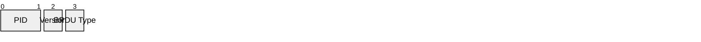
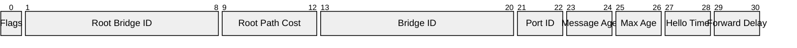
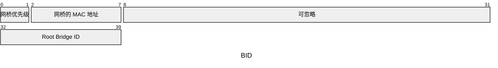
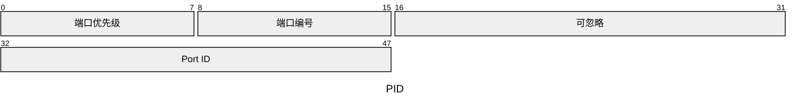
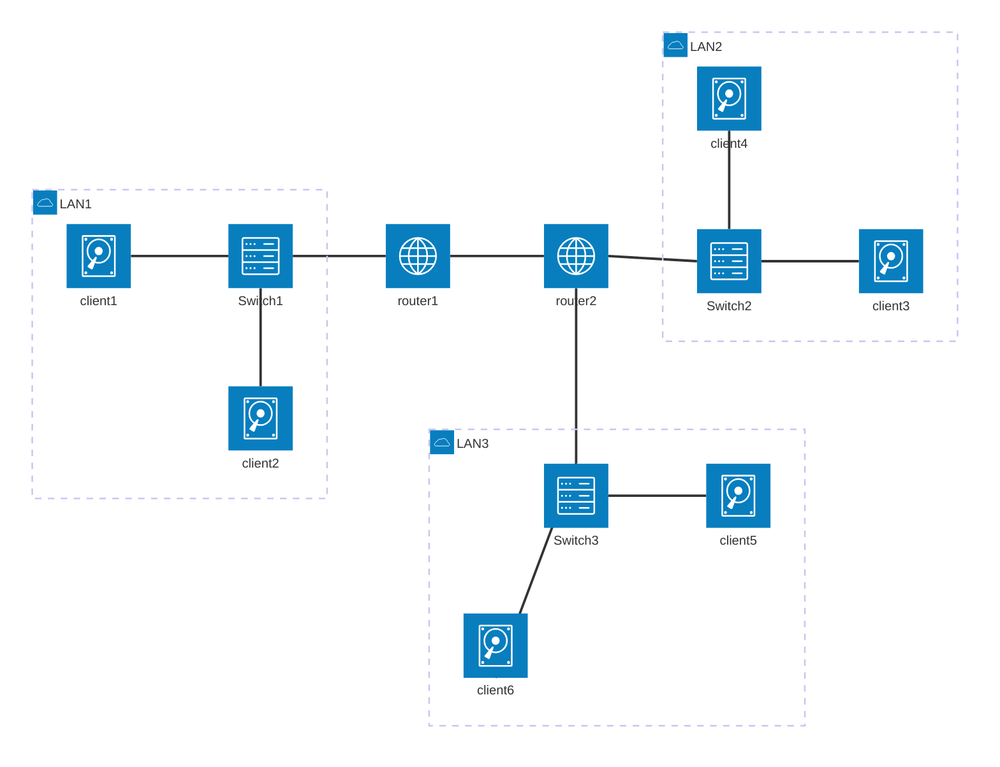
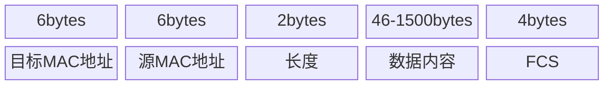
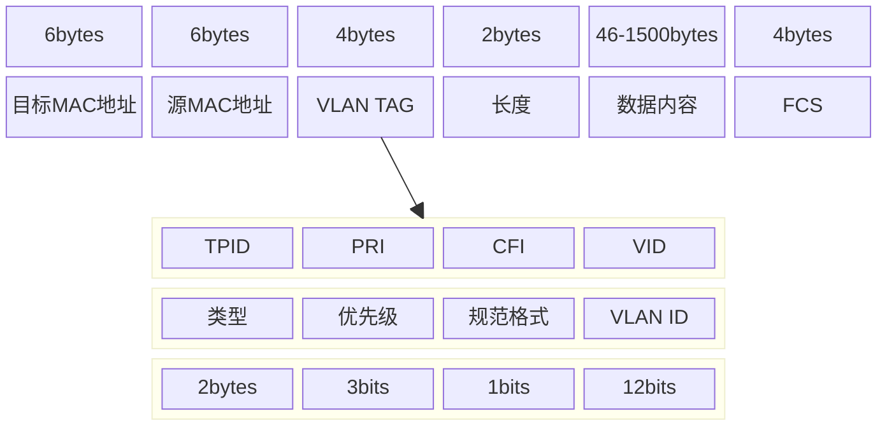
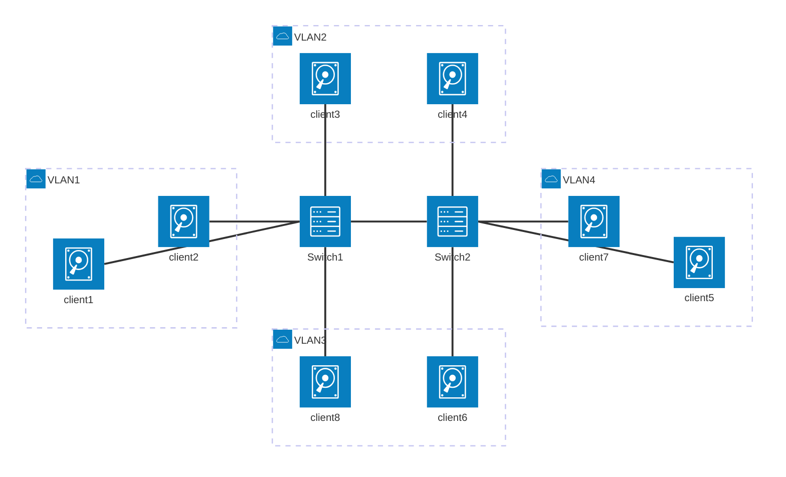

## 一、拓扑结构

拓扑结构是由多个交换机连接起来组成的。

### 1. 解决环路问题

TODO 待学习补充

拓扑结构是多个交换机组成的结构。

交换机传播数据的方式是广播，就有可能出现环路问题，所有数据同时在广播，会阻塞通信，占用过量资源，导致正常数据无法传输。

#### 1.1 STP 算法

**生成树协议(Spanning Tree Protocol)，作用在 OSI 网络模型中第二层的通信协议。**

该算法通过阻塞冗余链路，把物理上可能形成环路的网络在逻辑上变成一个无环的树形结构。

##### 1.1.1 STP 相关定义

STP 是用来解决环路问题的最小生成树。

###### 根交换机(Root Bridge)

* 在交换机网络中，拥有最低网桥 ID(优先级值和 MAC 地址的组合) 的交换机会选为根桥。
* 根桥是整个生成树拓扑的根节点。

###### 指定交换机

* 大多数文章中没有提到这个概念，但原文中提到了，猜测是出于根交换机级别之下的交换机。

###### 网桥协议数据单元(BPDU)

* 在交换机内直接传递的一种特殊的协议报文，专门在 STP 中使用。通常分为以下两种：
	* 配置 BPDU：用于生成树计算；
	* 拓扑变更通告 TCN BPDU：用于通知网络拓扑的变化。

不管哪种 BPDU，他们报头是一致的，如下：

配置 BPDU 的报文数据内容，包含报头一共是 35 字节。

TCN BPDU 则只有 Flags，没有其他字段。

| **字段名**              | **长度** | **描述**                                                           | **版本差异** (STP/RSTP/MSTP) |
| -------------------- | ------ | ---------------------------------------------------------------- | ------------------------ |
| **以太网帧头**            |        |                                                                  |                          |
| - 目的MAC              | 6字节    | 固定组播 `01:80:C2:00:00:00`                                         | 所有版本                     |
| - 源MAC               | 6字节    | 发送设备端口MAC地址                                                      | 所有版本                     |
| - 长度/类型              | 2字节    | 值 `0x0000`（LLC封装）                                                | 所有版本                     |
| **LLC头部**            |        |                                                                  |                          |
| - DSAP/SSAP          | 2字节    | 均 `0x42`（二进制 `01000010`）                                         | 所有版本                     |
| - Control            | 1字节    | `0x03`（无编号帧）                                                     | 所有版本                     |
| **BPDU数据体**          |        |                                                                  |                          |
| Protocol Identifier  | 2字节    | 固定 `0x0000`                                                      | 所有版本                     |
| Protocol Version     | 1字节    | - STP: `0x00` - RSTP/MSTP: `0x02` (RSTP)/`0x03` (MSTP)        | ✅ STP ✅ RSTP ✅ MSTP      |
| BPDU Type            | 1字节    | - 配置BPDU: `0x00` (STP), `0x02` (RSTP/MSTP) - TCN BPDU: `0x80` | ✅ STP ✅ RSTP ✅ MSTP      |
| Flags                | 1字节    | - STP: TC/TCA标志位（最低/最高比特） - RSTP: 新增6比特（如P/A协商）               | ✅ STP ✅ RSTP ✅ MSTP      |
| Root Identifier      | 8字节    | 根桥ID（2字节优先级 + 6字节MAC）                                            | 所有版本                     |
| Root Path Cost       | 4字节    | 到根桥的累计路径开销                                                       | 所有版本                     |
| Bridge Identifier    | 8字节    | 发送设备的桥ID（优先级 + MAC）                                              | 所有版本                     |
| Port Identifier      | 2字节    | 发送端口ID（优先级 + 端口号）                                                | 所有版本                     |
| Message Age          | 2字节    | BPDU存活时间（每跳+1）                                                   | 所有版本                     |
| Max Age              | 2字节    | 最大存活时间（默认20秒）                                                    | 所有版本                     |
| Hello Time           | 2字节    | 根桥发送BPDU间隔（默认2秒）                                                 | 所有版本                     |
| Forward Delay        | 2字节    | 端口状态迁移延迟（默认15秒）                                                  | 所有版本                     |
| **扩展字段 (RSTP/MSTP)** |        |                                                                  |                          |
| - Version 1 Length   | 1字节    | RSTP固定为0（兼容STP）                                                  | RSTP                     |
| - MST配置信息            | 可变     | MSTP专有多实例配置（如CIST/MSTI配置）                                        | MSTP                     |

**备注**：
- **STP BPDU长度**：固定35字节（仅基础字段）。
- **RSTP优化**：通过Flags新增比特实现快速收敛（如 Proposal/Agreement）。
- **MSTP扩展**：包含多生成树实例（MSTI）配置字段，支持VLAN分组计算。

###### 优先级向量

##### 1.1.2 STP 工作过程

1. 选择根交换机(根网桥)
	* 根网桥就是根交换机
	* 选择 BID 最小的交换机作为根网桥
	* 如下所示，**BID 由 2bytes 和 6bytes 的 MAC 地址组成**。

2. 选择根端口(Root Port)
  * 在每一个非根桥中选举一个根端口，根端口的路径开销是最小的
  * *注意根端口并不在根网桥上*
3. 选择指定端口(Designated Port)
  * 在非根桥中，PID 更小的会成为指定端口，负责收发数据，剩余优先级更高的端口只负责接受消息，不再转发数据
4. 谁的根交换机优先级高，则整个链路就会跟谁
  * 端口也有 **PID，由 8 位的端口优先级和 8 位的端口编号组成**。其实是 **2bytes**.

##### 1.1.3 STP 端口状态

**禁用(Disabled)**: 端口手动关闭或物理断开，不处理任何 BPDU，也不转发用户数据。不学习 MAC 地址。
* 通常是管理员禁用端口或者物理故障。

**阻塞(Blocking)**: 只接受 BPDU 报文，不转发数据，也不学习 MAC 地址。
* 防止临时环路，作为备份路径。

**监听(Listening)**: 发送和接收 BPDU，参与生成数计算，但不学习 MAC 地址并构建转发表，也不转发数据包。
* 确定端口角色（根端口或指定端口），默认持续 15 秒。

**学习(Learnning)**: 发送和接收 BPDU，学习 MAC 地址并构建转发表，但不转发数据包。
* 防止临时环路，为转发数据做准备。

**转发(Forwarding)**: 正常转发用户数据，同时接收和发送 BPDU，学习 MAC 地址。
* 作为活跃端口参与网络通信。必须是根端口或者指定端口。

#### 1.2 其他算法(RSTP、MSTP)

##### 1.2.1 快速生成树协议 RSTP

在 STP 中的五种端口状态，在 RSTP 中合并成了三种。
* **丢弃(Discarding)**：原来的禁用、阻塞、和监听合并。
* **学习**：不收发数据，但学习 MAC 地址。
* **转发**： 收发数据，学习 MAC 地址。

> RSTP通过 **状态简化**（3→5）、**主动协商机制**（P/A）、**端口角色扩展**（Alternate/Backup）和 **快速收敛设计**，将STP的50秒收敛缩短至秒级，同时增强了网络稳定性与安全性。实际部署中，RSTP更适合高可用性要求的现代网络，而STP仅适用于简单拓扑或兼容旧设备的场景。

##### 1.2.2 多生成树协议 MSTP

暂不展开。

### 2. 路由演示图

下面是客户端 client1 想要连接 client6 的示意图。

#### 2.1 拓扑图示意

## 二. VLAN(虚拟局域网)

要解决广播问题和安全问题，可以对交换机进行物理隔离或者是逻辑隔离（虚拟隔离）。

VLAN 是逻辑隔离，就是虚拟局域网，通常使用在交换机中。

### 1. VLAN 包结构

在原来的二层包头上，添加一个 Tag，用来标识。其中有一个 12bits 的 VLAN ID 字段。可以标识最多 4096 个 VLAN。

通过二层头里的这个 ID，交换机可以准确识别相同 ID 的包，符合条件的才会互相转发，来解决广播问题和安全问题。

#### 1.1 包图示意

##### 1.1.1 常规数据包

##### 1.1.2 VLAN 的数据包

#### 1.2 拓扑图示意

下面可以看到，即使机器 6 和机器 8 不存在于同一物理位置，连接着不同的交换机，但仍然处于同一个虚拟局域网内。
机器 3 和机器 4 也是。

### 2. VLAN 的优势

#### 2.1 减少广播域的大小

能够显著减少带宽流量。

#### 2.2 增强网络安全些

VLAN 创建的虚拟边界，只能被路由器跨越。因此可以通过路由器来设置安全措施，限制对 VLAN 的访问。

#### 2.3 易于管理

可以快速添加或更改网络节点，为有着相似网络需求的用户提供服务。
