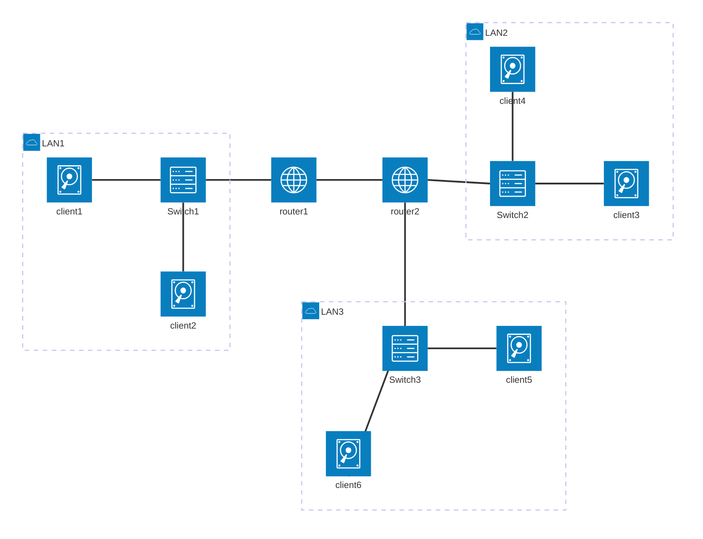
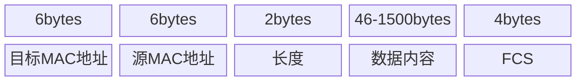
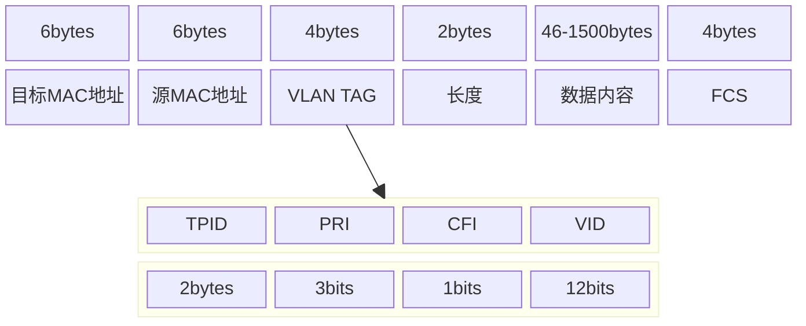
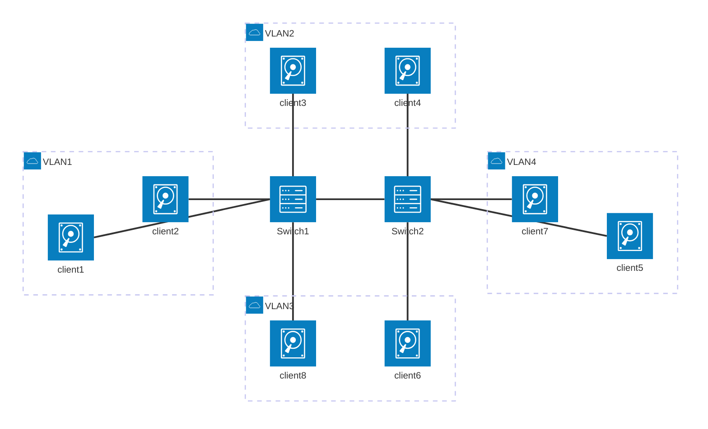

## 一、拓扑结构

拓扑结构是由多个交换机连接起来组成的。

### 1. 解决环路问题

TODO 待学习补充

* 多个交换机组成的结构

#### 1.1 STP 算法

##### 1.1.1 STP 工作过程

* STP 是用来解决环路问题的  最小生成树

* 根交换机
* 指定交换机
* 网桥协议数据单元
* 优先级向量

* 谁的根交换机优先级高，则整个链路就会跟谁

### 2. 路由演示图

下面是客户端 client1 想要连接 client6 的示意图。

#### 2.1 拓扑图示意

### 3. VLAN(虚拟局域网)

要解决广播问题和安全问题，可以对交换机进行物理隔离或者是逻辑隔离（虚拟隔离）。

VLAN 是逻辑隔离，就是虚拟局域网，通常使用在交换机中。

#### 3.1 VLAN 包结构

在原来的二层包头上，添加一个 Tag，用来标识。其中有一个 12bits 的 VLAN ID 字段。可以标识最多 4096 个 VLAN。

通过二层头里的这个 ID，交换机可以准确识别相同 ID 的包，符合条件的才会互相转发，来解决广播问题和安全问题。

##### 3.1.1 包图示意

常规数据包

VLAN 的数据包

##### 3.1.2 拓扑图示意

下面可以看到，即使机器 6 和机器 8 不存在于同一物理位置，连接着不同的交换机，但仍然处于同一个虚拟局域网内。
机器 3 和机器 4 也是。

#### 3.2 VLAN 的优势

##### 3.2.1 减少广播域的大小

能够显著减少带宽流量。

##### 3.2.2 增强网络安全些

VLAN 创建的虚拟边界，只能被路由器跨越。因此可以通过路由器来设置安全措施，限制对 VLAN 的访问。

##### 3.2.3 易于管理

可以快速添加或更改网络节点，为有着相似网络需求的用户提供服务。
