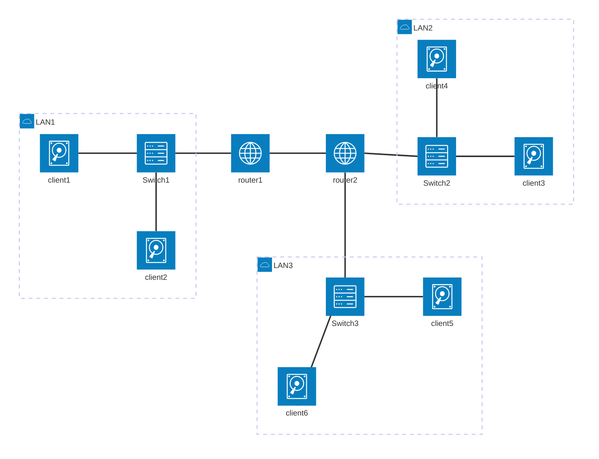
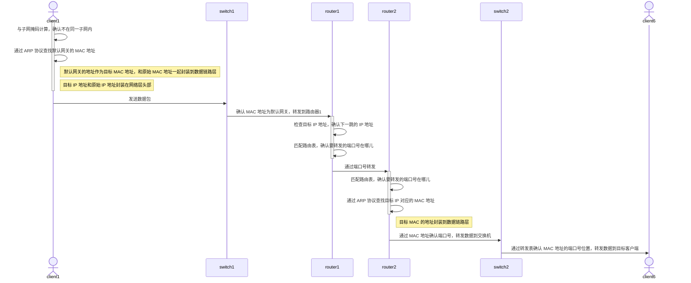

## 一、拓扑结构

### 1. 解决环路问题

TODO 待学习补充

* 多个交换机组成的结构

### 1.1 STP 算法

#### 1.1.1 STP 工作过程

* STP 是用来解决环路问题的  最小生成树

* 根交换机
* 指定交换机
* 网桥协议数据单元
* 优先级向量

* 谁的根交换机优先级高，则整个链路就会跟谁
* 
### 2. 路由演示图

下面是客户端 client1 想要连接 client6 的示意图。

#### 2.1 拓扑图示意

#### 2.2 时序图示意

### 3. VLAN

* 虚拟隔离（虚拟局域网）