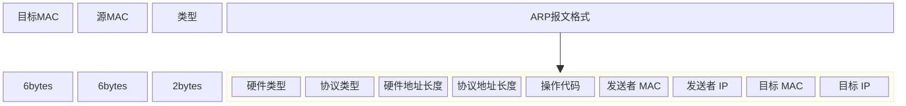
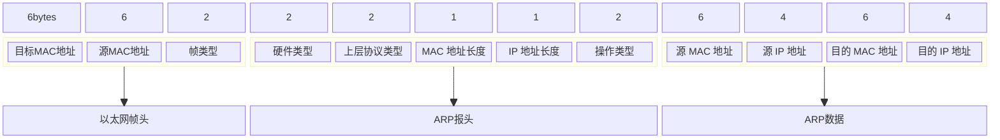
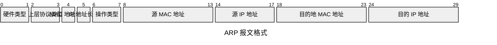
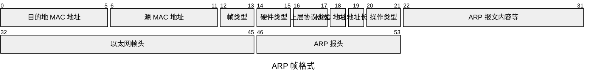

# 物理层与数据链路层

使用路由器，实际上是属于第三层，我们先从第一层开始。

## 一、第一层（物理层）

插网线，也就是物理连接。早期的网线连接，有两个头，分别插在两台电脑的网卡上，还要在水晶头上做交叉线，**1-3**、**2-6** 交叉接法。
* 水晶头的 1、2 脚是收信号；
* 水晶头的 3、6 脚是发信号；
* 把一端的1 和 3 号线换一下位置，2 和 6 号线换一下位置，这样的线两端各连上一台计算机，就可以实现通信。当然，两台计算机的 IP 也要配在同一个网络中，这样的局域网叫作 LAN。

集线器是普通网线的优化版，这类设备有多个口，可以接入多台电脑。

**集线器（Hub)是物理层面的连接，完全在物理层面工作，它会把自己收到的每一个字节，都转发到其他端口上去。其实就是广播的模式。**

## 二、第二层（数据链路层）

集线器广播的方式，会有以下几个问题：
* 无法确认特定的包是发给谁的，谁应该接收？
* 所有人都在广播，是否会出现混乱，先发后发有没有区别，有没有对应的规则？
* 广播发送出现错误怎么处理？

### 1. MAC 地址

这些问题，是数据链路层需要解决的问题，也就是 MAC 层要解决的问题。

**MAC(Media Access Control) 就是媒体访问控制。** 通常也成为以太网地址或者物理地址，它是一个用于确认网络设备位置的地址，每个网络设备（如网络适配器Network Adapter），即网卡都有世界上唯一的 MAC 地址，一台设备如果有多张网卡，那么**每个网卡都必须具有一个唯一的 MAC 地址，这是在网络设备出厂时由厂商烧制确定的。**
* MAC 地址共 48 位，即 6 个字节，通常每 4 位构成一个 16 进制数，所以可以表示成 `xx:xx:xx:xx:xx:xx` 的形式，每个 x 都是一个 16 进制数。其中 `ff:ff:ff:ff:ff:ff` 作为广播地址，以此作为目的地址的数据包会被集线器广播到全部端口，发到与其端口相连的全部局域网。而 `01:xx:xx:xx:xx:xx` 是多播地址。
* MAC 的所有地址，是 2^48，不会涉及到重复。

MAC 解决的是上述第二个的问题，对应的规则，学名叫多路访问。

多路访问有下面三种方式：
* 信道划分：类似多个车道行驶着不同的车
* 轮流协议：类似汽车单双号限行
* 随机接入协议（以太网使用的是这个协议）

对于包是发送给谁的，以及又是谁来接收的，需要用到物理地址，也就是链路层地址。
而因为第二层主要解决媒体接入控制的问题，这个链路层地址常常被称为 MAC 地址。
**第二层的网络包格式，在以太网中，第二层的开始就是目标 MAC 地址和 源的 MAC 地址。**
如下所示，在 MAC 地址之后就是类型，绝大多数的类型是 IP 数据包，IP 包括更上层的 TCP、UDP、HTTP 等。

#### 1.1 MAC 地址构成

数据包有了上面格式的目标 MAC 地址，在链路上广播，MAC 的网卡才能识别出是发给自己的。MAC 网卡把包收进来，打开 IP 包，确认 IP 也是自己的，打开 TCP 包，确认端口也是自己的，也就是 80，而 nginx 就是监听的 80 端口。

这时把请求提交给 nginx，nginx 会返回一个网页，然后将网页需要发回请求的机器，然后层层封装，最后到 MAC 层。因为来的时候有源 MAC 地址，返回的时候，源 MAC 就变成了目标 MAC，（*服务器和客户端处于同一个网段；如果服务器和客户端处于不同的网段，源MAC地址是不能变成目标MAC地址的。此时目标MAC地址应该是这个网段的网关的MAC地址*）再返给请求的机器。

在以太网中，最后一层是 CRC，也就是**循环冗余检测**。**CRC 使用的 XOR 异或的算法，来计算整个网络包在发送的过程中是否出现了错误。**
* 其他层都只是加个头部，而数据链路层不仅得加头部还得加尾部。
	* 因为加头部加的是源 MAC 地址和目标 MAC 地址，是为了解决网络包发给谁的问题。 
	* 加尾部加的是 CRC(循环冗余检测)，是为了解决网络包在网络上传输数据出错的问题。

### 2. ARP 协议

每个广播的网络里通常都会有多台机器，怎么知道 MAC 地址对应的机器呢？就是通过 ARP 协议。
**已知 IP 地址，求 MAC 地址的协议。** 在以太网环境下，同一个网段的主机之间，需要知道对方的 MAC 地址，才能进行通信。

知道 IP 地址，可以通过广播得到 MAC 地址。

发送广播包，谁是对应的 IP，谁就出来回答。

#### 2.1 ARP 报文格式

##### 2.1.1 框图示意图

##### 2.1.2 包图示意图

### 3. 局域网

#### 3.1 集线器(Hub)

**集线器(Hub)** 的处理方式是广播的，在接入的网络设备较多时，显然会出现冗余和不必要的网络包发送。这时需要有更加智能的设备，来记住每个网络包发送的特定地址，每个网络包发送的目标对象是特定的，而且通过网线接入的设备通常不会出现经常性的变化，也就是 IP 地址和 MAC 地址较少变化。

集线器也是物理层面（*OSI 模型的第一层*）的机器。集线器发送数据的方式是无脑的，不涉及任何的逻辑。逐渐被时代淘汰。

#### 3.2 交换机(Switch)

交换机可以满足需求，它是一个二层设备（*OSI 模型的第二层*），可以根据 MAC 地址来决定要转发的端口。在它内部，有一个转发表来记录这些地址，存在学习能力来记住 MAC 地址。

##### 3.2.1 交换机的原理

MAC1 的设备向 MAC2 的设备发送网络包，交换机一开始并不知道 MAC2 的设备对应的地址，它会把网络包广播发送给除了来的那个口的所有口，并且记住来的那个口，这个口是明确的，也就是 MAC1 来自一个明确的口，以后有发送给 MAC1 设备的网络包，就会直接发送到这个口。

简单说，交换机具有 **“存储转发”** 的功能：
* 交换机在接收到数据帧以后，首先会记录数据帧中的源 MAC 地址和对应的到达端口到 MAC 表中，这一过程通常称为“自学习”，不需要任何人工干预；
* 然后，交换机会检查自己的 MAC 表中是否有数据帧中目的地 MAC 地址的匹配条目：
	* 如果有，就会根据 MAC 表中记录的对应端口将数据帧转发出去，这种转发方式称为 **“单播”（Unicast）**；(*个人理解，读取了本地缓存*)
	* 如果没有，就会将该数据帧从非来源端口的其他全部端口发送出去，这种转发方式称为 **“广播”（Broadcast）**

##### 3.2.2 转发表

交换机记住的表就是转发表(**Forwarding Table**)，后续也是根据转发表来发送网络包的。而转发表也有一定时间期限，因为接入网络的机器也会发生变化，IP 地址会改变。

交换机的转发表也称为**MAC 地址表**， 核心是记录**MAC地址与交换机端口的映射关系**。

下面是单个交换机的原理：

下面是多个交换机的原理：

##### 3.2.3 交换机拓展

多个交换机就是下一章节[[Network Topology|网络拓扑结构]] 的内容。

> [交换机补充内容文章，比较详细](https://cloud.tencent.com/developer/article/1173761)

<iframe src="https://cloud.tencent.com/developer/article/1173761" width="100%" height="500"/>

#### 3.3 集线器和交换机的区别

| 特性     | 集线器                         | 交换机                   |
| ------ | --------------------------- | --------------------- |
| OSI 层级 | 物理层（第一层）                    | 数据链路层（第二层）            |
| 端口数量   | 多端口（4-24 口）                 | 多端口（24-48 口为主）        |
| 数据转发方式 | 广播到所有端口                     | 根据 MAC 地址精确转发到目标端口    |
| 传输模式   | **半双工**：同一时间只能单向传输（收或发）。    | **全双工**：可同时收发数据，效率翻倍。 |
| 冲突域    | 所有端口共享同一冲突域，易引发数据冲突，导致网络拥塞。 | 每个端口为独立冲突域，冲突概率极低。    |
| 带宽管理   | 所有端口共享带宽                    | 每个端口独享带宽（全双工）         |
