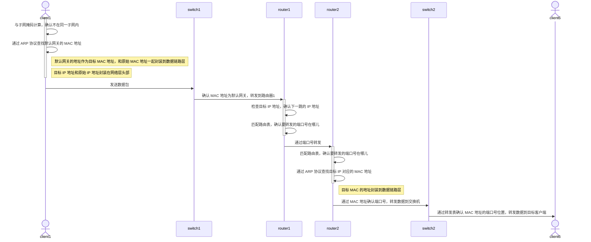

## 索引
 
> [[Physical and Data Link|物理层与数据链路层]]
> 
> [[Network Topology|拓扑结构]]
> 
> [[ICMP and Ping|ICMP与Ping]]
> 
> [[Gateway|网关]]
> 
> [[Routeing Protocol|路由协议]]

## 时序图示意图

下面是客户端 client1 想要连接 client6 的示意图。

