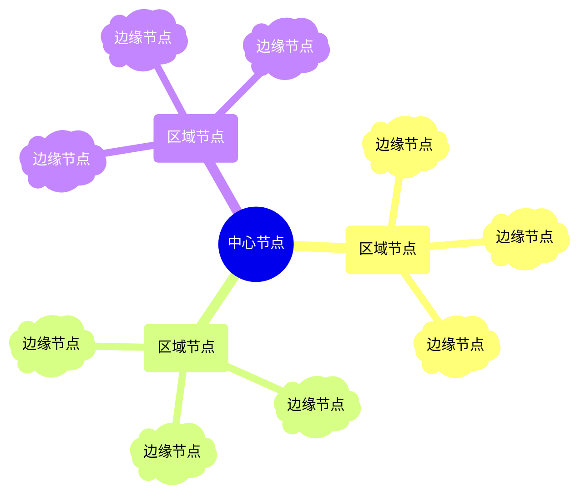
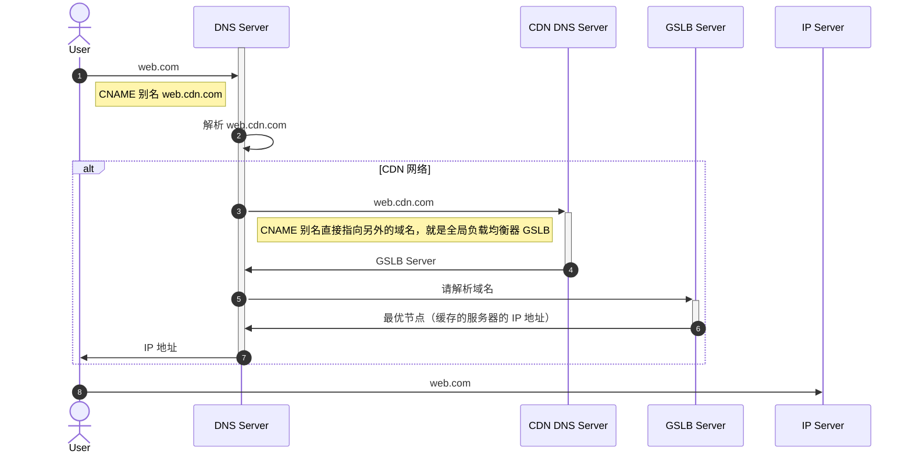
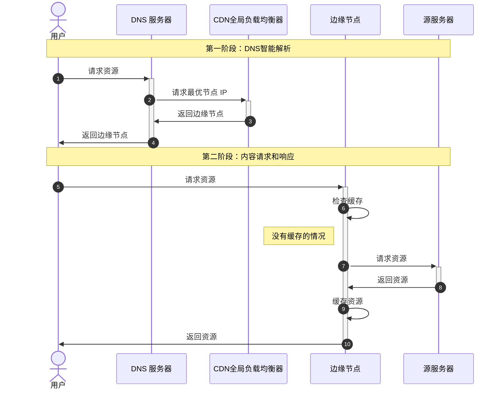
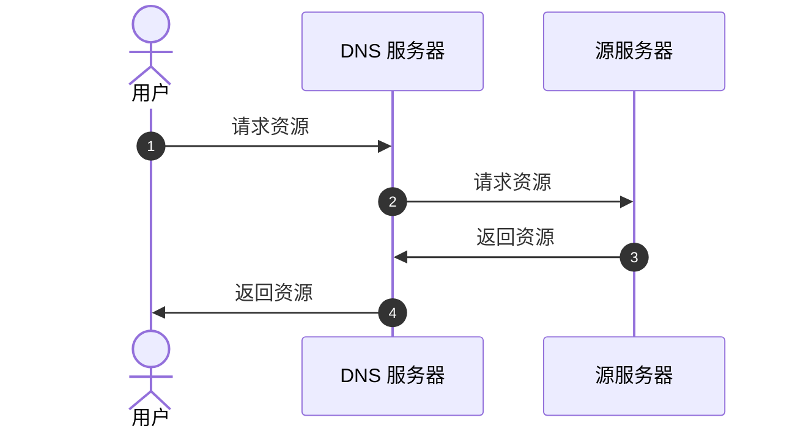
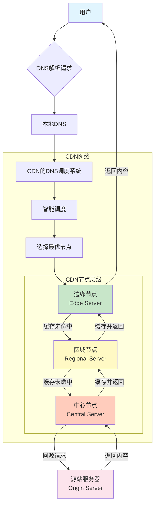

## 一、CDN

### 1. CDN 是什么

CDN 是内容分发网络(Content Delivery Network). 适合缓存静态数据，也支持缓存动态数据。

#### 1.1 CDN 架构

#### 1.2 CDN 策略

CDN 的全局负载均衡 DNS 服务器，根据用户的**地理位置**、**运营商**、实时的**网络情况**和各个节点的**承载流量（负载）** 来分配具体的边缘节点。

#### 1.3 CDN 分发流程

##### 1.3.1 全流程

用户访问 `web.com`, 访问对应的 权威 DNS 服务器.

##### 1.3.2 简化版流程

##### 1.3.3 传统访问模式，不使用 CDN

直接访问源服务器的方式：距离远、延迟高。
例如从杭州访问北京的服务器。传统方式直接访问，速度必然慢。CDN 会优先返回杭州或上海的服务器，响应自然会快一些。

#### 1.4 CDN 流程图

### 2. CDN 的优势

#### 2.1 提高速度，降低延迟

CDN 会返回最优节点，从最合适的节点返回数据，速度比访问远处的源服务器更快。

#### 2.2 节省带宽

CDN 节点能够有效减少源服务器的带宽流量，取而代之的是这些流量会被 CDN 承载。

#### 2.3 提高可用性

CDN 通常有多个边缘节点，单一节点挂掉之后，其他节点仍然可以提供服务。

#### 2.4 提高安全性

内容分发以后，源服务器的流量分流，也能承受 DDoS 的攻击，因为攻击的流量也会分散。

### 3. CDN 缓存动态数据

动态 CDN 主要是两种缓存方式

#### 3.1 边缘计算模式

数据的逻辑计算和存储，在边缘节点里完成。
* 定时从源服务器同步元数据，然后在边缘节点计算得到结果。
#### 3.2 路径优化模式

数据在源服务器产生，通过路径优化，将源数据快速下发到最优的边缘节点。

## 二、TODO

通过在权威 DNS 服务器设置域名别名的方式，也就是设置 `CNAME`,把域名执行 CDN 域名，