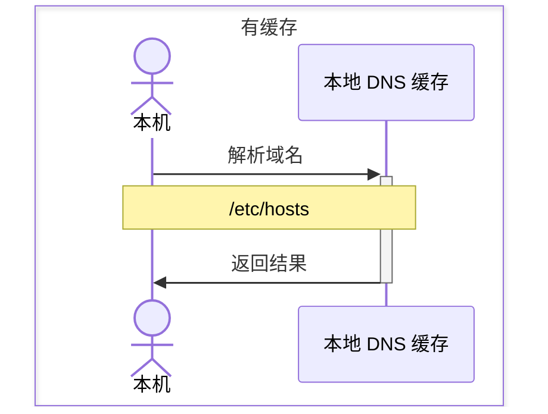
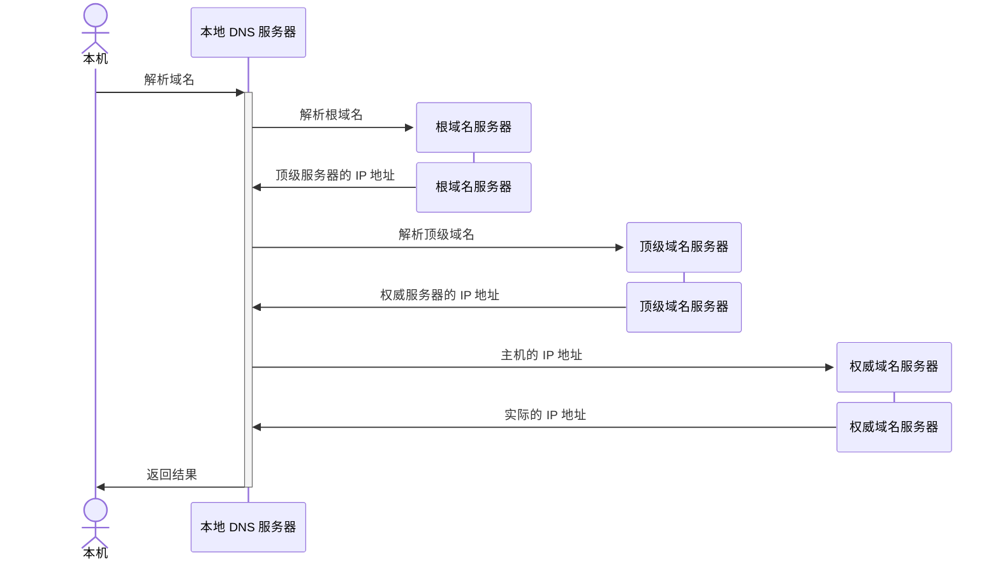
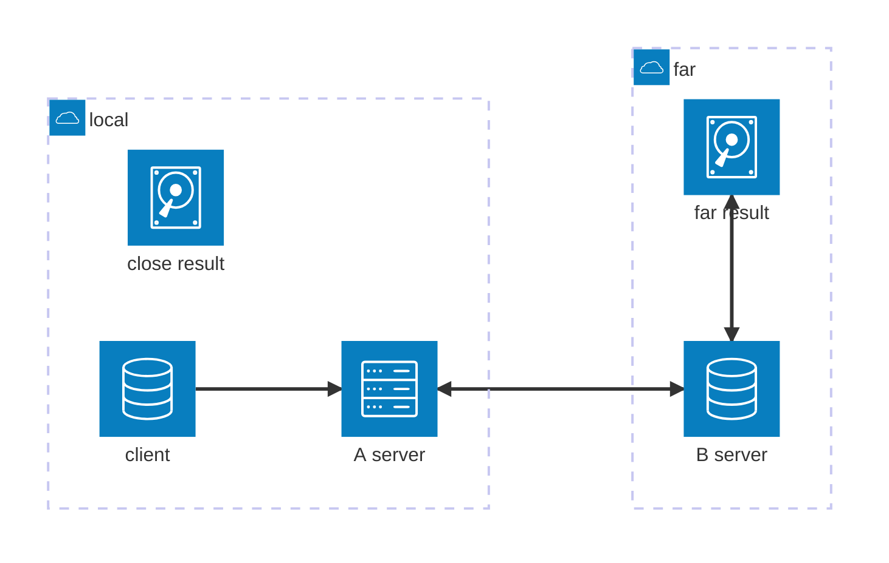

# DNS

DNS 服务器，必须是高可用、高并发、分布式的，这样才能确保稳定性。
* 根 DNS 服务器，返回顶级 DNS 服务器的 IP 地址。
* 顶级 DNS 服务器，返回权威 DNS 服务器的 IP 地址。
* 权威 DNS 服务器，返回主机的 IP 地址。

## 一、域名解析

本质上是一种自上而下的递归查询的策略，使用缓存来提升性能。
### 1. 本地缓存

客户端会受限在浏览器缓存中找，再到本地的 `/etc/hosts` 文件中查找。
* 平时配置本机地址的文件。
* `185.199.108.133 raw.githubusercontent.com`

完整的链路里，有浏览器缓存、系统缓存、路由器缓存、IPS 服务器缓存、根域名服务器缓存、顶级域名服务器缓存、主域名服务器缓存。


### 2. 本地无缓存




## 二、负载均衡

DNS 服务器，可以通过一个域名映射多个 IP 地址，对多个 IP 地址进行轮询操作，从而实现负载均衡的效果。

在客户端层面，例如数据库，配置它访问的是域名，而不是 IP，结合上述 DNS 的策略，实现软件层面的负载均衡。

### 1. 内部负载均衡

核心通过两部分实现：
* 一个域名映射多个 IP 地址。
* 通过**轮询**或者**加权轮询**实现每次访问不同 IP。

```shell
example.com IN A 192.0.2.1
example.com IN A 192.0.2.2
example.com IN A 192.0.2.3
```

### 2.全局负载均衡

不同地方分布着不同的机房，根据实际的地址和运营商来做全局的负载均衡，返回最优 IP。

应用部署在不同地方的不同机房内，每个机房对应自己的 IP 地址。用户访问域名，通过 IP 地址轮询来访问各个数据中心；如果一个数据中心失效，DNS 服务器就把这个数据中心对应的 IP 地址在服务器里删除，实现高可用。

#### 2.1 全局负载均衡器

负载均衡器 `SLB`(`server load balance`).

在对应域名的 DNS 服务器中，使用 `CNAME` 配置域名的别名，告诉本地 DNS 服务器，请求 `GSLB`(`global server load balance`) 来解析这个域名，`GSLB` 会使用自己的策略（**根据地址和运营商**）来实现负载均衡，返回最优的 IP 地址。
* 例如可以为 `apple.com` 配置一个别名 `a.apple.com`. 让 `GSLB` 来解析这个别名域名。

## 三、HTTPDNS

### 1. 传统 DNS 的问题

#### 1.1 域名缓存失效

传统的 DNS 会存在本地缓存失效的问题，服务器更新，但本地缓存指向旧的 IP 地址，导致出现无法访问的问题。

本地缓存会导致全局负载均衡失效，因为无法抵达服务器，本地缓存的地址经过一段时间后，不一定会是最近的地址。

#### 1.2 域名转发问题

服务器端有时候会配置请求转发，假设 B 运营商转发 A 运营商的请求，所有请求通过 B 运营商去权威 DNS 服务器查询，服务器会认为请求实际来自于 B 运营商，返回 B 运营商的网站地址，导致客户的请求实际跨运营商，增肌时延。

例如下图里的 `close result` 才是最近的结果，但是实际请求的是 `far result`.因为 B 服务进行了一层转发。



#### 1.3 出口 NAT 问题

现在很多机房的网关就配置 NAT，网络地址转换，将本地的私有 IP 地址转换为公有 IP 地址，但是经过转换的网络地址，权威 DNS 服务器就没法通过地址判断客户端的运营商，导致误判，导致跨运营商的访问，增加时延。

#### 1.4 域名更新问题

本地 DNS 服务器是由不同地区、不同运营商独立部署的。不同的服务器，对域名解析缓存的处理(过期时间不一致)，可能也会不一样。例如域名解析的 TLL 时间限制不一致。

#### 1.5 解析延迟问题（性能问题）

传统 DNS 通过递归遍历所有服务器来获取最终结果，会带来明显的时延，效率不高。


> [[HTTP/index|HTTP]]