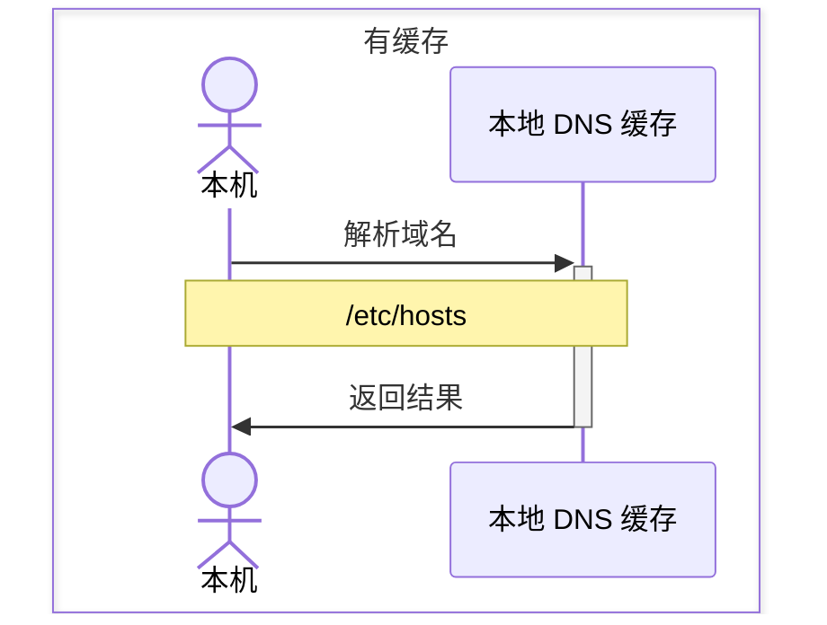
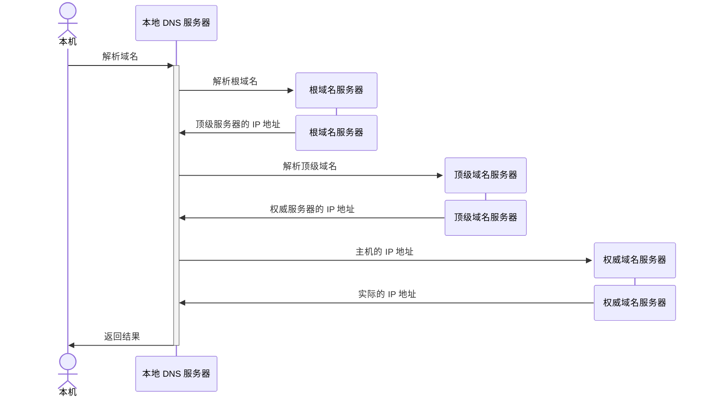

# DNS

DNS 服务器，必须是高可用、高并发、分布式的，这样才能确保稳定性。
* 根 DNS 服务器，返回顶级 DNS 服务器的 IP 地址。
* 顶级 DNS 服务器，返回权威 DNS 服务器的 IP 地址。
* 权威 DNS 服务器，返回主机的 IP 地址。

## 一、域名解析

本质上是一种自上而下的递归查询的策略，使用缓存来提升性能。
### 1. 本地缓存

客户端会受限在浏览器缓存中找，再到本地的 `/etc/hosts` 文件中查找。
* 平时配置本机地址的文件。
* `185.199.108.133 raw.githubusercontent.com`

完整的链路里，有浏览器缓存、系统缓存、路由器缓存、IPS 服务器缓存、根域名服务器缓存、顶级域名服务器缓存、主域名服务器缓存。

### 2. 本地无缓存

## 二、负载均衡

DNS 服务器，可以通过一个域名映射多个 IP 地址，对多个 IP 地址进行轮询操作，从而实现负载均衡的效果。

在客户端层面，例如数据库，配置它访问的是域名，而不是 IP，结合上述 DNS 的策略，实现软件层面的负载均衡。

### 1. 内部负载均衡

### 2.全局负载均衡

不同地方分布着不同的机房，根据实际的地址和运营商来做全局的负载均衡，返回最优 IP。

应用部署在不同地方的不同机房内，每个机房对应自己的 IP 地址。用户访问域名，通过 IP 地址轮询来访问各个数据中心；如果一个数据中心失效，DNS 服务器就把这个数据中心对应的 IP 地址在服务器里删除，实现高可用。

#### 2.1 全局负载均衡器

负载均衡器 SLB(server load balance).

在对应域名的 DNS 服务器中，使用 CNAME 配置域名的别名，告诉本地 DNS 服务器，请求 GSLB 来解析这个域名，GSLB 会使用自己的策略（**根据地址和运营商**）来实现负载均衡，返回最优的 IP 地址。
* 例如可以为 `apple.com` 配置一个别名 `a.apple.com`. 让 GSLB 来解析这个别名域名。

> [[HTTP/index|HTTP]]