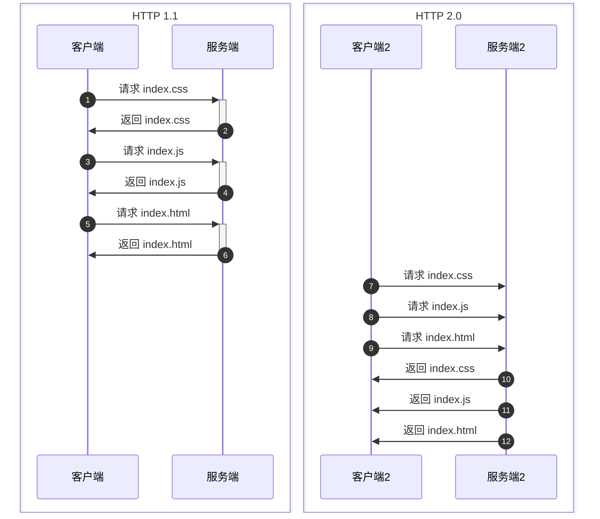

# HTTP 2.0

## 一、请求发送的对比

### 1. 时序图对比

连续发送请求，在 1.1 的协议里是左侧的效果。

![[多路复用.png]]



![[http2.0.png]]

## 二、二进制分帧

HTTP 2 把传输信息拆分成更小的帧，使用二进制格式编码，抛弃 ASCII 编码。所有数据都是二进制，统称为帧。
* header 帧：传输 header 内容。
* data 帧：传输正文实体。

## 三、多路复用

HTTP 2 把一个 TCP 的连接切成多个流，每个流有自己的 ID。
多路复用就是一个连接上可以有多个请求，每个请求对应一个独立的 ID。
* 简单理解，1.1 的客户端请求发起。服务端在响应前一个后再继续响应下一个，类似于串行请求；而 HTTP 2.0 的客户端和服务端都可以同时发送多个请求。
* 通过上述两种机制实现：把多个客户端请求分到不同的流中，再把请求内容拆分成帧，进行二进制传输。传输的帧可以是乱序的，后续会通过帧首部的流标识符重新组装，并且可以根据优先级来优先处理某些流的数据。

nginx 开启 HTTP 2 的方式：

```shell
server {
	listen 443 ssl http2; // 加一句 http2
	server_name domain.com
}
```

## 四、头部压缩

对原来的 HTTP 头进行压缩，引入了头信息压缩机制。
对原来客户端和服务端都维护的 `key` `value` 建立索引表，相同的头每次都只发送索引，来提升速度。
* 字段例如 `User-Agent`,`Cookie`,`Accept`,`Server`,`Range`.

优先级和流控制

服务器推送
