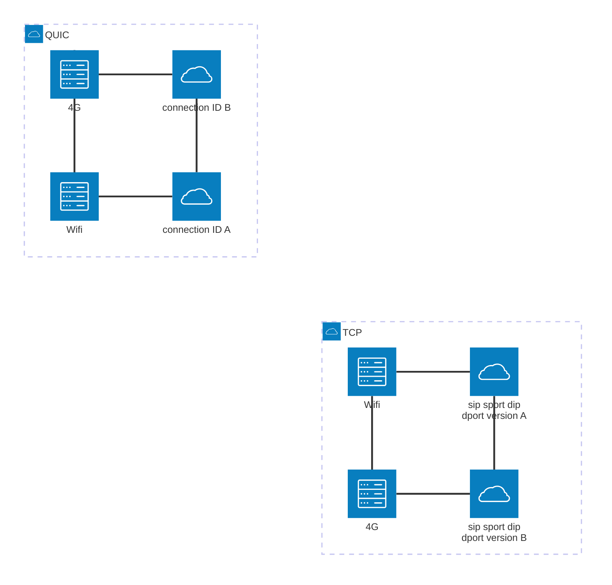
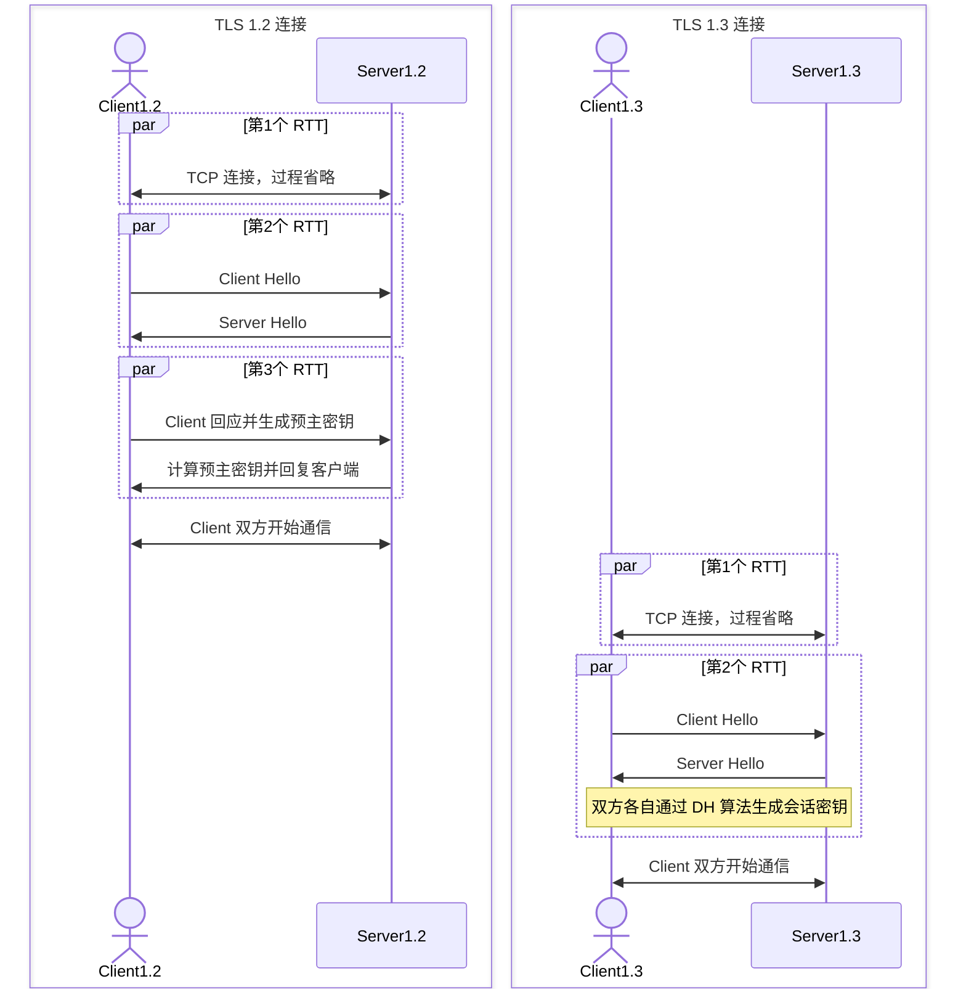
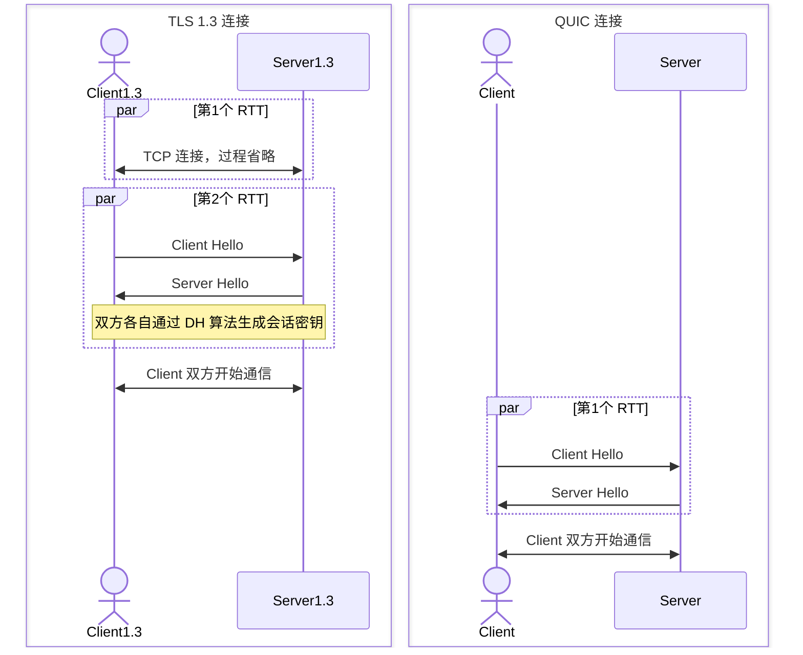

## QUIC

QUIC 是基于 UDP 的协议，是构成 HTTP3 的基础。

### [图解QUIC](https://cangsdarm.github.io/illustrate/quic)

### 1. 机制一：自定义连接机制

TCP 建立连接依靠四元素（源 IP、源端口、目标 IP、目标端口），当网络变化（例如从 wifi 切换到蜂窝网络时），ip 地址或端口势必会变化。此时，不可避免需要进行一次重连。

QUIC 基于 UDP 是无连接的，新定义了一种连接方式，基于 `connectionId`(一个 64 位的随机数) 建立连接，不依赖 IP 和端口号，即使网络变化，也能保证不断开重连，从而提高网络效率。

#### 1.1 演示图

#### 1.2 低时延连接

对 HTTPS 中的 [[../HTTPS/index#4.1 版本 1.2 及以下的建立连接过程|TLS 1.2 连接流程图]] 和 [[../HTTPS/index#4.2 版本 1.3 的建立连接过程|TLS 1.3 连接流程图]]进行简化并且对比 HTTP 3.0.

#### 1.2.1 TLS 1.2 vs 1.3

在真正开始 TLS 的连接前，还需要先建立 TCP 的连接，所以实际上分别会消耗 3 个 RTT 和 2 个 RTT 的对比:

#### 1.2.2 TLS 1.3 vs QUIC

新的 QUIC 初次连接只需要 1 个 RTT 就可以开始传输。因为 QUIC 集成了 TLS 安全协议。

TODO

### 2. 机制二：自定义重传机制

TCP 使用序号和应答机制来解决顺序问题和丢包问题。

### 3. 机制三：无阻塞的多路复用

### 4. 机制四：自定义流量控制
