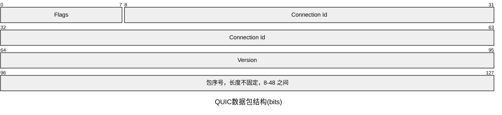
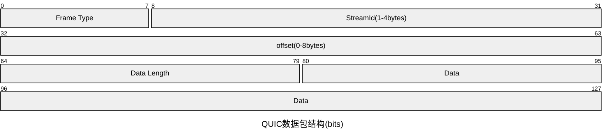
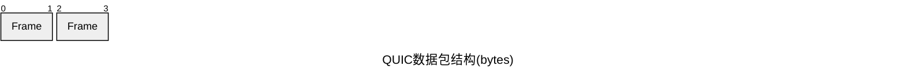
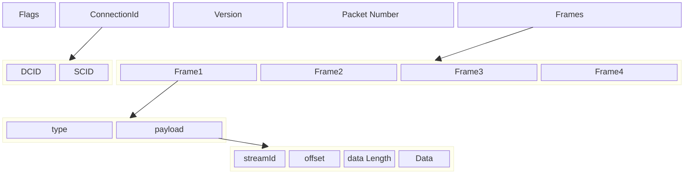
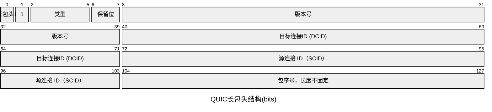
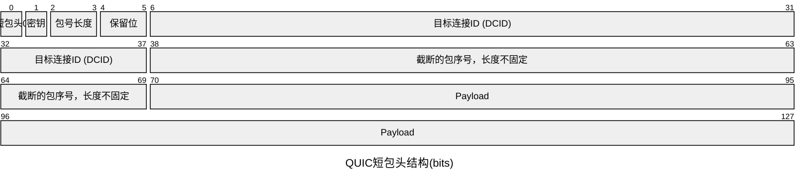
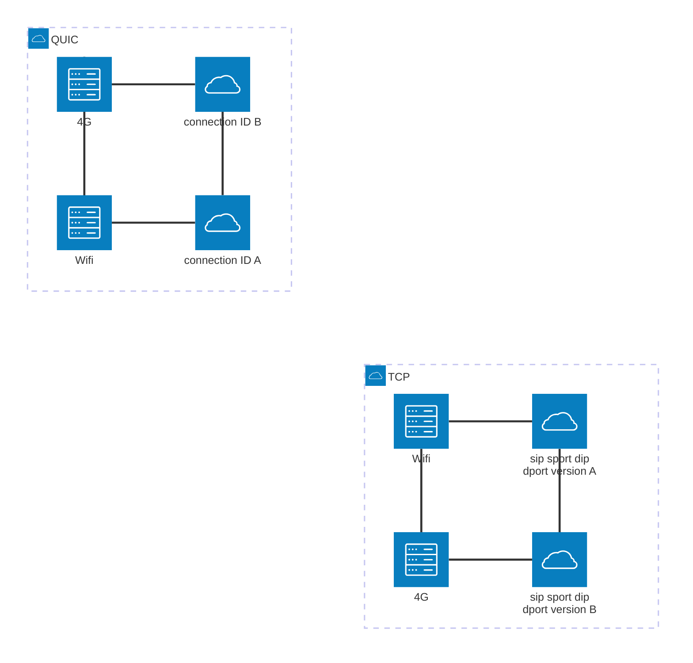
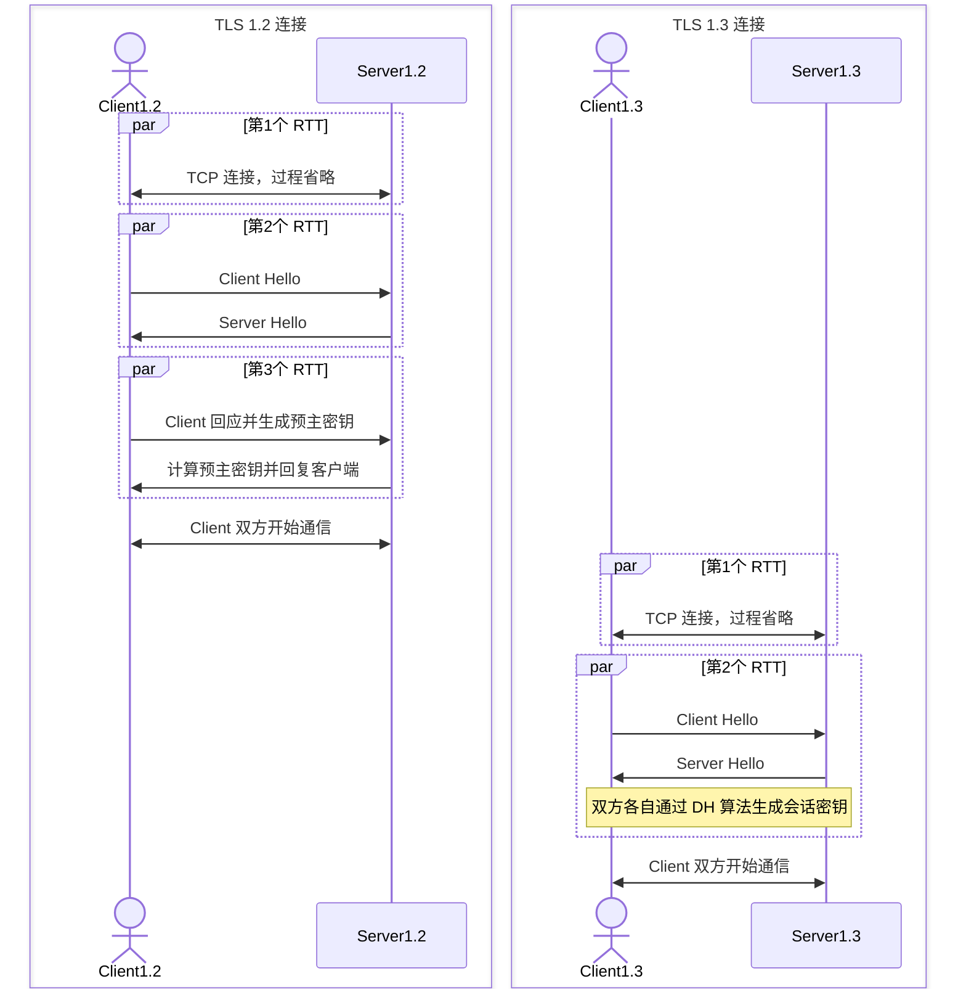
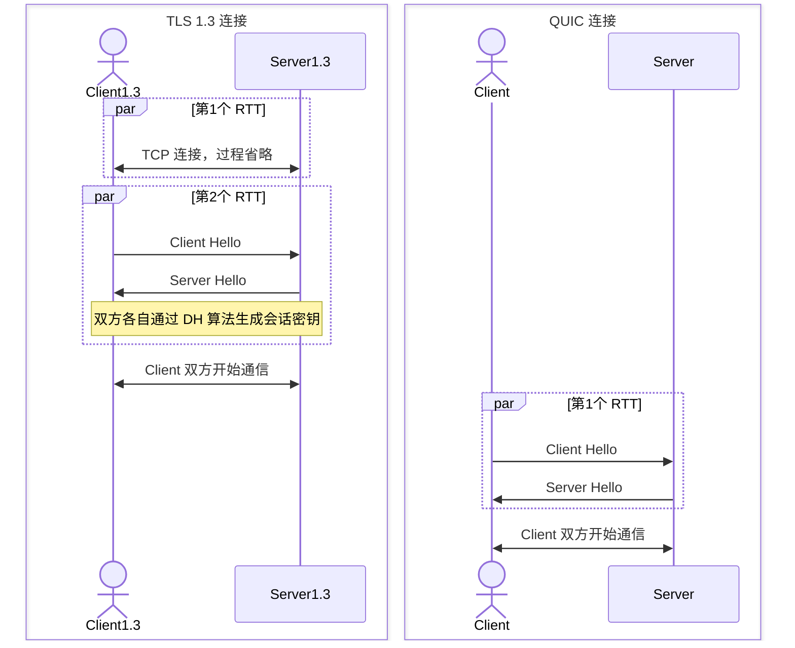
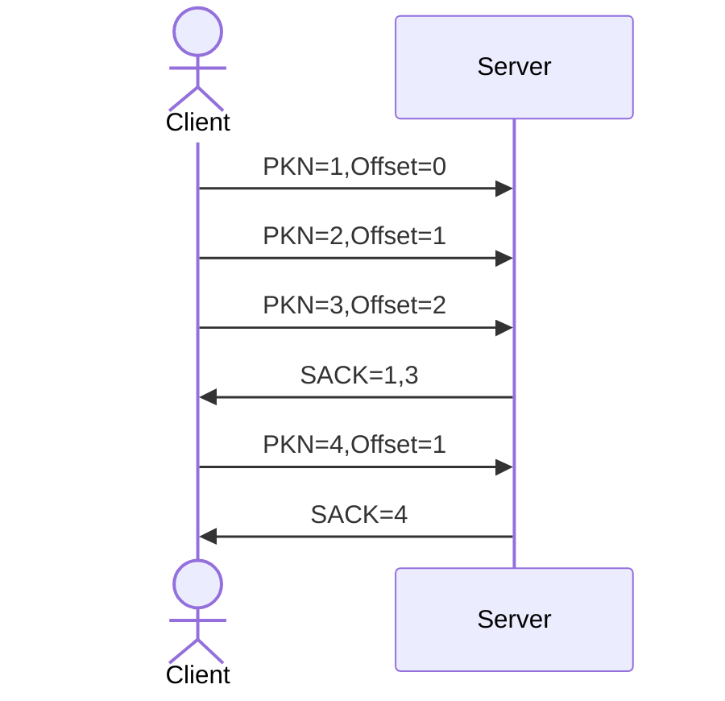

## QUIC

QUIC 是基于 UDP 的协议，是构成 HTTP3 的基础。

## 一、QUIC 的结构

### 1. QUIC 包结构

QUIC 是基于 UDP 的，因此包头是 UDP。
[[../../底层网络知识之重要的传输层/UDP#二、UDP 格式|UDP 格式]]

#### 1.1 包头结构

##### 1.1.1 比特单位

##### 1.1.2 字节单位

#### 1.2 报文结构

##### 1.2.1 报文内容比特单位

##### 1.2.2 框架图

#### 1.3 包头类型

QUIC 分为长包头和短包头。
长包头用来建立连接，数据包相对多一些。
短包头用来传输数据。

##### 1.3.1 长包头

##### 1.3.2 短包头

## 二、QUIC 的优化

### [图解QUIC](https://cangsdarm.github.io/illustrate/quic)

### 1. 机制一：自定义连接机制

TCP 建立连接依靠四元素（源 IP、源端口、目标 IP、目标端口），当网络变化（例如从 wifi 切换到蜂窝网络时），ip 地址或端口势必会变化。此时，不可避免需要进行一次重连。

QUIC 基于 UDP 是无连接的，新定义了一种连接方式，基于 `connectionId`(一个 64 位的随机数) 建立连接，不依赖 IP 和端口号，即使网络变化，也能保证不断开重连，从而提高网络效率。

#### 1.1 演示图

#### 1.2 低时延连接

对 HTTPS 中的 [[../HTTPS/index#4.1 版本 1.2 及以下的建立连接过程|TLS 1.2 连接流程图]] 和 [[../HTTPS/index#4.2 版本 1.3 的建立连接过程|TLS 1.3 连接流程图]]进行简化并且对比 HTTP 3.0.

#### 1.2.1 TLS 1.2 vs 1.3

在真正开始 TLS 的连接前，还需要先建立 TCP 的连接，所以实际上分别会消耗 3 个 RTT 和 2 个 RTT 的对比:

#### 1.2.2 TLS 1.3 vs QUIC

新的 QUIC 初次连接只需要 1 个 RTT 就可以开始传输。因为 QUIC 集成了 TLS 安全协议。

### 2. 机制二：自定义重传机制

TCP 使用**序号和应答机制**来解决顺序问题和丢包问题。
QUIC 使用序号和相对位置来重传。
* `packet number`字段用来标识包序号，如果没有收到该序号的响应，就会重发一个包。包的序号在当前最近发送的序号基础上依次递增，通过 `offset` 相对位置来确认数据的具体位置。
* `ACK` 返回的序号则和发送的序号对应上。

例如下图，序号 2 的包丢失了，重传的包序号是 2. `offset` 是 1.

### 3. 机制三：无阻塞的多路复用

QUIC 把连接能够拆分成多个流 Stream，这些多个 Stream 并不像 HTTP2 的 TCP 一样共享一个滑动窗口，而是分别使用不同的滑动窗口。而且这些 Stream 之间完全不是相互依赖的，并不会发生前后阻塞的情况。

[[HTTP 2.0#3. 多路复用]]

### 4. 机制四：自定义流量控制

#### 4.1 流量控制

QUIC 也使用和 TCP 类似的滑动窗口机制来实现流量控制。

QUIC 的滑动窗口分成两个级别，`Connection` 和 `Stream`。
* `Connection` 规定了所有数据流的大小；
* `Stream` 流量控制规定了每个流的大小。

`Connection` 的可用窗口大小是 **60**.

## 三、参考

> [QUIC 协议](https://zhuanlan.zhihu.com/p/405387352)
> [RFC9312中文](https://autumnquiche.github.io/RFC9312_Chinese_Simplified/#2.1_QUIC_Packet_Header_Structure)