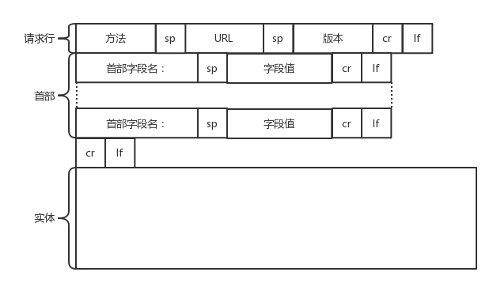
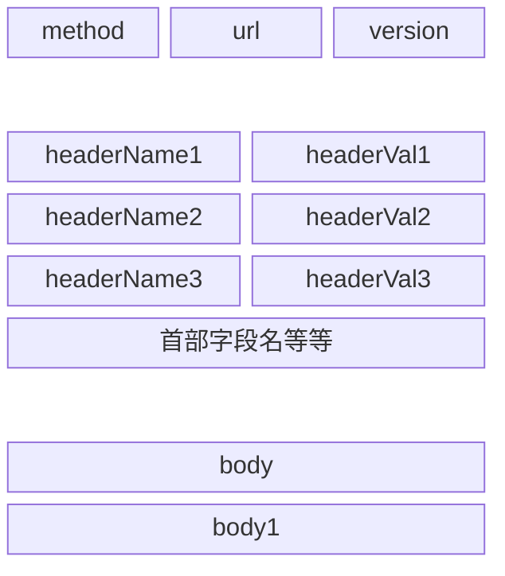
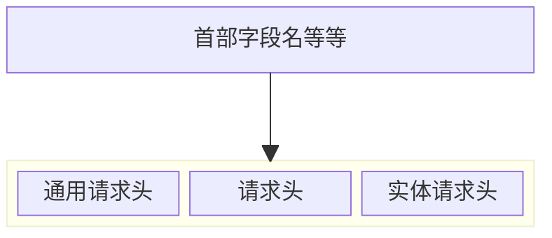
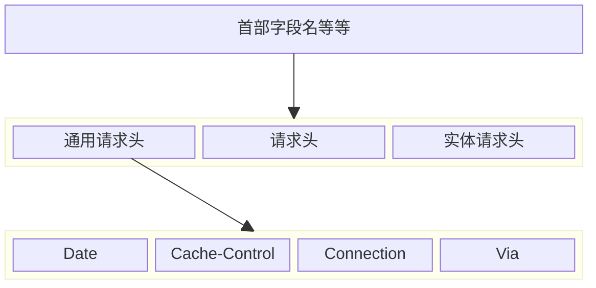
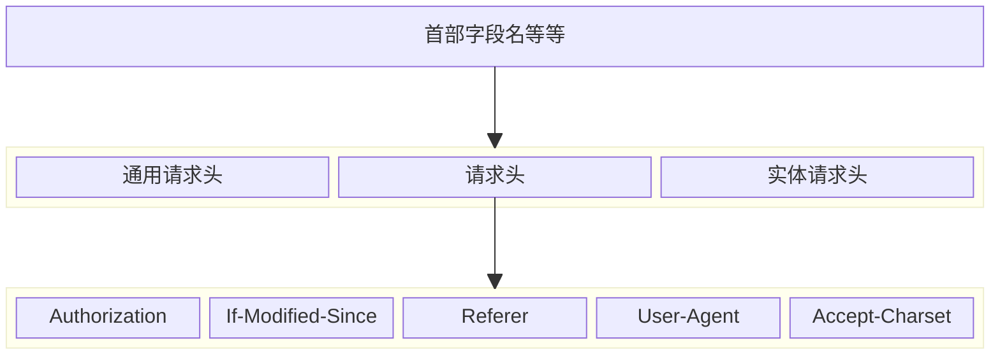
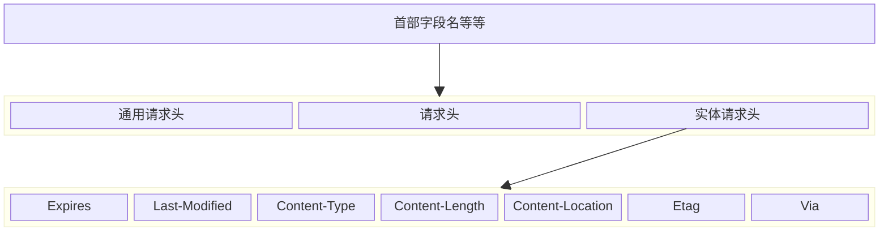
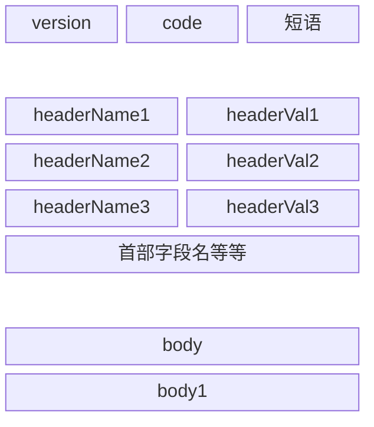

# [HTTP](https://developer.mozilla.org/zh-CN/docs/Web/HTTP)

## 一、HTTP 请求的构建

请求的格式如下



HTTP的报文大概分为三大部分。第一部分是**请求行**，第二部分是请求的**首部**，第三部分是请求的**正文实体**。



### 1. 请求行

请求行包括**请求方法**、**URL** 和**版本**。

#### 1.1 [请求方法](https://developer.mozilla.org/zh-CN/docs/Web/HTTP/Methods)

请求方法，也即 method 有以下几种：
* **`GET`** 请求资源
* **`POST`** 新增资源
* **`PUT`** 修改资源
* **`DELETE`** 删除资源
正好对应了增删改查四大功能。
其他平时开发中并不太常用的还有 `HEAD`、`OPTIONS`、`TRACE`、`CONNECT`、`PATCH`等。


#### 1.2 URL

URL 例如 `https://www.google.com`.

#### 1.3 版本

版本现在最常见的是 HTTP 1.1。

### 2. [请求首部（HTTP标头）](https://yari-demos.prod.mdn.mozit.cloud/zh-CN/docs/Glossary/HTTP_header)

首部字段包含一些重要的字段，结构是 key value 的形式，中间通过冒号分隔。
请求头分为以下几类：
* **通用请求头**
* **请求头**
* **实体请求头**



#### 2.1 [通用请求头(通用标头)](https://yari-demos.prod.mdn.mozit.cloud/zh-CN/docs/Glossary/General_header)

**该标头可同时用于请求信息，也可以用于响应信息。但是与主体中传输的数据无关。这是过时的规范。**
在 HTTP 1.1 版本的协议中，没有再明确地定义通用标头，而是直接分为请求标头和响应标头。
* `Date`: 请求和响应生成的日期
* `Cache-Control`: 控制缓存的相关信息
* `Connection`: 设置发送响应之后TCP连接是否继续保持的通信选项(持久连接还是不持久连接)
* `Via`: 记录途中经过的代理和网关

##### 2.1.1 框图示意



#### 2.2 [请求头](https://yari-demos.prod.mdn.mozit.cloud/zh-CN/docs/Glossary/Request_header)

**表示请求消息的附加信息的头字段。**

* `Authorization`: 身份认证数据
* `If-Modified-Since`: 设置仅在某个日期之后再获取更新的数据，用于判断客户端缓存
* `Referer`: 记录跳转超链时的上一个页面的链接
* `User-Agent`: 客户端软件的名称和版本号等相关信息
* `Accept-Charset`，表示**客户端可以接受的字符集**

##### 2.2.1 框图示意



#### 2.3 [实体请求头](https://yari-demos.prod.mdn.mozit.cloud/zh-CN/docs/Glossary/Representation_header)

**用于表示实体(消息体)的附加信息的头字段。**

* `Expires`: 是指消息体(正文)的有效期
* `Last-Modified`: 数据的最后更新日期
* `Content-Type`: 是指消息体(正文)的格式
* `Content-Length`: 表示消息体(正文)的长度
* `Content-Location`: 表示消息体(正文)的在服务器上的位置(URI)
* `Etag`: 缓存相关的唯一标识，和其他字段 `If-Match`、`If-None-Match`、`If-Range 配合使用

##### 2.3.1 框图示意




### 3. 请求体

POST 请求才会有消息体。

## 二、HTTP 返回的构建

以下是基于 HTTP 1.1 请求的返回结构，包括状态行、首部和实体
![[HTTP响应格式.png]]



### 1. 状态行

状态行会返回 HTTP 请求的结果的概览，包括版本号、状态码和短语。
版本号和请求一样，通常是 `HTTP 1.1`.
状态码，正确是 200，错误有很多。
正确的情况下，短语内容是 `ok`。

#### 1.1 [状态码](https://developer.mozilla.org/zh-CN/docs/Web/HTTP/Status)

状态码有很多，1xx，2xx，3xx，4xx，5xx 分别有着各自的含义。
以 2 开头的通常是成功的，3 开头是重定向消息，4 开头是客户端错误响应，5 开头的是服务端错误响应，它们都是常见的错误。

##### 1.1.1 常见状态码
| 状态码                                                                 | 短语                    | 含义                                                     |
| ------------------------------------------------------------------- | --------------------- | ------------------------------------------------------ |
| [200](https://developer.mozilla.org/zh-CN/docs/Web/HTTP/Status/200) | ok                    | 请求成功                                                   |
| [301](https://developer.mozilla.org/zh-CN/docs/Web/HTTP/Status/301) | Moved Permanently     | 请求资源的 URL 已永久更改。在响应中给出了新的 URL。                         |
| [302](https://developer.mozilla.org/zh-CN/docs/Web/HTTP/Status/302) | Found                 | 此响应代码表示所请求资源的 URI 已 _暂时_ 更改。                           |
| [304](https://developer.mozilla.org/zh-CN/docs/Web/HTTP/Status/304) | Not Modified          | 这是用于缓存的目的。它告诉客户端响应还没有被修改，因此客户端可以继续使用相同的缓存版本的响应。        |
| [400](https://developer.mozilla.org/zh-CN/docs/Web/HTTP/Status/400) | Bad Request           | 由于被认为是客户端错误（例如，错误的请求语法、无效的请求消息帧或欺骗性的请求路由），服务器无法或不会处理请求 |
| [401](https://developer.mozilla.org/zh-CN/docs/Web/HTTP/Status/401) | Unauthorized          | 客户端必须对自身进行身份验证才能获得请求的响应。                               |
| [403](https://developer.mozilla.org/zh-CN/docs/Web/HTTP/Status/403) | Forbidden             | 客户端没有访问的权限。是未经授权的，因此服务器拒绝提供请求的资源。                      |
| [404](https://developer.mozilla.org/zh-CN/docs/Web/HTTP/Status/404) | Not Found             | 服务器找不到请求的资源。                                           |
| [405](https://developer.mozilla.org/zh-CN/docs/Web/HTTP/Status/405) | Method Not Allowed    | 服务器知道请求方法，但目标资源不支持该方法。例如，API 可能不允许调用`DELETE`来删除资源。     |
| [500](https://developer.mozilla.org/zh-CN/docs/Web/HTTP/Status/500) | Internal Server Error | 服务器遇到了不知如何处理的情况。                                       |
| [502](https://developer.mozilla.org/zh-CN/docs/Web/HTTP/Status/502) | Bad Gateway           | 服务器异常                                                  |
| [503](https://developer.mozilla.org/zh-CN/docs/Web/HTTP/Status/503) | Service Unavailable   | 服务器没有准备好处理请求。常见原因是服务器因维护或重载而停机。                        |
| [504](https://developer.mozilla.org/zh-CN/docs/Web/HTTP/Status/504) | Gateway Timeout       | 当服务器充当网关且无法及时获得响应时，会给出此错误响应。服务器超时。                     |

### 2. 响应头

**用于表示响应消息的附加信息的头字段。**

* `WWW-Authenticate`:当请求的消息存在访问控制时，返回身份认证用的数据
* `Location`: 表示信息的准确位置
* `Server`: 表示服务器的名称和版本号等信息

### 3. 返回示例

#### 3.1 成功返回示例

下面是完整的一个返回示例，终端执行 `curl -v www.baidu.com`

```http
HTTP/1.1 200 OK
Accept-Ranges: bytes
Cache-Control: private, no-cache, no-store, proxy-revalidate, no-transform
Connection: keep-alive
Content-Length: 2443
Content-Type: text/html
Date: Fri, 22 Dec 2023 14:15:42 GMT
Etag: "58860401-98b"
Last-Modified: Mon, 23 Jan 2017 13:24:17 GMT
Pragma: no-cache
Server: bfe/1.0.8.18
Set-Cookie: BDORZ=27315; max-age=86400; domain=.baidu.com; path=/
<!DOCTYPE html>
<!--STATUS OK--><html> <head><meta http-equiv=content-type content=text/html;charset=utf-8><meta http-equiv=X-UA-Compatible content=IE=Edge><meta content=always name=referrer><link rel=stylesheet type=text/css href=https://ss1.bdstatic.com/5eN1bjq8AAUYm2zgoY3K/r/www/cache/bdorz/baidu.min.css><title>百度一下，你就知道</title></head> <body link=#0000cc> <div id=wrapper> <div id=head> <div class=head_wrapper> <div class=s_form> <div class=s_form_wrapper> <div id=lg>  </div> <form id=form name=f action=//www.baidu.com/s class=fm> <input type=hidden name=bdorz_come value=1> <input type=hidden name=ie value=utf-8> <input type=hidden name=f value=8> <input type=hidden name=rsv_bp value=1> <input type=hidden name=rsv_idx value=1> <input type=hidden name=tn value=baidu><span class="bg s_ipt_wr"><input id=kw name=wd class=s_ipt value maxlength=255 autocomplete=off autofocus=autofocus></span><span class="bg s_btn_wr"><input type=submit id=su value=百度一下 class="bg s_btn" autofocus></span> </form> </div> </div> <div id=u1> <a href=http://news.baidu.com name=tj_trnews class=mnav>新闻</a> <a href=https://www.hao123.com name=tj_trhao123 class=mnav>hao123</a> <a href=http://map.baidu.com name=tj_trmap class=mnav>地图</a> <a href=http://v.baidu.com name=tj_trvideo class=mnav>视频</a> <a href=http://tieba.baidu.com name=tj_trtieba class=mnav>贴吧</a> <noscript> <a href=http://www.baidu.com/bdorz/login.gif?login&amp;tpl=mn&amp;u=http%3A%2F%2Fwww.baidu.com%2f%3fbdorz_come%3d1 name=tj_login class=lb>登录</a> </noscript> <script>document.write('<a href="http://www.baidu.com/bdorz/login.gif?login&tpl=mn&u='+ encodeURIComponent(window.location.href+ (window.location.search === "" ? "?" : "&")+ "bdorz_come=1")+ '" name="tj_login" class="lb">登录</a>');
                </script> <a href=//www.baidu.com/more/ name=tj_briicon class=bri style="display: block;">更多产品</a> </div> </div> </div> <div id=ftCon> <div id=ftConw> <p id=lh> <a href=http://home.baidu.com>关于百度</a> <a href=http://ir.baidu.com>About Baidu</a> </p> <p id=cp>&copy;2017&nbsp;Baidu&nbsp;<a href=http://www.baidu.com/duty/>使用百度前必读</a>&nbsp; <a href=http://jianyi.baidu.com/ class=cp-feedback>意见反馈</a>&nbsp;京ICP证030173号&nbsp;  </p> </div> </div> </div> </body> </html>
```

#### 3.2 3xx 返回示例

请求资源已被永久移动的网页响应：

```http
* Trying 5.22.145.16:80...
* Connected to sd.com (5.22.145.16) port 80
GET / HTTP/1.1
Host: sd.com
User-Agent: curl/8.4.0
Accept: */*

HTTP/1.1 301 Moved Permanently
date: Sat, 06 Jan 2024 11:59:01 GMT
server: Apache
location: http://www.haleglobal.com
content-length: 0
content-type: text/html; charset=UTF-8

* Connection #0 to host sd.com left intact
```

#### 3.3 4xx 返回示例

请求资源不存在的网页响应：

```http
HTTP/1.1 404 Not Found
Content-Type: text/html; charset=utf-8
Content-Length: 38217
Connection: keep-alive
Cache-Control: no-cache, no-store, must-revalidate, max-age=0
Content-Language: en-US
Date: Thu, 06 Dec 2018 17:35:13 GMT
Expires: Thu, 06 Dec 2018 17:35:13 GMT
Server: meinheld/0.6.1
Strict-Transport-Security: max-age=63072000
X-Content-Type-Options: nosniff
X-Frame-Options: DENY
X-XSS-Protection: 1; mode=block
Vary: Accept-Encoding,Cookie
X-Cache: Error from cloudfront
<!DOCTYPE html>… (包含一个站点自定义 404 页面，帮助用户找到丢失的资源)
```

### 4. [pipeline机制](https://developer.mozilla.org/zh-CN/docs/Web/HTTP/Connection_management_in_HTTP_1.x#http_%E6%B5%81%E6%B0%B4%E7%BA%BF)

默认情况下，[HTTP](https://developer.mozilla.org/zh-CN/docs/Web/HTTP) 请求是按顺序发出的。下一个请求只有在当前请求收到响应过后才会被发出。由于会受到网络延迟和带宽的限制，在下一个请求被发送到服务器之前，可能需要等待很长时间。如果某一个回应比较慢，后面的请求就会排队等候，也就是**队首阻塞**。
流水线则是在同一条长连接上发出连续的请求，而不用等待应答返回。这样理论上可以避免连接延迟。

它有以下限制：
* 请求必须是幂等的。只支持 `GET`、`OPTIONS`、`HEAD`、`PUT` 请求，它们可以安全地进行尝试，而不支持 `POST` 请求。
* 开启的条件比较苛刻，而且同样会遇到队头阻塞的问题。
* 现状是没有主流的现代浏览器默认开启这一特性。

由于诸多的限制和设计缺陷，需要一种设计更加先进的连接管理模型来解决，而这种模型后续设计进了 HTTP 2.0，也就是下文的 HTTP 2.0 里的多路复用。

[[HTTP 2.0]]