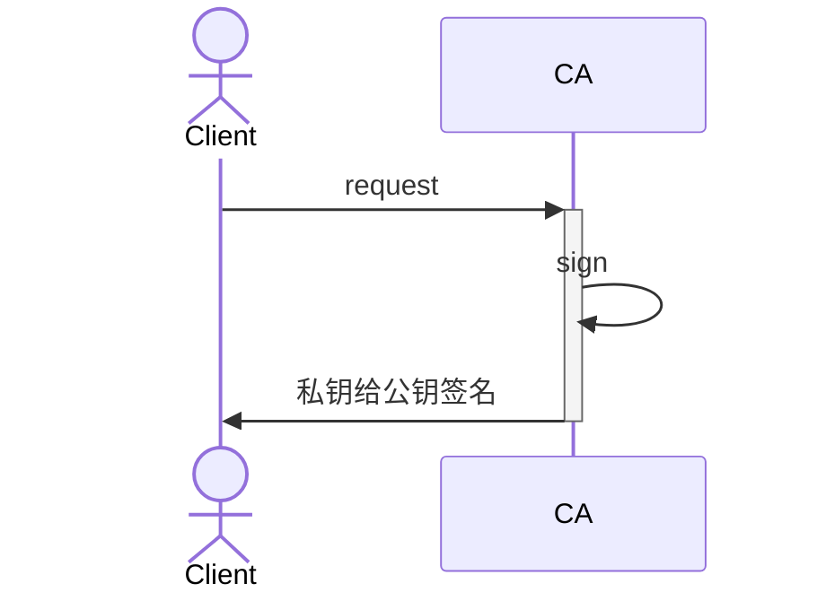
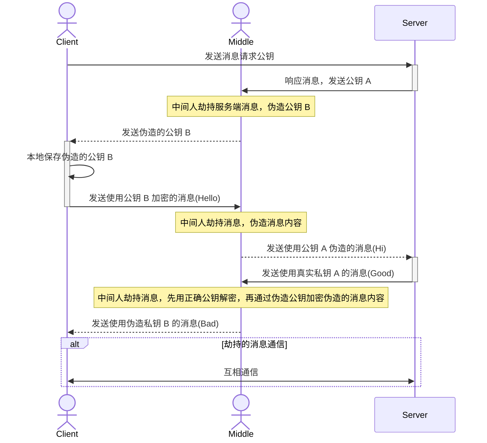
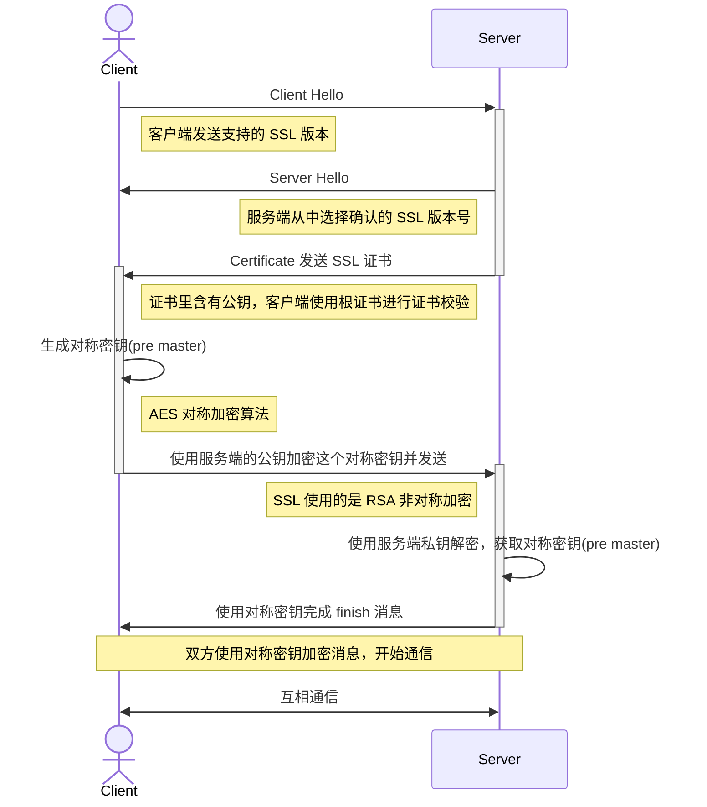
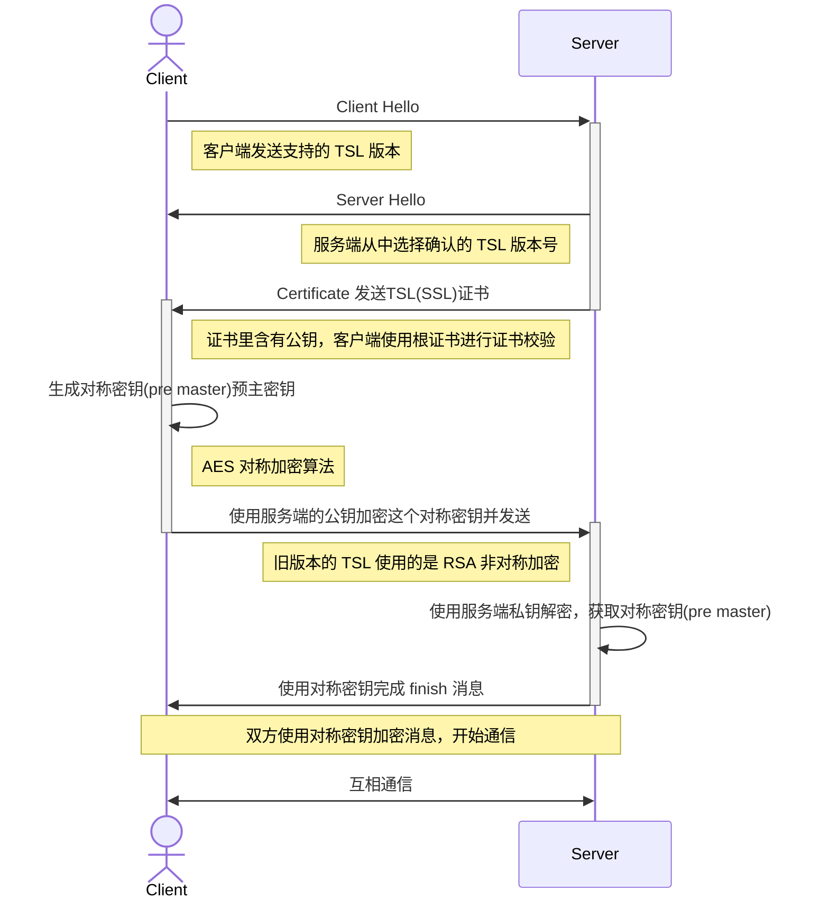
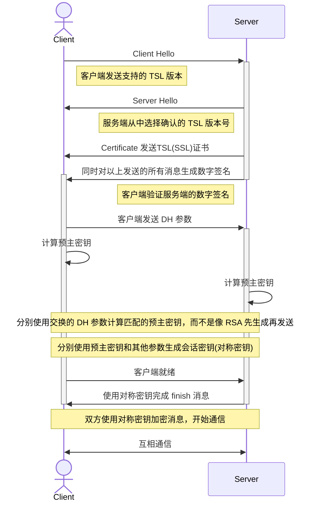

## 一、加密

### 1. 对称加密

加密和解密的密钥是相同的。用一个加密算法进行加密和解密。
* winRAR 和 winZIP 压缩包的加密和解密就是同一个。

常用的对称加密算法有 AES，是目前最广泛使用的加密算法。

#### 1.1 AES 算法

加密

```javascript
const secret = encrypt(key, message);
```

解密

```javascript
const plain = decrypt(key, password);
```

##### 1.1.1 加密模式

ECB 是最简单的加密模式，只需要一个固定长度的密钥，固定的明文会生成固定的密文，这样的加密方式简单但也不可靠。
CBC 模式通过使用一个随机数作为 IV 参数，这样可以让每次生成的密文都不相同。

##### 1.1.1 算法实现

下面实现一个 128 位的极简加密算法。初始化一个实例，并选择加密模式。

###### 使用 js 实现

```javascript
// 极简 AES-128 加密核心（ECB模式示例，实际生产环境应使用GCM/CBC）
class MiniAES {
  static async encrypt(key, data) {
    const cryptoKey = await crypto.subtle.importKey('raw', 
      new TextEncoder().encode(key.padEnd(16)), 
      { name: 'AES-ECB' }, false, ['encrypt']
    );
    
    const encrypted = await crypto.subtle.encrypt(
      { name: 'AES-ECB' },
      cryptoKey,
      new TextEncoder().encode(data)
    );
    
    return btoa(String.fromCharCode(...new Uint8Array(encrypted)));
  }

  static async decrypt(key, ciphertext) {
    const cryptoKey = await crypto.subtle.importKey('raw',
      new TextEncoder().encode(key.padEnd(16)),
      { name: 'AES-ECB' }, false, ['decrypt']
    );
    
    const decrypted = await crypto.subtle.decrypt(
      { name: 'AES-ECB' },
      cryptoKey,
      Uint8Array.from(atob(ciphertext), c => c.charCodeAt(0))
    );
    
    return new TextDecoder().decode(decrypted);
  }
}

// 使用示例
(async () => {
  const encrypted = await MiniAES.encrypt('my16bytekey', 'secret');
  console.log('加密结果:', encrypted);  // 输出Base64
  
  const decrypted = await MiniAES.decrypt('my16bytekey', encrypted);
  console.log('解密结果:', decrypted); // 输出"secret"
})();
```

###### 使用 python 实现

```python
from cryptography.hazmat.primitives.ciphers import Cipher, algorithms, modes
from cryptography.hazmat.primitives import padding
from cryptography.hazmat.backends import default_backend
import os

def generate_key():
    """生成随机密钥（AES-256需要32字节）"""
    return os.urandom(32)

def encrypt_aes(key, plaintext):
    """AES加密"""
    # 生成随机IV（初始化向量）
    iv = os.urandom(16)
    
    # 创建加密器（CBC模式）
    cipher = Cipher(algorithms.AES(key), modes.CBC(iv), backend=default_backend())
    encryptor = cipher.encryptor()
    
    # 填充数据（AES要求数据长度为16字节的倍数）
    padder = padding.PKCS7(128).padder()
    padded_data = padder.update(plaintext) + padder.finalize()
    
    # 加密
    ciphertext = encryptor.update(padded_data) + encryptor.finalize()
    
    return iv + ciphertext  # 返回IV+密文

def decrypt_aes(key, encrypted_data):
    """AES解密"""
    # 提取IV和密文
    iv = encrypted_data[:16]
    ciphertext = encrypted_data[16:]
    
    # 创建解密器
    cipher = Cipher(algorithms.AES(key), modes.CBC(iv), backend=default_backend())
    decryptor = cipher.decryptor()
    
    # 解密
    padded_plaintext = decryptor.update(ciphertext) + decryptor.finalize()
    
    # 去除填充
    unpadder = padding.PKCS7(128).unpadder()
    plaintext = unpadder.update(padded_plaintext) + unpadder.finalize()
    
    return plaintext

# 使用示例
if __name__ == "__main__":
    # 生成密钥（在实际应用中需要安全存储）
    key = generate_key()
    print(f"密钥 (hex): {key.hex()}")
    
    # 原始消息
    message = b"Hello, AES Encryption World!"
    print(f"原始消息: {message.decode()}")
    
    # 加密
    encrypted = encrypt_aes(key, message)
    print(f"加密后 (hex): {encrypted.hex()}")
    
    # 解密
    decrypted = decrypt_aes(key, encrypted)
    print(f"解密后: {decrypted.decode()}")
```

### 2. 非对称加密

比较经典的非对称加密算法，是 RSA 算法。

每个客户端，维护属于自己的一套公钥和私钥。公钥在互联网公开，私钥只有自己维护。

公钥加密的信息，只有私钥能解密。私钥加密的信息，只有公钥能解密。
- **公钥**用于加密数据或验证数字签名，可以自由分发和共享。
- **私钥**用于解密数据和创建数字签名，但必须保密，以确保安全。

常见的非对称加密算法：
- Rivest-Shamir-Adleman (RSA)
- 椭圆曲线加密 (ECC)
- 数字签名算法 (DSA)

#### 2.1 RSA 算法

RSA 是一种非对称加密算法，以其发明者的名字命名。该算法依赖于**素数的数学复杂性**来生成密钥对，使用一对公私密钥进行加密和解密，因此，适用于安全数据传输和数字签名。

RSA 算法通常帮助保护 HTTPS、SSH 和 TLS 等通信协议。尽管是在 20 世纪 70 年代开发的，但由于其稳健性和安全性，RSA 仍被广泛使用。各种应用程序都依赖于 RSA，包括安全的电子邮件、VPN 和软件更新。

##### 2.1.1 算法实现

###### 使用 js 实现

核心使用浏览器提供的 [Web_Crypto_API](https://developer.mozilla.org/zh-CN/docs/Web/API/Web_Crypto_API).

```javascript
// 生成RSA密钥对（2048位）
async function generateKeyPair() {
  return await crypto.subtle.generateKey(
    {
      name: "RSA-OAEP",
      modulusLength: 2048,
      publicExponent: new Uint8Array([0x01, 0x00, 0x01]), // 65537
      hash: "SHA-256",
    },
    true, // 是否可导出
    ["encrypt", "decrypt"]
  );
}

// RSA加密（公钥加密）
async function rsaEncrypt(publicKey, plaintext) {
  const encoded = new TextEncoder().encode(plaintext);
  return await crypto.subtle.encrypt(
    { name: "RSA-OAEP" },
    publicKey,
    encoded
  );
}

// RSA解密（私钥解密）
async function rsaDecrypt(privateKey, ciphertext) {
  const decrypted = await crypto.subtle.decrypt(
    { name: "RSA-OAEP" },
    privateKey,
    ciphertext
  );
  return new TextDecoder().decode(decrypted);
}

// ---------- 使用示例 ----------
(async () => {
  // 1. 生成密钥对
  const { publicKey, privateKey } = await generateKeyPair();

  // 2. 加密数据
  const originalText = "Hello RSA!";
  const encrypted = await rsaEncrypt(publicKey, originalText);
  console.log("加密结果 (ArrayBuffer):", encrypted);

  // 3. 解密数据
  const decrypted = await rsaDecrypt(privateKey, encrypted);
  console.log("解密结果:", decrypted); // 输出: "Hello RSA!"
})();
```

###### 使用 python 实现

| **`cryptography`** | 功能全面，提供了高级和低级接口[](https://ironpdf.com/zh/python/blog/python-help/cryptography-python/)，是目前最流行、维护最积极的加密库之一 |
| ------------------ | --------------------------------------------------------------------------------------------------------- |

```python
from cryptography.hazmat.primitives.asymmetric import rsa, padding
from cryptography.hazmat.primitives import serialization, hashes

# 生成RSA私钥
private_key = rsa.generate_private_key(
    public_exponent=65537,
    key_size=2048,  # 安全起见，建议至少2048位
)

# 从私钥导出公钥
public_key = private_key.public_key()

# 序列化公钥以便分发
pem_public = public_key.public_bytes(
    encoding=serialization.Encoding.PEM,
    format=serialization.PublicFormat.SubjectPublicKeyInfo
)
print("公钥:\n", pem_public.decode())

# 待加密的原始消息
message = b"Hello, Secret World!"

# 使用公钥加密
ciphertext = public_key.encrypt(
    message,
    padding.OAEP(  # 推荐使用OAEP填充模式
        mgf=padding.MGF1(algorithm=hashes.SHA256()),
        algorithm=hashes.SHA256(),
        label=None
    )
)
print("\n加密后的密文 (hex):", ciphertext.hex())

# 使用私钥解密
plaintext = private_key.decrypt(
    ciphertext,
    padding.OAEP(
        mgf=padding.MGF1(algorithm=hashes.SHA256()),
        algorithm=hashes.SHA256(),
        label=None
    )
)
print("\n解密后的明文:", plaintext.decode())
```

### 3. 签名算法

非对称加密里，使用公钥加密，私钥解密，可以进行通信。反之，使用私钥加密，公钥解密，也有实际的应用场景。
这类场景的最终意义不在于加密，而在于证明消息由谁发出，换言之，这成为消息发送者的，独一无二的签名，**数字签名**。

不过实际应用的时候，不是直接对消息进行签名，而是对消息的哈希进行签名。

```javascript
const signature = encrypt(privateKey, sha256(message));
```

```javascript
const hash = decrypt(publicKey, signature);
```

#### 3.1 算法实现

常用的签名算法也是基于 RSA 的。

##### 3.1.1 python 实现

```python
from cryptography.hazmat.primitives import hashes
from cryptography.hazmat.primitives.asymmetric import rsa, padding
from cryptography.hazmat.primitives import serialization

def generate_rsa_keypair():
    """生成RSA密钥对"""
    private_key = rsa.generate_private_key(
        public_exponent=65537,
        key_size=2048,
    )
    public_key = private_key.public_key()
    return private_key, public_key

def rsa_sign(private_key, message):
    """使用RSA私钥对消息签名"""
    signature = private_key.sign(
        message.encode(),
        padding.PSS(
            mgf=padding.MGF1(hashes.SHA256()),
            salt_length=padding.PSS.MAX_LENGTH
        ),
        hashes.SHA256()
    )
    return signature

def rsa_verify(public_key, message, signature):
    """使用RSA公钥验证签名"""
    try:
        public_key.verify(
            signature,
            message.encode(),
            padding.PSS(
                mgf=padding.MGF1(hashes.SHA256()),
                salt_length=padding.PSS.MAX_LENGTH
            ),
            hashes.SHA256()
        )
        return True
    except Exception:
        return False

# 使用示例
if __name__ == "__main__":
    private_key, public_key = generate_rsa_keypair()
    message = "Important document content"
    
    # 签名
    signature = rsa_sign(private_key, message)
    print(f"消息: {message}")
    print(f"RSA签名 (hex): {signature.hex()}")
    
    # 验证
    is_valid = rsa_verify(public_key, message, signature)
    print(f"RSA签名验证: {'成功' if is_valid else '失败'}")
```

## 二、数字证书

数字证书包括证书的发布机构，有效期，所有者，公钥。
详细的数字证书可能包括以下内容：
* 域名；
* 电子邮件地址；
* 企业或个人身份；
* 用于启用加密的公钥；
* 颁发 CA 的详细信息；
* 有效期；
* 证书序列号；
* 签名防止篡改。

### 1. CA

颁发数字证书的权威机构称为 CA.

授信数字证书的方式是发送请求给 CA，CA 通过自己的签名算法，用 CA 的私钥给第三方公司的公钥签名，形成第三方公司的证书。

> * CA 通过证书链形成信任。
> * 证书链通过中间颁发 CA 把最终实体证书链接（第三方）接回受信任的根 CA 证书。
> 	* 受信任的根 CA 证书。 
> 	* root 颁发的中间 CA 证书。
> 	* 向申请人颁发的实体证书。

根 CA 证书，常见的有 Apple，MicroSoft，内置在各自的操作系统中。
**由商业 CA 签发的证书**: 如 DigiCert、GlobalSign 和 GeoTrust 等提供的根证书，通常用于商业 SSL 证书。



各大 CA 机构的公钥是默认安装在操作系统里的。Mac 的根证书可以在钥匙串中查看。

## 三、HTTPS 协议

### 1. 与 HTTP 区别

* HTTP 默认端口是 80，HTTPS 默认端口 443.
* HTTP 是明文传输，HTTPS 协议通过 SSL 进行加密，更具安全性。
	* SSL 加密是应用层的加密。
* HTTPS 有 CA 认证证书，证书认证需要费用。
* HTTPS 握手阶段因为流程更多，会相对更加耗时，页面加载时间相对变长。

### 2. 中间人攻击

为了更好的理解最终版本的协议设计，可以先尝试理解中间人是如何攻击的。



所以需要具有公信力的公认公钥，并且与网站域名等关键信息而绑定。

### 3. SSL 加密协议

**浏览器和服务器先通过 RSA 交换 AES 口令建立连接，然后用对称加密算法(会话密钥)进行通信。**

#### 3.1 流程图

会话密钥 = `pre master` + `client random` + `server random`



**为避免频繁建立连接，客户端和服务端会维护一个额 sessionId，在一段时间内保持这个 sessionId 来维持通信，服务端就可以使用已有的对称密钥继续通信。**

#### 3.2 风险

SSL 加密的风险：
* 一旦私钥泄露，可以破解得到前序消息，之前的所有的过往消息都能破解。

### 4. TLS 加密协议 TODO

TLS 是升级版本的 SSL。实际上所有 SSL 版本在现代已经弃用，通常说 SSL 其实指代的是 TLS，仅仅是因为 SSL 这个名称的传播更为广泛。

#### 4.1 版本 1.2 及以下的建立连接过程



#### 4.2 版本 1.3 的建立连接过程

使用 DH 算法替代 RSA，提高安全性的同时减少建立连接的步骤。



## 四、引申 TODO

开发中常常会用到 Charles,也需要下载证书。
[[charles|Charles]]

## 五、参考

> [SSL网站](https://www.ssl.com/zh-CN/%E6%96%87%E7%AB%A0%EF%BC%8C/%E4%BB%80%E4%B9%88%E6%98%AF%E8%AF%81%E4%B9%A6%E9%A2%81%E5%8F%91%E6%9C%BA%E6%9E%84-ca/)
> [tls handshake](https://www.cloudflare.com/zh-cn/learning/ssl/what-happens-in-a-tls-handshake/)