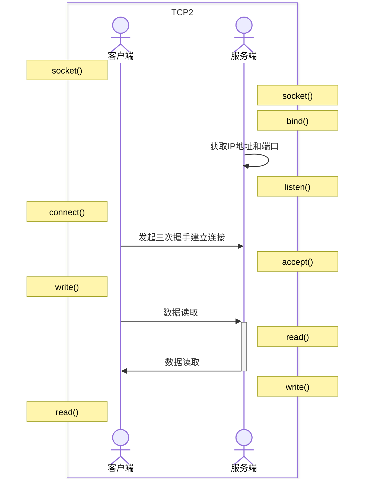
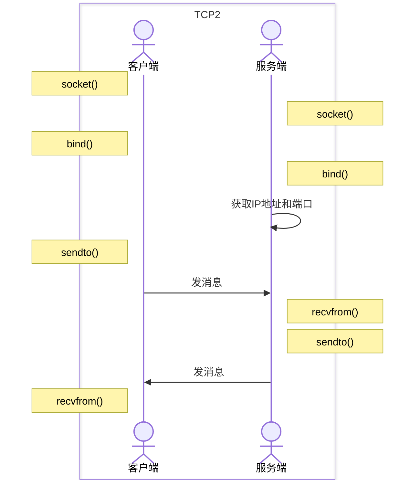

# 套接字Socket 

服务端和客户端都需要 Socket 来建立连接。Socket 可以理解为一个通用的组件库。
Socket 库是一种用于网络编程的编程接口，提供了一组函数和类，用于在计算机网络上数据通信。
Socket 通常使用 IP 地址和端口号来标识通信的两端，它们一起构成了网络通信的基础。

### 常见的套接字类型

在创建 socket 的时候通常需要指定 socket 的类型，一般有三种：
* `SOCK_STREAM`：面向连接的稳定通信，底层是 TCP 协议。
* `SOCK_DGRAM`：无连接的通信，底层是 UDP 协议，需要上层的协议来保证可靠性。
* `SOCK_RAW`：更加灵活的数据控制，可以接受指定 IP 头部。

在网络编程中，Socket 可以被看作是两个程序（通常运行在不同计算机上）之间通信链路的一个端点。这种通信可以是基于不同类型的协议，例如 TCP（传输控制协议）或 UDP（用户数据报协议）。

使用套接字建立连接，用 IP 地址和端口号来区分多个同时连接的套接字。
* 客户端 IP 地址
* 客户端端口号
* 服务端 IP 地址
* 服务端端口号

## Socket连接流程

### 基于 TCP 的套接字调用

TCP Sockets 是基于连接的，这意味着在数据传输开始之前，必须首先建立一个连接。TCP 提供了一种可靠的数据流服务，确保无差错、不重复且按顺序交付数据报文。这种 Socket 类型是面向连接的，因此它们在通信之前要经过三次握手过程建立连接。


![[TCP的Socket.png]]

#### 基于 TCP 建立连接的过程

1. 服务端初始化一个主动 Socket(`Active Socket`)，然后与 IP 地址和端口绑定(`bind`)；
2. 服务端对端口进行监听(`listen`)，开始监听客户端的连接请求，调用 `accept`
	* 调用 `listen` 后，主动 Socket 会变成监听 Socket.
3. 服务端监听过程中，客户端就可以初始化 Socket，然后调用(`connect`)连接服务端；
4. 客户端在 `connect` 中指定 IP 地址和端口号，开始建立三次握手的连接；
5. 通过三次握手建立成功的连接，连接成功后服务端的 `accept` 函数会返回另一个 socket；
	* 服务端会从已完成的连接里找到并返回（`Connected Socket`）
	* 如果调用`accept`没有获取到成功连接的 Socket，那么就会一直阻塞，直到客户端连接；
6. 客户端发送数据请求，服务器端接收请求并处理请求；
	* 双方通过 `read` 和 `write` 函数来读写数据，就像写入文件流一样；
7. 把回应数据发送给客户端，客户端读取数据，最后关闭连接，一次交互结束。



在建立连接的过程中，其实有两个 Socket，一个是监听的 Socket，一个是已连接 Socket。
内核中，会分别维护两个队列，一个是已经成功建立连接的 Socket（三次握手完成），处于 `established` 的状态，另一个是未完成三次握手的，处于 `syn_rcvd` 的状态。

#### TCP 的 Socket 就是文件流

在内核中，Socket是一个文件，对应就有文件描述符。每一个进程都有一个数据结构 `task_struct`，里面指向一个文件描述符数组，来列出这个进程打开的所有文件的文件描述符。
文件描述符是一个整数，是这个数组的下标。

这个结构里主要是两个队列，一个是发送队列，一个是接收队列。队列里保存的是缓存 `sk_buff`.
缓存里有完整的数据包的结构。

![[Socket队列.png]]

### 基于 UDP 的套接字调用

相对于 TCP，UDP Sockets 是无连接的，它们发送的数据报文可能会丢失或是无序到达。UDP 不保证通信的可靠性，但由于没有建立连接的开销，它通常提供更快的数据传输速度。UDP 常用于广播通信或实时应用，例如视频会议或在线游戏，这些应用对速度要求高，可以容忍一定程度的数据丢失。

UDP 面向无连接，所以不需要三次握手，也就是不需要调用 `listen` 和  `connect` 函数来连接，但还是需要 bind 函数来绑定 IP 地址和端口号。而且也不需要每对连接都建立一组 socket，只要有一个 socket，就可以和多个客户端通信。

![[UDP的Socket.png]]



## Socket编程

Socket 编程是指编写程序以创建 **Sockets** 并通过它们进行通信。*注意这里其实是多个 Socket。*

Socket 库支持多种编程语言，包括 Python 、C、C++等。在 Python 中，有一个内置的 `Socket` 模块，可以直接使用，进行网络编程。例如在 Python 中使用 `socket` 库；在 C/C++ 中使用 `POSIX Sockets`，或者在 JavaScript 的 Node.js 环境中使用 `net` 模块。

在典型的客户端-服务器模型中，服务器会在特定端口上监听连接请求，等待客户端发起连接。一旦连接建立，客户端和服务器就可以通过 Socket 发送和接收数据。

### Nodejs实践

下面是在 Nodejs 中使用 socket 模块。[**net**](https://nodejs.org/api/net.html)
在 Node.js 中，你可以使用内置的 `net` 模块来操作 TCP sockets，以及 `dgram` 模块来处理 UDP sockets。以下是如何使用 Node.js 的 `net` 模块创建一个简单的 TCP 服务器和客户端的例子。

#### 创建 TCP 服务端

```javascript
const net = require('net');

// 创建服务器
const server = net.createServer((socket) => {
  console.log('客户端已连接');

  // 接收来自客户端的数据
  socket.on('data', (data) => {
    console.log('收到客户端数据:', data.toString());
  });

  // 客户端断开连接的事件
  socket.on('end', () => {
    console.log('客户端已断开连接');
  });

  // 发送数据到客户端
  socket.write('你好，来自服务器的问候!\n');
});

// 监听 3000 端口
server.listen(3000, () => {
  console.log('服务器正在监听端口 3000');
});
```

在上述代码中，我们首先导入 `net` 模块，然后调用 `net.createServer` 方法创建一个 TCP 服务器。该方法接收一个回调函数，该函数在每次有新的客户端连接时调用，并传入一个 `socket` 对象，代表与客户端的连接。

服务器通过调用 `listen` 方法并指定一个端口来开始监听网络连接。

#### 创建 TCP 客户端

```javascript
const net = require('net');

// 创建一个 socket（客户端）
const client = net.createConnection({ port: 3000 }, () => {
  console.log('已连接到服务器');
  client.write('你好，这是客户端!');
});

// 接收来自服务器的数据
client.on('data', (data) => {
  console.log(data.toString());
  client.end(); // 断开与服务器的连接
});

// 监听断开连接事件
client.on('end', () => {
  console.log('已从服务器断开');
});
```

以上就是用 Node.js 的 `net` 模块创建基本的 TCP 服务器和客户端的例子。如果需要使用 UDP，可以查看 `dgram` 模块的文档以获取如何创建和操作 UDP sockets 的信息。[**dgram**](https://nodejs.org/api/dgram.html)

Nodejs 的 `net` 模块提供的 TCP 网络 API 是专门针对流式套接字的，因此调用 `net.createConnection` 或 `net.Socket()` 创建一个新的套接字实例时，默认情况下就是一个 TCP 套接字，而不用显式指定套接字类型来创建。
其他的一些语言的网络语会需要在调用时指定类型，比如 Python。

### Python实践

python 的 socket 库需要制定 socket.AF_INET 和 `socket.SOCK_STREAM` 来创建一个 IPv4 的套接字。

#### 创建 TCP 服务端

```python
import socket

def tcp_server():
  # 创建 socket 对象
  serversocket = socket.socket(socket.AF_INET, socket.SOCK_STREAM)

  # 获取本地主机名
  host = socket.gethostname()
  port = 9999

  # 绑定端口号
  serversocket.bind((host, port))

  # 设置最大连接数，超过后排队
  serversocket.listen(5)

  while True:
    # 建立客户端连接
    clientsocket, addr = serversocket.accept()
    print(f"连接地址：{str(addr)}")

    msg = '欢迎访问TCP服务器！' + "\r\n"
    clientsocket.send(msg.encode('utf-8'))
    clientsocket.close()

if __name__ == '__main__':
  tcp_server()
```

在 Python 示例中，服务器创建了一个*无限循环*，这是因为 TCP 服务器的典型行为是持续运行并等待客户端的连接请求。服务器需要在一个无限循环中运行，以便它可以不断地接受新的连接，处理客户端发送的数据，然后等待更多的连接。

如果没有这个无限循环，服务器将接受一个客户端连接，处理完成后就会退出，这意味着它不会再继续等待其他客户端连接。而在实际的服务器应用中，我们通常会希望服务器能持续服务多个客户端，而不是服务一个后就停止运行。

一个无限循环确保了 TCP 服务器可以像守护进程一样运行，永远地等待并处理客户端的连接请求。当然，在实际部署中，服务器通常会加入逻辑来优雅地处理关闭请求，以及错误处理和资源管理，以确保服务器稳定运行。

#### 创建 UDP 服务端

创建文件 `udp_server.py `

```python
import socket
s = socket.socket(socket.AF_INET, socket.SOCK_DGRAM)
# 绑定端口:
s.bind(('127.0.0.1', 9999))

print('Bind UDP on 9999...')
while True:
    # 接收数据:
    data, addr = s.recvfrom(1024)
    print('Received from %s:%s.' % addr)
    s.sendto(b'Hello, %s!' % data, addr)
```
#### 创建 UDP 客户端

创建文件 `udp_client.py `

```python
import socket
s = socket.socket(socket.AF_INET, socket.SOCK_DGRAM)
for data in [b'Michael', b'Tracy', b'Sarah']:
    # 发送数据:
    s.sendto(data, ('127.0.0.1', 9999))
    # 接收数据:
    print(s.recv(1024).decode('utf-8'))
s.close()
```

分别运行 `python udp_server.py` `python udp_client.py`. 可以得到以下日志：

```shell
Bind UDP on 9999...
Received from 127.0.0.1:56796.
Received from 127.0.0.1:56796.
Received from 127.0.0.1:56796.
```

```shell
Hello, Michael!
Hello, Tracy!
Hello, Sarah!
```