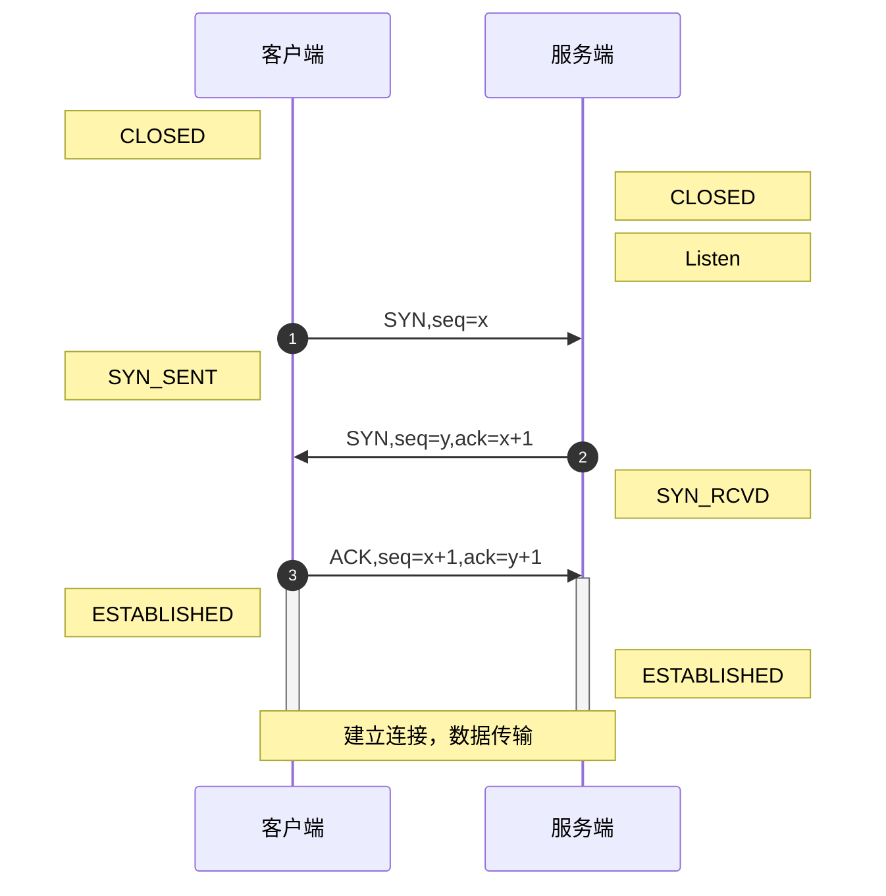
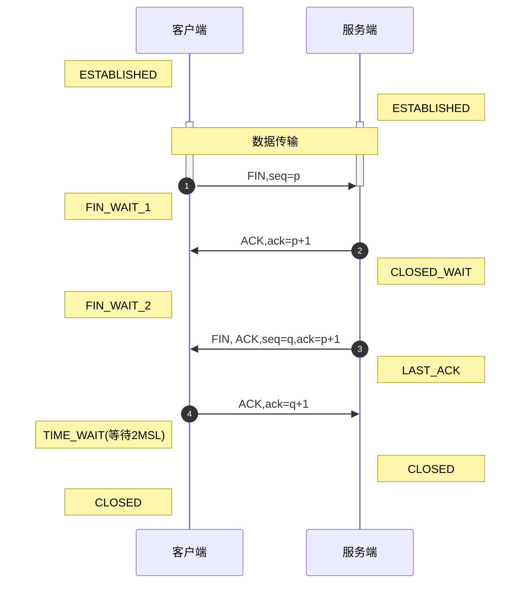

# TCP

TCP 设计的初衷，是为了应对真实网络世界中的各种复杂情况。例如拥塞、丢包、乱序、重传，从而需要有一种协议在算法层面保证可靠性。

## TCP 包头格式

![[./TCP包头格式.png]]

### 端口号

TCP 包头的格式包括两个端口号，源端口号和目标端口号。它们用来区分收发的应用。
和 UDP 相同。

### 序号

**序号和确认序号。**
接下来的是包的序号，TCP 为了解决乱序的问题，采用给包编号的方式来确认。
确认序号是用于告诉发送方，发出的包是否确认到达。如果一段时间发送方没有收到确认编号，就会重新发送。

### 状态位

**TCP 是面向连接的，因而双方要维护连接的状态，这些带状态位的包的发送，会引起双方的状态变更。**
* SYN 是发起一个连接；
* ACK 是回复；
* RST 是重新连接；
* FIN 是结束连接。

### 窗口大小
 
 TCP 会做流量控制，通信双方各声明一个窗口，标识自己当前的处理能力，通过控制发送的速度来避免发送地过快或过慢。也同样适用于拥塞控制。

#### 流量控制和拥塞控制的区别

>拥塞控制：拥塞控制是作用于网络的，它是防止过多的数据注入到网络中，避免出现网络负载过大的情况；常用的方法就是：
>* 1. 慢开始、拥塞避免
>* 2. 快重传、快恢复。
> 
> 流量控制：流量控制是作用于接收者的，它是控制发送者的发送速度从而使接收者来得及接收，防止分组丢失的。

## TCP 三次握手

TCP 的三次握手可以总结为==请求-应答-应答之应答==。

### 三次握手时序图

![[./三次握手.png]]

### 三次挥手过程

1. 开始时，客户端和服务端都处于 CLOSED 状态。
2. 首先是服务端主动监听某个端口，使其处于 LISTEN 状态。
3. 然后客户端主动发起连接 SYN，使其处于 SYN-SENT 状态。
4. 服务端收到发起的连接，返回 SYN，并且 ACK 客户端的 SYN，之后处于 SYN-RCVD 状态。
5. 客户端收到服务端发送的 SYN 和 ACK 之后，发送 ACK 的 ACK，之后处于 ESTABLISHED 状态，因为它成功完成了一发一收成功。
6. 服务端收到 ACK 的 ACK 之后，处于 ESTABLISHED 状态，因为它也完成了一发一收。

#### 为什么不是二次握手

如果通过二次握手，A 与 B 双方建立连接，此后再断开。但是有可能存在客户端 A 早期发送地建立连接的数据包晚到达的情况，这时服务端 B 处于断开状态，通会过接收到晚到达的数据包重新建立连接，而实际上客户端已经断开连接，此连接是不必要的。
因此需要第三次握手来保证连接的可靠性。

#### 为什么不是四次握手

在三次握手的情况下，已经满足需求，没有必要再浪费资源进行后续的数据包发送。
如果考虑极端场景，再多次数的挥手其实也不能满足需求。

**三次握手，能够保证双端的数据包都有去有回。**

### 三次握手的作用

三次握手除了建立连接之外，还会确认 TCP 包的序号。

TCP 发送的每个包都有序号，如上面分析的数据格式那样。起始序号是按照时间来累计计算的。
TCP 包的序号是每 4 微秒加 1，共 32 位。发到重复项需要四个多小时，通常早就超过了 TTL（包的生存时间），可以满足需求，避免了超时包后到达造成数据紊乱的问题。

## TCP 四次挥手

### 四次挥手时序图

![[./四次挥手.png]]

等待的时间设为 2MSL，MSL 是 Maximum Segment Lifetime，也就是报文最大生存时间，它是任何报文在网络上存在的最长时间，超过这个时间报文将被丢弃。
因为 TCP 报文基于是 IP 协议的，而 IP 头中有一个 TTL 域，是 IP 数据包可以经过的最大路由数，每经过一个处理他的路由器此值就减 1，当此值为 0 则数据报将被丢弃，同时发送 ICMP 报文通知源主机。协议规定 MSL 为 2 分钟，实际应用中常用的是 30 秒，1 分钟和 2 分钟等。

### 四次挥手 Chatgpt 归纳

TCP 的四次挥手指的是在数据传输结束后，客户端和服务端之间关闭连接的过程。其过程如下：
* 客户端发送一个 FIN (FINished) 数据包，表示数据发送完毕，请求关闭连接。
* 服务端收到 FIN 数据包后，发送一个 ACK (ACKnowledgement) 数据包，表示已经收到客户端的请求关闭连接，服务端进入 CLOSE_WAIT 状态。
* 如果服务端还有数据需要发送，会继续发送数据，发送完毕后发送一个 FIN 数据包。
* 客户端收到 FIN 数据包后，发送一个 ACK 数据包，表示已经收到服务端的请求关闭连接，进入 TIME_WAIT 状态。此时客户端进入等待状态，等待可能出现的延迟数据包，保证数据传输的完整性。服务端收到 ACK 数据包后，进入 CLOSED 状态，关闭连接。

**TCP 设计成四次挥手是为了确保数据传输的完整性和正确性。**
由于 TCP 传输的数据是有序的，因此需要在关闭连接之前保证所有数据都被传输完毕。在客户端发送 FIN 数据包后，服务端需要确认已经收到了请求关闭连接的信号，因此需要发送一个 ACK 数据包。但是服务端发送 ACK 数据包后，可能还存在未传输完毕的数据，因此需要等待数据传输完毕后，服务端再发送 FIN 数据包。客户端收到 FIN 数据包后，也需要发送一个 ACK 数据包来确认已经收到了请求关闭连接的信号，并进入 TIME_WAIT 状态等待延迟数据包，保证数据传输的完整性。最后，服务端收到 ACK 数据包后直接关闭连接。这样设计可以保证数据传输的完整性和正确性，防止数据丢失或错误。

## TCP 状态机

![[./状态机.png]]

## TCP 的算法和策略 TODO

### 顺序问题与丢包问题

#### 确认与重发的机制

第一种方法是**超时重试**，其中一种算法就是**自适应重传算法**。
* 每当遇到一次超时重传的时候，都会将下一次超时时间间隔设为先前值的两倍。两次超时，就说明网络环境差，不宜频繁反复发送。

第二种方式称为 `Selective Acknowledgment`(SACK)。这种方式需要在 TCP 头里加一个 SACK，可以将缓存的地图发送给发送方。例如可以发送 ACK6、SACK8、SACK9，有了地图，发送方一下子就能看出来是 7 丢了。

### 流量控制问题

![[./流量控制1.png]]

![[流量控制2.png]]

![[流量控制3.png]]

![[流量控制4.png]]

![[流量控制5.png]]

![[流量控制6.png]]

![[流量控制7.png]]

### 拥塞控制问题

**通道的容量 = 带宽 × 往返延迟**

![[拥塞控制1.png]]

控制拥塞速度和滑动窗口的速度的公式：
* *`LastByteSent - LastByteAcked <= min {cwnd, rwnd}`