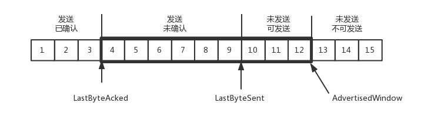

# TCP

TCP 设计的初衷，是为了应对真实网络世界中的各种复杂情况：例如拥塞、丢包、乱序、重传，从而需要有一种协议在算法层面保证可靠性。

## 一、TCP 包头格式

### 1. 包图

#### 1.1 比特单位

#### 1.2 字节单位

#### 1.3 框架图

### 1.2 端口号

**TCP 包头的格式包括两个端口号，源端口号和目标端口号。它们用来区分收发的应用。**
这俩个字段和 UDP 相同。

### 1.3 序号

**序号和确认序号。**
接下来的是包的序号，TCP 为了解决乱序的问题，采用给包编号的方式来确认。
确认序号是用于告诉发送方，发出的包是否确认到达。如果一段时间发送方没有收到确认编号，就会重新发送。

### 1.4 状态位

**TCP 是面向连接的，因而双方要维护连接的状态，这些带状态位的包的发送，会引起双方的状态变更。**
* **`URG` 是紧急标志位，说明紧急指针有效；**
* **`PSH`：推标志位，置位时表示接收方应立即请求将报文交给应用层；**
* **`SYN` 同步标志位，是发起一个连接，仅在三次握手建立连接时生效；**
* **`ACK` 是回复，说明确认序号有效；**
* **`RST` 是重新连接，用于重建一个混乱的连接；**
* **`FIN` 是结束连接，结束一个 TCP 会话。**

### 1.5 窗口大小
 
 TCP 会做流量控制，通信双方各声明一个窗口，标识自己当前的处理能力，通过控制发送的速度来避免发送地过快或过慢。也同样适用于拥塞控制。

#### 1.5.1 流量控制和拥塞控制的区别

> 拥塞控制：拥塞控制是作用于网络的，它是防止过多的数据注入到网络中，避免出现网络负载过大的情况；常用的方法就是：
> * 1. 慢开始、拥塞避免；
> * 2. 快重传、快恢复。
> 
> 流量控制：流量控制是作用于接收者的，它是控制发送者的发送速度从而使接收者来得及接收，防止分组丢失的。

## 二、TCP 的三次握手

TCP 的三次握手可以总结为==请求-应答-应答之应答==。

### 1. 三次握手时序图

### 2. 三次挥手过程

1. 开始时，客户端和服务端都处于 `CLOSED` 状态。
2. 首先是服务端主动监听某个端口，使其处于 `LISTEN` 状态。
3. 然后客户端主动发起连接 `SYN`，使其处于 `SYN-SENT` 状态。
4. 服务端收到发起的连接，返回 `SYN`，并且 `ACK` 客户端的 `SYN`，之后处于 `SYN-RCVD` 状态。
5. 客户端收到服务端发送的 `SYN` 和 `ACK` 之后，发送 `ACK` 的 `ACK`，之后处于 `ESTABLISHED` 状态，因为它成功完成了一发一收。
6. 服务端收到 `ACK` 的 `ACK` 之后，处于 `ESTABLISHED` 状态，因为它也完成了一发一收。

#### 2.1 为什么不是二次握手

需要保证数据连接的可靠性
* 如果通过二次握手，A 与 B 双方建立连接，此后再断开。但是有可能存在客户端 A 早期发送地建立连接的数据包晚到达的情况，这时服务端 B 处于断开状态，会通过接收到晚到达的数据包重新建立连接，而实际上客户端已经断开连接，此连接是不必要的。

因此需要第三次握手来保证连接的可靠性。

#### 2.2 为什么不是四次握手

在三次握手的情况下，已经满足需求，没有必要再浪费资源进行后续的数据包发送。
如果考虑极端场景，再多次数的挥手其实也不能满足需求。

**三次握手，能够保证双端的数据包都有去有回。**

### 3. 三次握手的作用

三次握手除了建立连接之外，还会确认 TCP 包的序号。

TCP 发送的每个包都有序号，如上面分析的数据格式那样。起始序号是按照时间来累计计算的。
TCP 包的序号是每 4 微秒加 1，共 32 位。发到重复项需要四个多小时，通常早就超过了 TTL（包的生存时间），可以满足需求，避免了超时包后到达造成数据紊乱的问题。

## 三、TCP 的四次挥手

### 1. 四次挥手时序图

等待的时间设为 2MSL，MSL 是 `Maximum Segment Lifetime`，也就是报文最大生存时间，它是任何报文在网络上存在的最长时间，超过这个时间报文将被丢弃。
因为 TCP 报文基于是 IP 协议的，而 IP 头中有一个 TTL 域，是 IP 数据包可以经过的最大路由数，每经过一个处理他的路由器此值就减 1，当此值为 0 则数据报将被丢弃，同时发送 ICMP 报文通知源主机。协议规定 MSL 为 2 分钟，实际应用中常用的是 30 秒，1 分钟和 2 分钟等。

### 2. 四次挥手 Chatgpt 归纳

TCP 的四次挥手指的是在数据传输结束后，客户端和服务端之间关闭连接的过程。其过程如下：
* 客户端发送一个 `FIN` (`FINished`) 数据包，表示数据发送完毕，请求关闭连接。
* 服务端收到 `FIN` 数据包后，发送一个 `ACK` (`ACKnowledgement`) 数据包，表示已经收到客户端的请求关闭连接，服务端进入 `CLOSE_WAIT` 状态。
* 如果服务端还有数据需要发送，会继续发送数据，发送完毕后发送一个 `FIN` 数据包。
* 客户端收到 `FIN` 数据包后，发送一个 `ACK` 数据包，表示已经收到服务端的请求关闭连接，进入 `TIME_WAIT` 状态。此时客户端进入等待状态，等待可能出现的延迟数据包，保证数据传输的完整性。服务端收到 ACK 数据包后，进入 `CLOSED` 状态，关闭连接。

**TCP 设计成四次挥手是为了确保数据传输的完整性和正确性。**

由于 TCP 传输的数据是有序的，因此需要在关闭连接之前保证所有数据都被传输完毕。在客户端发送 FIN 数据包后，服务端需要确认已经收到了请求关闭连接的信号，因此需要发送一个 ACK 数据包。但是服务端发送 ACK 数据包后，可能还存在未传输完毕的数据，因此需要等待数据传输完毕后，服务端再发送 FIN 数据包。客户端收到 FIN 数据包后，也需要发送一个 ACK 数据包来确认已经收到了请求关闭连接的信号，并进入 TIME_WAIT 状态等待延迟的数据包，来保证数据传输的完整性。最后，服务端收到 ACK 数据包后直接关闭连接。这样设计可以保证数据传输的完整性和正确性，防止数据丢失或错误。

## 四、TCP 状态机

## 五、TCP 的算法和策略

### 1. 如何实现靠谱的协议

为了保证顺序性，每一个包都有一个 ID。在两端建立连接的时候，会先商定起始的 ID，再按顺序发送。而且为了保证不丢包，对于发送的包都要应答，应答特定 ID 的包，表示收到。
这种模式称为**累计确认**或**累计应答**。

为了记录所有发送的包和接收的包，TCP 需要发送端和接收端有缓存来保存这些记录。
发送端的缓存是按照包的 ID 一个个排列，根据处理的情况分成以下四部分：
* 第一部分：发送了并且已经确认的。
* 第二部分：发送了还未确认的。
* 第三部分：没有发送，正在等待发送的。
* 第四部分：没有发送，而且暂时不会发送的。

#### 1.1 滑动窗口（rwnd）

在 TCP 里，接收端会给发送端报一个窗口的大小，叫滑动窗口 (`Advertised window`)，表示接收端能处理的数据的大小。
**这个窗口的大小等于上面的第二部分和第三部分：已发送未反馈，准备发送但未发送的数据。**
超过这个大小，接收端就无法处理。

##### 1.1.1 发送端数据结构

**发送端发送的数据结构如下：**

* `LastByteAcked`：第一部分和第二部分的分界线
* `LastByteSent`：第二部分和第三部分的分界线
* `LastByteAcked + AdvertisedWindow`：第三部分和第四部分的分界线

###### 包图

以包图为例，滑动窗口指的是上述 `3-11` 间的数据。图里面 `4-12` 的数据。

##### 1.1.2 接收端数据结构

接收端缓存里的内容相对简单一些：
* 第一部分：接受并且确认过的。
* 第二部分：还没接收，但是马上就能接收的。
* 第三部分：还没接收，也没法接收的。

接收端的数据结构如下：

* `MaxRcvBuffer`：最大缓存的量；
* `LastByteRead` 之后是已经接收了，但是还没被应用层读取的；
* `NextByteExpected` 是第一部分和第二部分的分界线。

`NextByteExpected` 和 `LastByteRead` 的差其实是还没被应用层读取的部分占用掉的 `MaxRcvBuffer`的量，我们定义为 `A`。
`AdvertisedWindow` 其实是 `MaxRcvBuffer` 减去 `A`。
也就是：==`AdvertisedWindow=MaxRcvBuffer-((NextByteExpected-1)-LastByteRead)`==。
* 观察图里的结果，`6-14`的这部分，滑动窗口大小是 **9**.
* 通过计算得到的结果：`14-((6-1)-0)=10` 结果是 **9**.
	* 这里的 `NextByteExpected` 应该是 6.

###### 包图

### 2. 顺序问题与丢包问题

#### 2.1 确认与重发的机制

##### 2.1.1 超时重试

第一种方法是**超时重试**，其中一种算法就是**自适应重传算法**。
* **每当遇到一次超时重传的时候，都会将下一次超时时间间隔设为先前值的两倍。** 两次超时，就说明网络环境差，不宜频繁反复发送。

###### 自适应重传算法

对每一个已经发送，但没有收到 `ACK` 的包，都有一个定时器（超时时间），超过这个时间，就会重新尝试发送。

如何计算这个超时时间?
* 超时的时间不能过短，必须大于往返的时间 rtt，否则会有不必要的重传；
* 超时的时间不能太长，超时时间太长，访问会变慢（每个包的时间很长才会报错）。

估计超时时间，通过 TCP 采样 RTT 的时间，进行加权平均，得到一个基准值；同时这个值也在不停变化，因为网络状态是不停变化的。
采样 RTT 之外，同时采样 RTT 的波动范围，计算出一个估计的超时时间。

**超时的重传时间是动态变化的，所以称为自适应重传算法(`Adaptive Retransmission Algorithm`）。**

##### 2.1.2 SACK

第二种方式称为 `Selective Acknowledgment`(SACK)。这种方式需要在 TCP 头里加一个 SACK，可以将缓存的地图发送给发送方。例如可以发送 `ACK6`、`SACK8`、`SACK9`，有了地图，发送方一下子就能看出来是 7 丢了。

### 3. 流量控制问题

发送端发送的每一个数据包，服务端都要给一个确认包（`ACK`），确认它已经收到。 服务端给发送端发送的确认包（`ACK包`）中，会携带一个窗口的大小。 这个窗口的大小就代表目前服务器端的处理能力。
* **接收端最大缓存量-接收已确认但还未被应用层读取的部分**。

而这个窗口的大小也是时刻在变化的。

#### 3.1 常规场景

假设窗口不变，当前始终为 **9**。当包 4 到达的时候，可以右移一位，包 13 也可以准备发送。

假设发送端发送过猛，把包 10、11、12、13 都一起发送完毕，这时未发送可发送的部分就为 0.

这时，只有包 5 确认到达，窗口才可以右移一位，也就是包 14 才可以准备发送。

如果接收方实在处理的太慢，导致缓存中没有空间了，可以通过确认信息修改窗口的大小，甚至可以设置为 0，则发送方将暂时停止发送。

#### 3.2 接收端无法读取缓存数据的场景

另一种极端情况，则是接收端一直不读取缓存中的包数据，当数据包 6 确认后，窗口的大小就不能再是 9 了，要缩小成 8.

新的窗口会在 6 确认到达的时候，不再发生右移，只让左边位置移动，因此窗口实际就是减少成 8.

如果接收端还是一直不处理消息，那么窗口大小就会不断减少，直到变成 0.

当这个窗口通过包 14 的确认到达发送端的时候，发送端的窗口也调整为 0，停止发送。

如果是这样，发送方会定时发送窗口探测数据包，观察是否有机会调整窗口的大小。当接收方比较慢的时候，要防止低能窗口综合症，不能空出一个字节来就赶快告诉发送方，然后马上又填满。可以在窗口太小的时候，不更新窗口，直到达到一定大小，或者缓冲区一半为空，才更新窗口。
这就是流量控制的策略。

### 4. 拥塞控制问题

拥塞控制的问题，也是通过窗口的大小来控制的，前面的滑动窗口 rwnd 是怕发送方把**接收方缓存**塞满，而拥塞窗口 cwnd，是怕把**网络**塞满。

#### 4.1 拥塞窗口（cwnd）

TCP 发送方维护的一个变量，表示发送方一次要发送多少字节的数据。

控制拥塞速度和滑动窗口的速度的公式：
* **`LastByteSent - LastByteAcked <= min {cwnd, rwnd}`**

**通道的容量 = 带宽 × 往返延迟**

如果我们设置发送窗口，使得发送但未确认的包为为通道的容量，就能够撑满整个管道。

##### 4.1.1 包丢失和超时重传

TCP 的拥塞控制主要来避免两种现象，包丢失和超时重传。
拥塞的一种表现形式是丢包，需要超时重传。因此需要发送方控制发送速度。
发送方计算发送速度也需要相应的策略，这就有**快速重传算法**。

TCP 建立连接时，窗口大小是呈指数增长。
* 初始时 cwnd 设置为一个报文段，一次只发送一个，`cwnd = 1`。
* 当收到确认的时候，cwnd 加 1，这时可以发送 2 个，当 2 个收到确认的时候，每个确认的 cwnd 加 1，于是可以一次发送 4 个，4 个发送之后，收到确认变成 8 个，这就是指数性增长。
* 最大值 `ssthresh` 为 `65535` 个字节，超过这个数，发送速度就会慢下来。
* 超过 `65535`, 就会变成线性增长，每次只增加 `1/cwnd`.

传统的算法是在发现丢包的时候，直接把发送速度降为 1：
* `sshthresh = cwnd / 2`
* `cwnd = 1`，设为 1 之后重新开始慢启动，从高速的网络一下子降下来，会造成网络卡顿；
* 如下图蓝线所示

快速重传算法是在发现丢包时，把速度降为当前速度的 `1/2 + 3`，3 是示意，真实值不一定是这个数字。
* `cwnd = cwnd / 2`, TCP 认为丢包不严重，可以先降为一半，而不是到初始值；
* `sshthresh = cwnd`
* `cwnd = sshthresh + 3`，还停留在比较高的值，而且线性增长
* 如下图橙线所示

##### 4.1.2 BBR 算法

TCP 的拥塞控制仍然会遇到两个问题：
* 丢包并不一定是通道满了，可能是网络本身就会丢包，例如在带宽不满的情况下丢包；
* 拥塞控制通常都是等到中间设备都填充满了，才会丢包，再降低速度。这时的处理其实已经较晚，应该在通道满的时候就进行处理，而不是通道和缓存都满了才进行处理。

为了应对上述两个问题，出现了 TCP BBR 拥塞算法。该算法试图找到一个平衡点，就是通过不断地加快发送速度，将管道填满，但是不要填满中间设备的缓存，因为这样时延会增加。
在这个平衡点，可以很好的达到高带宽和低时延的平衡。

