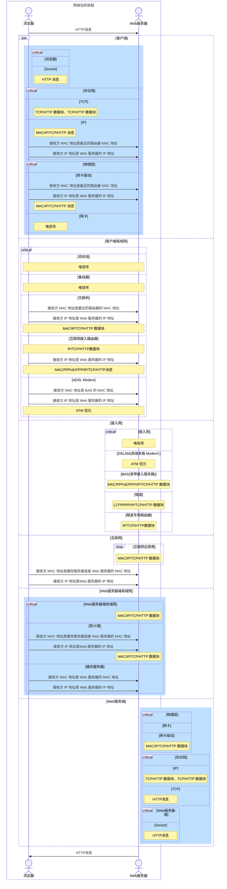

预计收听 1-23 讲

## 引子

结合实际的应用场景来理解网络协议；
在大型应用中，掌握了网络协议就解开了一半的问题。

### 《网络是怎样连接的》时序图

```mermaid
sequenceDiagram
  box 网络包的旅程
  actor 浏览器
  actor Web服务器
  end

  %% 用户输入网址
  浏览器->>Web服务器: HTTP消息
  par 客户端
  rect rgb(191, 223, 255)
  critical
  option 浏览器
  %% 浏览器解析网址，生成 HTTP消息然后转交给Socket库
  option Socket
  %% Socket 库把收到的 HTTP 消息作为数据转交给协议栈
  note right of 浏览器: HTTP 消息
  end
  critical 协议栈
	 option TCP
	 %% TCP 按照网络包的长度对数据进行拆分，在每个包前面加上 TCP 头部然后转交给 IP
	 note right of 浏览器: TCP/HTTP 数据块、TCP/HTTP 数据块
	 option IP
	 %% IP 在 TCP 包前面加上 IP 头部，然后查询 MAC 地址并加上 MAC 头部，然后把包交给网卡驱动
	 note right of 浏览器: MAC/IP/TCP/HTTP 消息
	 浏览器->>Web服务器: 接收方 MAC 地址是最近的路由器 MAC 地址
	 浏览器->>Web服务器: 接收方 IP 地址是 Web 服务器的 IP 地址
    end
  
  critical 物理层
	 option 网卡驱动
	 %% 网卡驱动收到 IP 发来的数据包，转交给网卡并且发出指令
	 浏览器->>Web服务器: 接收方 MAC 地址是最近的路由器 MAC 地址
	 浏览器->>Web服务器: 接收方 IP 地址是 Web 服务器的 IP 地址
	 note right of 浏览器: MAC/IP/TCP/HTTP 消息
	 option 网卡
	 %% 网卡检查以太网的可发送状态，把包转成电信号通过双绞线发送出去
	 note right of 浏览器: 电信号
    end
  end
  and 客户端局域网
	  critical 
		 option 双绞线
		 %% 信号通过双绞线到达集线器
		 note over 浏览器,Web服务器: 电信号
		 option 集线器
		 %% 集线器把信号广播到所有端口，信号到达交换机
		 note over 浏览器,Web服务器: 电信号
		 option 交换机
		 %% 交换机根据收到的包的接收方 MAC 地址查询自身的地址表找到输出端口，然后把包转发到输出端口
		 浏览器->>Web服务器: 接收方 MAC 地址是最近的路由器的 MAC 地址
		 浏览器->>Web服务器: 接收方 IP 地址是 Web 服务器的 IP 地址
		 note over 浏览器,Web服务器: MAC/IP/TCP/HTTP 数据块
		 option 互联网接入路由器
		 note over 浏览器,Web服务器: IP/TCP/HTTP数据块
		 %% 互联网接入路由器根据收到的包的接收方 IP 地址查询自身的路由表找到输出端口，然后把包转发到输出端口
		 浏览器->>Web服务器: 接收方 IP 地址是 Web 服务器的 IP 地址
		 note over 浏览器,Web服务器: MAC/PPPoE/PPP/IP/TCP/HTTP消息
		 option ADSL Modem
		 %% 互联网接入路由器输出到互联网的包带有 PPPoE 头部和 PPP 头部
		 浏览器->>Web服务器: 接收方 MAC 地址是 BAS 的 MAC 地址
		 浏览器->>Web服务器: 接收方 IP 地址是 Web 服务器的 IP 地址
		 %% ADSL Modem 把收到的包拆分成 ATM 信元
		 note over 浏览器,Web服务器: ATM 信元
		 %% ADSL Modem 把拆分后的 ATM 信元转成电信号通过电话线发送出去
	    end
  and 接入网
	  critical 接入网
	    %% ADSL Modem 发送的信号通过电线杆上的电话线到达电话局的 DSLAM
		 note over Web服务器: 电信号
		 option DSLAM(局端多路 Modem）
		 %% DSLAM 把收到的电信号还原成 ATM 信元再发送给 BAS
		 note over Web服务器: ATM 信元
		 option BAS(宽带接入服务器)
		 %% BAS 把 ATM 信元还原成网络包，根据接收方 IP 地址进行转发
		 note over Web服务器: MAC/PPPoE/PPP/IP/TCP/HTTP 数据块
		 option 隧道
		 %% BAS 转发的包加上 L2TP 头部再通过隧道
		 note over Web服务器: L2TP/PPP/IP/TCP/HTTP 数据块
		 option 隧道专用路由器
		 %% 网络包到达隧道出口的隧道路由器，L2TP 头部和 PPP 头部被丢弃，通过互联网流向 Web 服务器
		 note over Web服务器: IP/TCP/HTTP数据块
	    end
  and 互联网
	  loop 互联网运营商
		 %% 服务器端的局域网中有防火墙，对进入的包进行检查，判断是否允许通过
		 note over Web服务器: MAC/IP/TCP/HTTP 数据块
		 end
	  浏览器->>Web服务器: 接收方 MAC 地址是缓存服务器或者 Web 服务器的 MAC 地址
	  浏览器->>Web服务器: 接收方 IP 地址是Web 服务器的 IP 地址
  and Web服务器端局域网
	  rect rgb(191, 223, 255)
	  critical Web服务器端局域网
		 note over Web服务器: MAC/IP/TCP/HTTP 数据块
		 option 防火墙
		 %% Web 服务器前面如有有缓存服务器，会拦截通过防火墙的包；如果用户请求的页面已经缓存在服务器上，就代替服务器向用户返回页面数据
		 浏览器->>Web服务器: 接收方 MAC 地址是缓存服务器或者 Web 服务器的 MAC 地址
	    浏览器->>Web服务器: 接收方 IP 地址是Web 服务器的 IP 地址
		 note over Web服务器: MAC/IP/TCP/HTTP 数据块
		 option 缓存服务器
		 %% 如果请求的页面没有被缓存，缓存服务器会把请求转发给 Web 服务器
		 浏览器->>Web服务器: 接收方 MAC 地址是 Web 服务器的 MAC 地址
	    浏览器->>Web服务器: 接收方 IP 地址是 Web 服务器的 IP 地址
	    end
	  end
  and Web服务端
	  rect rgb(191, 223, 255)
	  critical 物理层
		 option 网卡
		 option 网卡驱动
		 %% Web服务器收到包后，网卡和网卡驱动会接收这个包然后转交给协议栈
		 note right of Web服务器: MAC/IP/TCP/HTTP 数据块
	  end
	  critical 协议栈
		  option IP
		  %% 协议栈依次检查 IP 头部和 TCP 头部，如果没有问题就取出 HTTP 消息的数据块进行组装
		  note right of Web服务器: TCP/HTTP 数据块、TCP/HTTP 数据块
		  option TCP
		  note right of Web服务器: HTTP消息
	  end
	  critical Web服务器端
		 %% HTTP 消息恢复成原始形态，然后通过 Socket 转交给 Web 服务器
		 option Socket
		 %% Web 服务器分析 HTTP 消息的内容，然后根据请求内容把读取的数据返回给客户端
		 note right of Web服务器: HTTP消息
	  end
	  end
  end  
  Web服务器->>浏览器: HTTP消息
```
