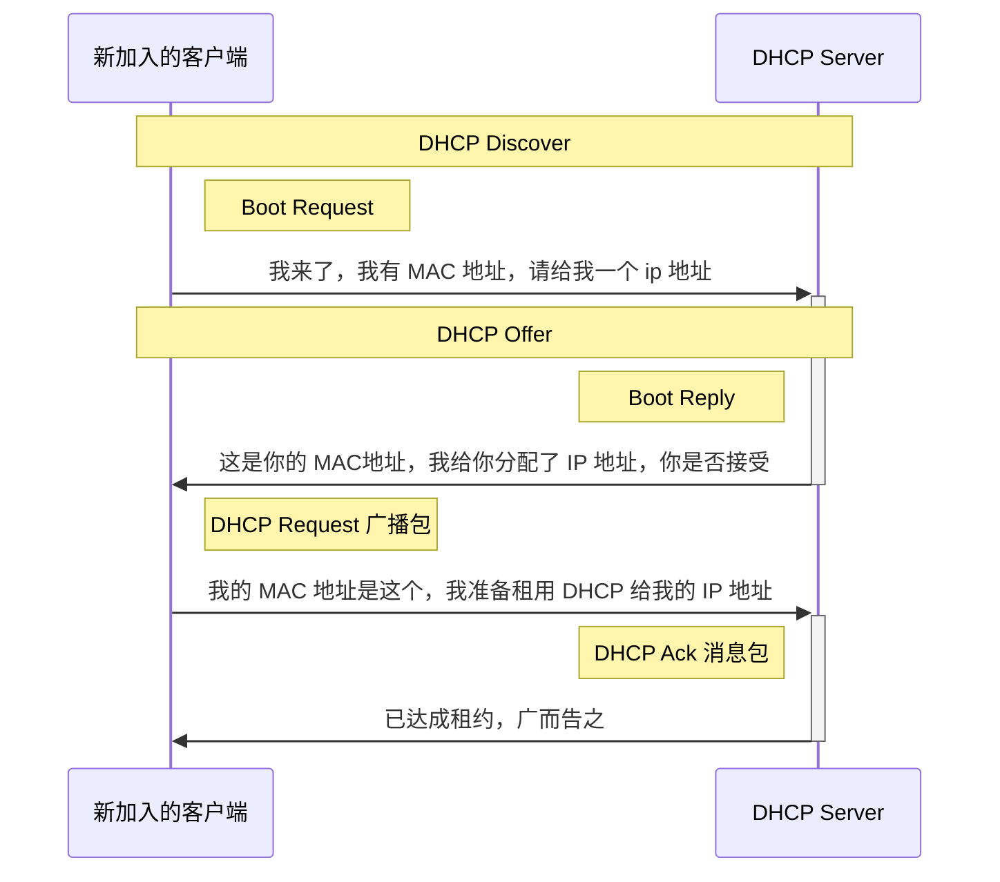
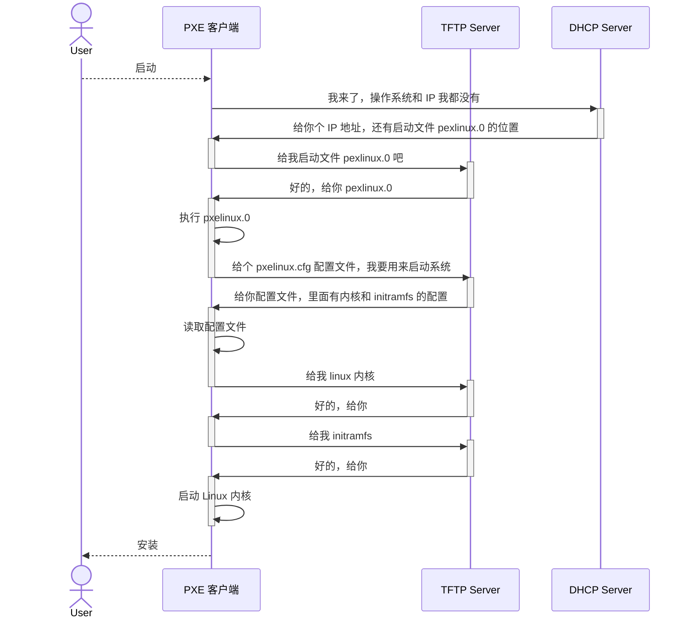

## DHCP 与 PXE

### 如何正确配置  IP 地址

**正确配置 IP 地址，配置的内容包括 CIDR、子网掩码、广播地址和网关地址。**

#### 手动配置 IP 地址的方式

在 linux 上有两种方式可以手动配置 IP 地址，通过 `ifconfig` 配置或者通过 `ip addr` 配置。
设置好之后，再用命令把网卡 up 一下，就可以开始工作了。

* 使用  `net-tools`
```shell
$ sudo ifconfig eth1 10.0.0.1/24
$ sudo ifconfig eth1 up
```

* 使用 `iproute2`
```
$ sudo ip addr add 10.0.0.1/24 dev eth1
$ sudo ip link set up eth1
```

#### 跨网段的配置

Linux 默认的逻辑是，如果这是一个跨网段的调用，它便不会直接将包发送到网络上，而是企图将包发送到网关。这和机器的物理地址通常没有关系。
* **在跨网段的调用中，获取目标 ip 的 MAC 地址，需要从源 ip 网关获取所在网关 MAC 地址，然后替换成目标 IP 所在网段的网关的 MAC 地址，最后是目标的 MAC 地址。**
	* 如果没有网关配置，包是发不出去的。
	* 如果网关配置成和当前网络不是一个网段的，那么系统是不会配置成功的。

实际配置的时候，通常不会用命令直接配置，而是会使用配置文件进行配置。
* 不同系统的配置文件的格式不同，但都是包括 CIDR、子网掩码、广播地址和网关地址。

### DHCP(Dynamic Host Configuration Protocol)

#### 为什么会有 DHCP

因为接入网络的客户端是可能移动的，并非一成不变，而同一网段里的网络地址也是有限的，不可能一个客户端配置 ip 后，就一直占据这个地址。如果这个客户端离开网络或者有新的客户端进来（办公人员带着电脑离开或有人入职），固定的手动配置显然不能满足需求。
而且手动进行配置当然是非常繁琐的。

所以就有了**动态主机配置协议(DHCP)**。这个协议可以做到类似房屋租赁的效果。

如果是数据中心里的服务器地址，一般不会搬迁或移动，可以使用手动配置的方式。配置后一直保持不变。

#### DHCP 的工作方式（新机器加入网络的流程）

* 新的机器加入网络后，会使用 ip 地址 `0.0.0.0` 发送一个广播包，目标地址是 `255.255.255.255`
* 广播包封装了 udp，udp 封装了 bootp 协议。

##### DHCP discover
| 各种头   | 流程(**DHCP discover**)                                            |
| -------- | ----------------------------------------------- |
| MAC 头   | 新人 MAC<br/>广播 MAC 地址(ff:ff:ff:ff:ff:ff)          |
| IP 头    | 新人的 IP 0.0.0.0 <br/>广播 IP(255.255.255.255) |
| UDP 头   | 源端口 68 <br/>目标端口 67                      |
| BOOTP 头 | Boot Request                                    |
| /        | 我的 MAC 地址是这个，我需要 IP 地址             |

* 如果网络中配置 了 DHCP Server，它会做出响应。
* 做出响应的过程，也就是租给新机器一个 IP 地址。

##### DHCP Offer
| 各种头   | 流程(**DHCP Offer**)                                                       |
| -------- | ---------------------------------------------------------- |
| MAC 头   | DHCP Server 的 MAC<br/>广播 MAC(ff:ff:ff:ff:ff:ff)         |
| IP 头    | DHCP Server的 IP 192.168.1.2 <br/>广播 IP(255.255.255.255) |
| UDP 头   | 源端口 67 <br/>目标端口 68                                 |
| BOOTP 头 | Boot Reply                                                 |
| /        | 这是你的 MAC 地址，我分配了这个 IP 租给你，你觉得如何？    |

* DHCP 也是使用广播地址作为回应，因为新加入的机器并没有 IP 地址。
* 而发送的信息除了 IP 地址，还有子网掩码、网关、IP 地址租用期等。

| 各种头   | 流程                                                           |
| -------- | -------------------------------------------------------------- |
| MAC 头   | 新人 MAC<br/>广播 MAC 地址(ff:ff:ff:ff:ff:ff)                  |
| IP 头    | 新人的 IP 0.0.0.0 <br/>广播 IP(255.255.255.255)                |
| UDP 头   | 源端口 68 <br/>目标端口 67                                     |
| BOOTP 头 | Boot Request                                                   |
| /        | 我的 MAC 地址是这个，我准备租用 DHCP Server 分配给我的 IP 地址 |

* 客户端在 BOOT P里，接受某个 DHCP 分配的 IP，通常是最先到达的包。
* 因为没有得到  DHCP Server 的确认，客户端仍然使用 `0.0.0.0` 的地址广播到 `255.255.255.255` 进行回复。
	* 客户端的回复是 DHCP Request 广播包，广播数据包中包含客户端的 MAC 地址，接受租约中的 IP 地址、提供此租约的 DHCP 服务器地址等，并告诉所有的 DHCP 它将接受哪一个 DHCP 服务器提供的 IP 地址，让他们其他的撤销提供的 IP 地址。以便提供给下一个 IP 租用者。

| 各种头   | 流程                                                       |
| -------- | ---------------------------------------------------------- |
| MAC 头   | DHCP Server 的 MAC<br/>广播 MAC(ff:ff:ff:ff:ff:ff)         |
| IP 头    | DHCP Server的 IP 192.168.1.2 <br/>广播 IP(255.255.255.255) |
| UDP 头   | 源端口 67 <br/>目标端口 68                                 |
| BOOTP 头 | Boot Reply                                                 |
| /        | DHCP Ack <br/>这个新人的 IP 是在 DHCP Server 这里租的，这是租约    |

* DHCP Server 接收到客户端的 DHCP Request 后，会返回给客户端一个 DHCP Ack 消息包，表明已经接受客户端的选择，并且会把这个 IP 地址的合法租用信息和其他的配置信息都放入这个广播包。

#### DHCP 时序图



#### IP 地址的续租和收回

DHCP 提供地址的方式也是有租期的。
* 客户端会在租期过去 50% 的时候，客户机会发送 DHCP Request 消息包给提供它地址的 DHCP Server。
* DHCP server 则会回应 DHCP Ack 消息包，在这个消息包里，会包括新的租期和 TCP/IP 等配置参数，客户机会在收到之后更新自己的配置。
* 这样就完成了租期的更新。

### PXE（预启动执行环境）

#### PXE 的诞生背景

背景：批量安装机器的操作系统

通常的笔记本电脑，没有需要安装操作系统这种需求，一般出厂时系统已经自带。但在数据中心里，管理员可能面对的是几百甚至更多空的机器，需要给这些机器一起安装操作系统，就要有更好的解决方案。也就是在自动安装 IP 之后，能否更进一步，再自动安装系统。

安装操作系统，一般需要光盘。所以可以把原本在光盘里要安装的操作系统，放在一个服务器上，让客户端去下载，但问题是客户端并不知道去哪里下载这个操作系统，而且客户端本身也需要一个操作系统才能运行。这里可以使用 BIOS 这个小型操作系统来完成。

安装操作系统的过程，会在 BIOS 启动之后，BIOS 系统只做一件事，就是读取硬盘的 MBR(Master Boot Record) 启动扇区，把 GRUB 启动，GRUB 会加载内核、加载作为根文件系统的 initramfs 文件；再把执行交给内核，内核启动，初始化整个操作系统。

#### 什么是 PXE 

所以安装操作系统的过程，是在 BIOS 启动之后。于是这个过程就叫**预启动执行环境(Pre-boot Execution Environment)**. 也可以理解为使用网络原理进行安装操作系统。
* PXE 协议分为客户端和服务端，由于没有操作系统，只能把客户端放在 BIOS 里，也就是计算机的**网卡中包含 PXE 客户端**。当计算机启动时，BIOS 把 PXE 客户端调入内存，就可以连接到服务端做一些操作。
* PXE 本身也需要一个 IP 地址，因为它启动客户端之后，可以发送一个 DHCP 的请求，让 DHCP Server 给它分配一个地址。但实际上 PXE 客户端启动的时候，没有自己的地址？
* DHCP Server 在分配 IP 地址外，还可以做其他事情。参照下面的配置：

```shell
ddns-update-style interim;
ignore client-updates;
allow booting;
allow bootp;
subnet 192.168.1.0 netmask 255.255.255.0
{
	option routers 192.168.1.1;
	option subnet-mask 255.255.255.0;
	option time-offset -18000;
	default-lease-time 21600;
	max-lease-time 43200;
	range dynamic-bootp 192.168.1.240 192.168.1.250;
	filename "pxelinux.0";
	next-server 192.168.1.180;
}
```

* 上述代码配置了 DHCP Server，包括 IP 地址段，子网掩码，网关地址、租期等。
* 而如果**要使用 PXE，则需要配置 `next-server`，指向 PXE 服务器的地址，还要配置初始启动文件 `filename`.**
	* 配置之后，PXE 客户端启动后发送 DHCP，不仅可以得到一个 IP 地址，还能知道 PXE 服务器在哪，也知道如何从 PXE 服务器上下载某个文件，去初始化操作系统。

#### 解析 PXE 的工作流程

PXE 的工作流程如下：
* 启动 PXE 客户端，通过 DHCP 协议告诉 DHCP Server；
* DHCP Server 会租给它一个 IP 地址，以及 PXE 服务器的地址、启动文件 pxelinux.0；
* PXE 客户端知道去哪下载之后，就会进行下载，下载是通过 TFTP（trivial file transfer protocol）协议，所以 PXE 服务器上通常还会有一个 TFTP 服务器，不过这个 TFTP 服务器一般都很小很轻量；
* PXE 客户端找 TFTP 服务器下载文件，下载后就执行文件内容；
* 文件会指示 PXE 客户端，向 TFTP 服务器请求计算机的配置信息 pxelinux.cfg，里面有 Linux 内核的位置，initramfs 的位置；
* 启动 Linux 内核，后续安装就顺理成章了。

#### 图解 PXE 的工作流程



#### PXE 的应用

PXE 的应用主要在云计算领域。
- **企业服务器部署**：快速批量安装操作系统，尤其适用于数据中心。
- **无盘工作站**：客户端通过网络启动，系统与数据集中管理（如网吧、学校机房）。
- **系统恢复与维护**：通过网络加载急救环境进行故障修复。