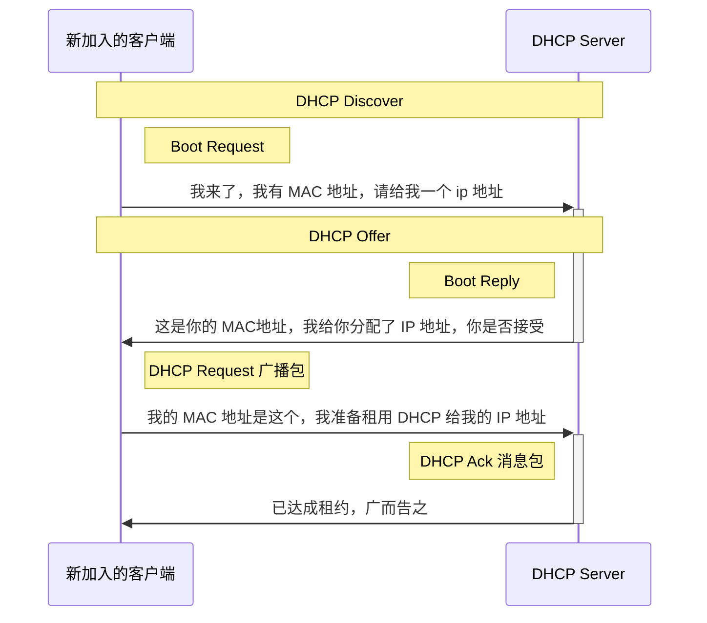
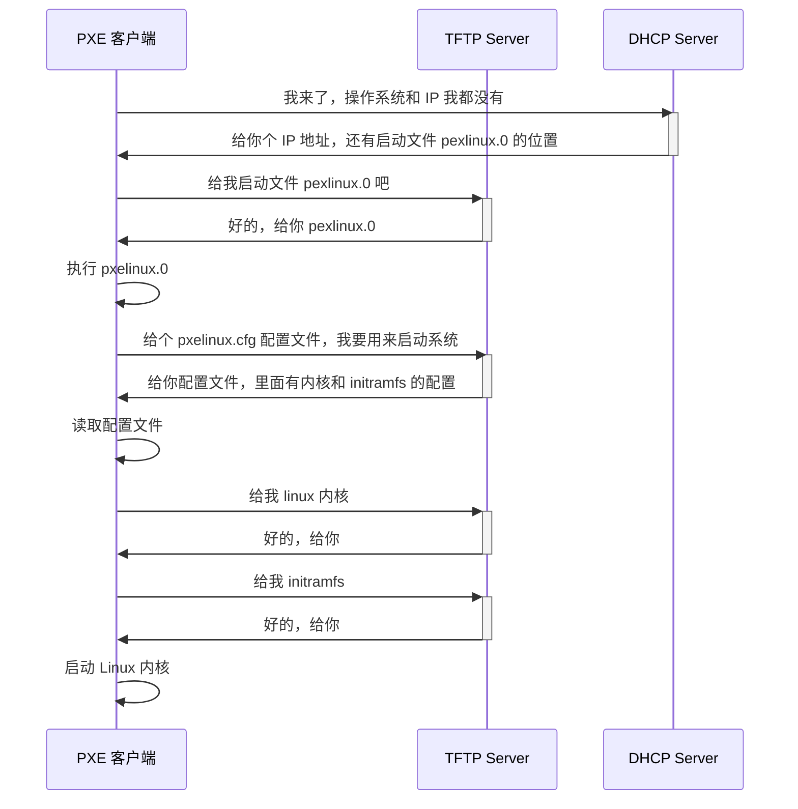

## 协议三要素

### 语法

**一段内容所需要符合的格式和规则：例如括号需要闭合，结束要使用分号;**

### 语义

**一段内容要代表具体的意义：数字减去数字是有意义的，数字减去字符是没有意义的;**

### 顺序

**按照顺序执行指令：数字先加上数值，再乘以某个数值。**

### 命令行查看返回内容

执行一段命令，查看百度的返回内容（why 百度，因为百度的返回相对比较简单
* `curl -v https://www.baidu.com`

```shell
* Trying 36.152.44.95:443...
* Connected to www.baidu.com (36.152.44.95) port 443 (#0)
* ALPN: offers h2
* ALPN: offers http/1.1
*  CAfile: /etc/ssl/cert.pem
*  CApath: none
* (304) (OUT), TLS handshake, Client hello (1):
* (304) (IN), TLS handshake, Server hello (2):
* TLSv1.2 (IN), TLS handshake, Certificate (11):
* TLSv1.2 (IN), TLS handshake, Server key exchange (12):
* TLSv1.2 (IN), TLS handshake, Server finished (14):
* TLSv1.2 (OUT), TLS handshake, Client key exchange (16):
* TLSv1.2 (OUT), TLS change cipher, Change cipher spec (1):
* TLSv1.2 (OUT), TLS handshake, Finished (20):
* TLSv1.2 (IN), TLS change cipher, Change cipher spec (1):
* TLSv1.2 (IN), TLS handshake, Finished (20):
* SSL connection using TLSv1.2 / ECDHE-RSA-AES128-GCM-SHA256
* ALPN: server accepted http/1.1
* Server certificate:
*  subject: C=CN; ST=beijing; L=beijing; OU=service operation department; O=Beijing Baidu Netcom Science Technology Co., Ltd; CN=baidu.com
*  start date: Jul  5 05:16:02 2022 GMT
*  expire date: Aug  6 05:16:01 2023 GMT
*  subjectAltName: host "www.baidu.com" matched cert's "*.baidu.com"
*  issuer: C=BE; O=GlobalSign nv-sa; CN=GlobalSign RSA OV SSL CA 2018
*  SSL certificate verify ok.
> GET / HTTP/1.1
> Host: www.baidu.com
> User-Agent: curl/7.86.0
> Accept: */*
>
* Mark bundle as not supporting multiuse
< HTTP/1.1 200 OK
< Accept-Ranges: bytes
< Cache-Control: private, no-cache, no-store, proxy-revalidate, no-transform
< Connection: keep-alive
< Content-Length: 2443
< Content-Type: text/html
< Date: Wed, 08 Feb 2023 14:43:24 GMT
< Etag: "5886041d-98b"
< Last-Modified: Mon, 23 Jan 2017 13:24:45 GMT
< Pragma: no-cache
< Server: bfe/1.0.8.18
< Set-Cookie: BDORZ=27315; max-age=86400; domain=.baidu.com; path=/
<
<!DOCTYPE html>
<!--STATUS OK--><html> <head><meta http-equiv=content-type content=text/html;charset=utf-8><meta http-equiv=X-UA-Compatible content=IE=Edge><meta content=always name=referrer><link rel=stylesheet type=text/css href=https://ss1.bdstatic.com/5eN1bjq8AAUYm2zgoY3K/r/www/cache/bdorz/baidu.min.css><title>百度一下，你就知道</title></head> <body link=#0000cc> <div id=wrapper> <div id=head> <div class=head_wrapper> <div class=s_form> <div class=s_form_wrapper> <div id=lg>  </div> <form id=form name=f action=//www.baidu.com/s class=fm> <input type=hidden name=bdorz_come value=1> <input type=hidden name=ie value=utf-8> <input type=hidden name=f value=8> <input type=hidden name=rsv_bp value=1> <input type=hidden name=rsv_idx value=1> <input type=hidden name=tn value=baidu><span class="bg s_ipt_wr"><input id=kw name=wd class=s_ipt value maxlength=255 autocomplete=off autofocus=autofocus></span><span class="bg s_btn_wr"><input type=submit id=su value=百度一下 class="bg s_btn" autofocus></span> </form> </div> </div> <div id=u1> <a href=http://news.baidu.com name=tj_trnews class=mnav>新闻</a> <a href=https://www.hao123.com name=tj_trhao123 class=mnav>hao123</a> <a href=http://map.baidu.com name=tj_trmap class=mnav>地图</a> <a href=http://v.baidu.com name=tj_trvideo class=mnav>视频</a> <a href=http://tieba.baidu.com name=tj_trtieba class=mnav>贴吧</a> <noscript> <a href=http://www.baidu.com/bdorz/login.gif?login&amp;tpl=mn&amp;u=http%3A%2F%2Fwww.baidu.com%2f%3fbdorz_come%3d1 name=tj_login class=lb>登录</a> </noscript> <script>document.write('<a href="http://www.baidu.com/bdorz/login.gif?login&tpl=mn&u='+ encodeURIComponent(window.location.href+ (window.location.search === "" ? "?" : "&")+ "bdorz_come=1")+ '" name="tj_login" class="lb">登录</a>');
                </script> <a href=//www.baidu.com/more/ name=tj_briicon class=bri style="display: block;">更多产品</a> </div> </div> </div> <div id=ftCon> <div id=ftConw> <p id=lh> <a href=http://home.baidu.com>关于百度</a> <a href=http://ir.baidu.com>About Baidu</a> </p> <p id=cp>&copy;2017&nbsp;Baidu&nbsp;<a href=http://www.baidu.com/duty/>使用百度前必读</a>&nbsp; <a href=http://jianyi.baidu.com/ class=cp-feedback>意见反馈</a>&nbsp;京ICP证030173号&nbsp;  </p> </div> </div> </div> </body> </html>
* Connection #0 to host www.baidu.com left intact
```

这里我们需要关注的是 200 之后的部分，也就是状态码之后的内容。共有三个方面：
1. 状态码之后，是响应头参数，响应体内容（HTML），这样的格式符合上面所说的符合语法。
2. 状态码 200 表示请求成功返回，也就是符合语义。
3. 上面的所有内容是按顺序展示的，最前面的部分表示了请求执行的顺序，以及请求后所得到的响应。

> [网络协议-极客时间](https://time.geekbang.org/column/article/8975)

## 网络分层

### 网络为什么要分层

* 因为复杂的程序都需要分层，这是程序设计的要求。每一层专注于做自己分内的事，将复杂度解耦。

### 网络如何分层

#### TCP/IP 网络模型

| 网络分层 | 对应内容                         |
| -------- | -------------------------------- |
| 应用层   | HTTP、FTP、DNS、RPC、DHCP、HTTPS |
| 传输层   | UDP、TCP                        |
| 网络层   | IP、ARP                          |
| 链路层   | MAC                              |
| 物理层   | 网络跳线                         |

* *有时把链路层和物理层统称为网络接口层。*

#### OSI 网络模型

* **按 OSI 七层级划分的话，在应用层下面有表现层和会话层。** [参考](https://developer.aliyun.com/article/47151)

| 网络分层 | 对应内容                         |
| -------- | -------------------------------- |
| 应用层   | FTP、DHCP、POP3、SMTP |
| 表现层   |         转换、压缩、和加密 SSL               |
| 会话层   | |
| 传输层   |         TCP、UDP                      |
| 网络层   | 路由器                       |
| 数据链路层   | 交换机                     |
| 物理层         |                                  网卡、集线器|

#### 分层举例

| 协议          | 举例内容                                                                |
| ------------- | ----------------------------------------------------------------------- |
| MAC 头        | 客户端电脑 MAC: 192.168.1.101 的 MAC<br/>网关的 MAC: 192.168.1.1 的 MAC |
| IP 头         | 客户端电脑 IP: 192.168.1.101 <br/> 电商服务器 IP: 106.114.138.24        |
| TCP 头        | 浏览器端口: 12345 <br/> 电商应用端口: 443                               |
| HTTP 头       | POST, URL, HTTP 1.1 <br/> 正文格式: json 正文长度 1234                  |
| 请求体/响应体 | 我要买什么，买多少                                                      |


#### 网络的执行过程


### TCP/IP 网络模型

所谓某层设备，就是设备上跑的程序不同。例如二层设备解析的是 mac 头，三层设备解析的是 mac 头 和 ip 头。
每层设备会摘下并解析对应的包头，并做出相应的行为，包括**丢弃、转发、或留下**等。
* 二层设备摘下并解析 mac 头；
* 三层设备摘下并解析 ip 头；
* 四层设备摘下并解析 tcp 头；

最终在四层头里，会有一个端口号，系统中的应用会监听不同的端口号，如果发现浏览器应用正在监听这个端口，那么就把这个网络包交给浏览器处理。
到这里网络层面的事就结束了。
浏览器接收到网络包以后，执行解析 html 页面或者其他操作。
**只要是在网络上跑的包，都是完整的。包可以有下层没有上层，不可能有上层没下层。**
* 包之间是层层依赖的，上层依赖下层。
* 对于 tcp 协议来说，只要发送出去的包，一定是带有 mac 层和 ip 层的，否则无法发送。

## ifconfig 命令

* 可以在 mac 下运行 `ifconfig`，查看网络信息

```shell
en0: flags=8863<UP,BROADCAST,SMART,RUNNING,SIMPLEX,MULTICAST> mtu 1500
	options=6463<RXCSUM,TXCSUM,TSO4,TSO6,CHANNEL_IO,PARTIAL_CSUM,ZEROINVERT_CSUM>
	ether 90:9c:4a:b6:30:47
	inet6 fe80::10a5:8bee:24d4:d5d7%en0 prefixlen 64 secured scopeid 0x6
	inet 192.168.0.104 netmask 0xffffff00 broadcast 192.168.0.255
	inet6 fd77:f3f0:fc39:48de:14ae:c888:f4d4:846d prefixlen 64 autoconf secured
	nd6 options=201<PERFORMNUD,DAD>
	media: autoselect
	status: active
```

* 也可以使用 `iproute` 查看，这是在 linux 上的命令，对应在 mac 下可以使用 `iproute2mac`.
* mac 上需要手动安装 `brew install iproute2mac`.
* 安装后运行 `ip addr` 查看网络信息。这是本机的实际输出（几乎）。

```shell
en0: flags=8863<UP,BROADCAST,SMART,RUNNING,SIMPLEX,MULTICAST> mtu 1500
	ether 90:9c:4a:b6:30:47
	inet6 fe80::804:ad5:7bf1:9b51/64 secured scopeid 0x6
	inet 192.168.0.105/24 brd 192.168.0.255 en0
	inet6 fd77:f3f0:fc39:48de:149e:c888:f4d4:846d/64 autoconf secured
```

* 这是教学中提供的输出，和自己跑的略有不同。

```shell
root@test:~# ip addr
1: lo: <LOOPBACK,UP,LOWER_UP> mtu 65536 qdisc noqueue state UNKNOWN group default 
    link/loopback 00:00:00:00:00:00 brd 00:00:00:00:00:00
    inet 127.0.0.1/8 scope host lo
       valid_lft forever preferred_lft forever
    inet6 ::1/128 scope host 
       valid_lft forever preferred_lft forever
2: eth0: <BROADCAST,MULTICAST,UP,LOWER_UP> mtu 1500 qdisc pfifo_fast state UP group default qlen 1000
    link/ether fa:16:3e:c7:79:75 brd ff:ff:ff:ff:ff:ff
    inet 10.100.122.2/24 brd 10.100.122.255 scope global eth0
       valid_lft forever preferred_lft forever
    inet6 fe80::f816:3eff:fec7:7975/64 scope link 
       valid_lft forever preferred_lft forever
```

* 后续的内容可以看作是对上面输出信息的理解分析。主要是针对教学中的进行分析，再结合实际的输出来帮助理解。

### 理解 IP 地址

早期的 IP 地址，例如 `10.100.122.2`，分成四个部分，每个部分  8  个 bit，所以一共是 32 位。这样的数量在现代是完全不够用的，因为当初设计时没有考虑到会有这么多设备接入网络。
结合更新的背景，现在设计出了 IPv6，也就是上面自己尝试的输出结果中的 **`fd77:f3f0:fc39:48de:149e:c888:f4d4:846d/64`** 这种。共有 128 位（`16 * 8`），目前是够用的，但以后的事无法预料。

**早期的 32 位地址，被分成了以下五类，如图所示。**


#### 私有 ip 公有 ip

对于 A 类、B类、和 C 类地址，前面的是网络号，后面的是主机号，下面的表格显示了各类 IP 所能容纳的最大主机数量。

| 类别 | ip 地址范围 | 最大主机数 | 私有 ip 地址范围 |
| ---- | ---------- | ---------- | ------------ |
| A    | 0.0.0.0 - 127.255.255.255           |    16777214        |     10.0.0.0 - 10.255.255.255         |
| B    | 128.0.0.0 - 191.255.255.255           |       65534     | 172.16.0.0 - 172.31.255.255             |
| C    | 192.0.0.0 - 253.255.255.255            |         256   |       192.168.0.0 - 192.168.255.255       |

* A类：前 8bit 值范围是 00000000~01111111 所以最大值是 127
* B类：前 8bit 值范围是 10000000 ~10111111 所以十进制是 128~191
* C类：前 8bit 值范围是 11000000 ~11011111 所以十进制是 192~223
* *主要是针对前 8 位作区分*
* 五类地址中，D 类是组播地址，使用这类地址，属于这个组的机器都能收到消息。

#### IP 地址的标识

```shell
1: lo: <LOOPBACK,UP,LOWER_UP> mtu 65536 qdisc noqueue state UNKNOWN group default 
    link/loopback 00:00:00:00:00:00 brd 00:00:00:00:00:00
    inet 127.0.0.1/8 scope host lo
2: eth0: <BROADCAST,MULTICAST,UP,LOWER_UP> mtu 1500 qdisc pfifo_fast state UP group default qlen 1000
    inet 10.100.122.2/24 brd 10.100.122.255 scope global eth0
```

在上面的 IP 地址 `10.100.122.2` 后面，有一些配置项。
* `scope` 的意思是对于 *eth0* 这张网卡，设置的是 global, 说明这张网卡是可以对外的，可以接收来自各个地方的包；
* 对于 *lo* 网卡，设置是 host，说明这张网卡仅仅可以供本机相互通信。

lo 全称是 loopback，也叫环回接口，通常会被分配到 `127.0.0.1` 这个地址，这个地址用于本机通信，经过内核处理后直接返回，不会在任何网络中出现。

#### [子网掩码](https://www.wikiwand.com/zh/%E5%AD%90%E7%BD%91)

**子网掩码(subnet mask)** 是一种用来指明一个 IP 地址的**哪些位标识的是主机所在的子网**，以及**哪些位标识的是主机的位掩码**。子网掩码不能单独存在，它必须结合 IP 地址一起使用。
* **子网掩码只有一个作用，就是将某个 IP 地址划分成网络地址和主机地址两部分。**

子网掩码是在 IPv4 地址资源紧缺的背景下，为了解决 lP 地址分配而产生的虚拟lP技术，通过子网掩码将 A、B、C 三类地址划分为若干子网，从而显著提高 IP 地址的分配效率，有效解决了IP地址资源紧张的局面。

### CIDR(无类型域间选路)

**CIDR 把 32 位的 ip 地址分为两部分，==前面的是网络号，后面的是主机号==。**
* 广播地址的最后一位是 255 的。
* **将子网掩码和 IP 地址按位计算 AND，就可得到网络号。**

#### 常见 IP

常见的 IP 地址有  `192.168.0.1/24`，表示前面 24 位是网络号，后面 8 位是主机号。主机号只有 8 位，也就是 2 的 8 次方，共 256 位。这种情况下，很容易就可以判断出第一个地址是 `192.168.0.1`，广播地址是  `192.168.0.255`，子网掩码是 `255.255.255.0`, 现在通常会用 16 进制表示 `0xffffff00`。
* 可以对应到上面输出的 **`inet 192.168.0.104 netmask 0xffffff00 broadcast 192.168.0.255`**.
* `192.168.0.x` 是最常用的私有 ip 地址。在同一个 wifi 下，家用设备通常不会超过 256 个，所以比较常见的是 `/24`。另外比较常见的是 `/16`.

#### 具体案例

下面我们来看一个不常见的示例：
* 计算 `16.158.165.51/22` 这个 CIDR。求这个网络的第一个地址、子网掩码和广播地址。
* 首先把对应的地址转换成**二进制**, 22 位对应到第三个数字 165.
	* `(165).toString(2); // 10100101`
	* 得到 **`16.158.<10100101>.51`**
	* 按照 22 位计算，这里的前 6 位属于网络号：`16.158.<101001>` 是网络号，`<01>.51` 是机器号。
	* 那么第一个地址就是 `16.158.<101001><00>.1` 也即 **`16.158.164.1`**.
	* 子网掩码是 `255.255.<111111><00>.0`, 也即 **`255.255.252.0`**.
	* 广播地址是 `16.158.<101001><11>.255`, 也即 **`16.158.167.255`**.

另外的解释（另一种分析方式）：
* 这里的最后十位（主机位）都是 0 就是网络地址：前面 2 位（去掉 6 位），后面 8 位如下
	* `16.158.<10100100>.<00000000>`，也就是 `16.158.164.0`.
		* 第一个地址就是 `16.158.164.1`.
* 子网掩码就是对应位数
	* `<11111111>.<11111111>.<11111100>.<0000000>` 也就是 `255.255.252.0`
* 广播地址就是十位主机位全部置 1
	* `16.158.<10100111>.<111111111>` 也就是 `16.158.167.255`.

#### 实操

分析 **`31.225.3.137/19`** 这个 IP 地址的第一个地址、子网掩码和广播地址.
* 首先转二进制：`31.225.<00000011>.137`.
* 取前 3 位，`31.225.<000>` 是网络号. `<00011>.137` 是机器号。
* `31.225.<00000000>.<00000000>` 是网络地址，`31.225.0.0`.
	* `31.225.0.1 是第一个地址`。
* 子网掩码把对应位数按位计算：
	* `<11111111>.<11111111>.<11100000>.<00000000>` 也就是 `255.255.224.0`
* 广播地址是把所有主机位的值置为 1
	* `31.225.<00011111>.<11111111>` 也就是 **`31.225.31.225`.**

### Mac 地址

在 IP 地址的上一行是 `link/ether fa:16:3e:c7:79:75 brd ff:ff:ff:ff:ff:ff`，这个被称为 MAC 地址，是一个**网卡的物理地址，用十六进制，6 个 byte 表示**。
Mac 地址是全局唯一的，类似身份证号，但不能用来直接通信，因为 Mac 地址定位能力弱，需要依赖 IP 来进行定位。
* Mac 只能在局域网内进行通信，跨子网就需要使用到 IP。
	* Mac 可以从 `192.168.0.3/24` 访问到 `192.168.0.8/24`.
	* 但不能从 `192.168.0.3/24` 访问到 `192.168.1.3/24`.
* Mac 地址和 IP 地址工作在不同的层次上, IP 地址用于确定子网, Mac用于子网中定位到主机。
* MAC 地址可以用来定位，但范围比较有限，因为它是物理层面的。
	* 例如，一个网卡在笔记本电脑中，网卡本身是唯一的，它可以通过查询出厂信息或销售信息得到笔记本的生产地址或销售地址，但笔记本售出后，是随着使用者移动的，也就基本失去了定位的功能。
* MAC 地址的唯一性，是为了组网的时候，任意网卡放在同一个网络里，可以不用担心冲突。从硬件角度，保证不同的网卡有不同标识。

### 网络设备的状态标识

```shell
2: eth0: <BROADCAST,MULTICAST,UP,LOWER_UP> mtu 1500 qdisc pfifo_fast state UP group default qlen 1000
```

`<BROADCAST,MULTICAST,UP,LOWER_UP>`  是 `net_device flags`，网络设备的标识。
* `UP` 表示设备处于启动的状态；
* `BROADCAST` 表示这个网卡有广播地址，可以发送广播包；
* `MULTICAST` 表示这个网卡可以发送多播包；
* `LOWER_UP` 表示 L1 处于启动中，网线是插着的；

#### MTU

`mtu 1500` 表示最大传输单元 MTU 是 1500，这是以太网的默认值。
MTU 是二层也就是 Mac 层的概念，是属于 MAC 层的定义。Mac 层有 MAC 头，以太网规定正文部分不可以超过 1500 个字节。正文里有 `IP`、`TCP`、 `HTTP` 的头，如果放不下，就需要分片传输。
* MTU 不含 MAC 头尾的正文长度，为 1500 个 Byte：
	* MTU 为 1500 个 Byte，前面有 6 个 Byte 的目标 MAC 地址，6 个 Byte 的源 MAC 地址，2 个 Byte 的类型，后面有 4 个 Byte 的 CRC 校验，加起来共 1518 个 Byte。 放不下，就分片多个包发送。详细的演示图可以参见 [[lib/底层网络知识之从二层到三层/index#MAC 地址构成]]
* **MTU=MSS(Maximum Segment Size)+ TCP 头长度 + IP 头长度。**

#### qdisc

**`qdisc pfifo_fast`** 设置的是排队规则。`qdisc` 全称是 **queueing discipline**，也就是排队规则。内核如果需要通过某个网络接口发送数据包，都需要按照这个接口配置的 qdist 的值把数据包加入队列。
`qdisc` 常见的简单值是 `pfifo`，也就是对进入的数据包不做任何处理。数据包采用先入先出的方式通过队列。
`pfifo_fast` 则相对复杂一些，它的队列包括三个波段 (band) 。在每个波段里，使用先进先出的规则。
* 三个波段（band）的优先级也不相同：
	* band 0 的优先级最高，band 2 的最低；
	* 如果 band 0 里面有数据包，系统就不会处理 band 1 里面的数据包，band 1 和 band 2 之间也是一样。
* 数据包是按照服务类型（`Type of Service`，TOS）被分配到三个波段（band）里面的。TOS 是 IP 头里面的一个字段，代表了当前的数据包是**高优先级**还是**低优先级**的。

## DHCP 与 PXE

### 如何正确配置  IP 地址

**正确配置 IP 地址，配置的内容包括 CIDR、子网掩码、广播地址和网关地址。**

#### 手动配置 IP 地址的方式

在 linux 上有两种方式可以手动配置 IP 地址，通过 `ifconfig` 配置或者通过 `ip addr` 配置。
设置好之后，再用命令把网卡 up 一下，就可以开始工作了。

* 使用  `net-tools`
```shell
$ sudo ifconfig eth1 10.0.0.1/24
$ sudo ifconfig eth1 up
```

* 使用 `iproute2`
```
$ sudo ip addr add 10.0.0.1/24 dev eth1
$ sudo ip link set up eth1
```

#### 跨网段的配置

Linux 默认的逻辑是，如果这是一个跨网段的调用，它便不会直接将包发送到网络上，而是企图将包发送到网关。这和机器的物理地址通常没有关系。
* **在跨网段的调用中，获取目标 ip 的 MAC 地址，需要从源 ip 网关获取所在网关 MAC 地址，然后替换成目标 IP 所在网段的网关的 MAC 地址，最后是目标的 MAC 地址。**
	* 如果没有网关配置，包是发不出去的。
	* 如果网关配置成和当前网络不是一个网段的，那么系统是不会配置成功的。

实际配置的时候，通常不会用命令直接配置，而是会使用配置文件进行配置。
* 不同系统的配置文件的格式不同，但都是包括 CIDR、子网掩码、广播地址和网关地址。

### DHCP(Dynamic Host Configuration Protocol)

#### 为什么会有 DHCP

因为接入网络的客户端是可能移动的，并非一成不变，而同一网段里的网络地址也是有限的，不可能一个客户端配置 ip 后，就一直占据这个地址。如果这个客户端离开网络或者有新的客户端进来（办公人员带着电脑离开或有人入职），固定的手动配置显然不能满足需求。
而且手动进行配置当然是非常繁琐的。

所以就有了**动态主机配置协议(DHCP)**。这个协议可以做到类似房屋租赁的效果。

如果是数据中心里的服务器地址，一般不会搬迁或移动，可以使用手动配置的方式。配置后一直保持不变。

#### DHCP 的工作方式（新机器加入网络的流程）

* 新的机器加入网络后，会使用 ip 地址 `0.0.0.0` 发送一个广播包，目标地址是 `255.255.255.255`
* 广播包封装了 udp，udp 封装了 bootp 协议。

##### DHCP discover
| 各种头   | 流程(**DHCP discover**)                                            |
| -------- | ----------------------------------------------- |
| MAC 头   | 新人 MAC<br/>广播 MAC 地址(ff:ff:ff:ff:ff:ff)          |
| IP 头    | 新人的 IP 0.0.0.0 <br/>广播 IP(255.255.255.255) |
| UDP 头   | 源端口 68 <br/>目标端口 67                      |
| BOOTP 头 | Boot Request                                    |
| /        | 我的 MAC 地址是这个，我需要 IP 地址             |

* 如果网络中配置 了 DHCP Server，它会做出响应。
* 做出响应的过程，也就是租给新机器一个 IP 地址。

##### DHCP Offer
| 各种头   | 流程(**DHCP Offer**)                                                       |
| -------- | ---------------------------------------------------------- |
| MAC 头   | DHCP Server 的 MAC<br/>广播 MAC(ff:ff:ff:ff:ff:ff)         |
| IP 头    | DHCP Server的 IP 192.168.1.2 <br/>广播 IP(255.255.255.255) |
| UDP 头   | 源端口 67 <br/>目标端口 68                                 |
| BOOTP 头 | Boot Reply                                                 |
| /        | 这是你的 MAC 地址，我分配了这个 IP 租给你，你觉得如何？    |

* DHCP 也是使用广播地址作为回应，因为新加入的机器并没有 IP 地址。
* 而发送的信息除了 IP 地址，还有子网掩码、网关、IP 地址租用期等。

| 各种头   | 流程                                                           |
| -------- | -------------------------------------------------------------- |
| MAC 头   | 新人 MAC<br/>广播 MAC 地址(ff:ff:ff:ff:ff:ff)                  |
| IP 头    | 新人的 IP 0.0.0.0 <br/>广播 IP(255.255.255.255)                |
| UDP 头   | 源端口 68 <br/>目标端口 67                                     |
| BOOTP 头 | Boot Request                                                   |
| /        | 我的 MAC 地址是这个，我准备租用 DHCP Server 分配给我的 IP 地址 |

* 客户端在 BOOT P里，接受某个 DHCP 分配的 IP，通常是最先到达的包。
* 因为没有得到  DHCP Server 的确认，客户端仍然使用 `0.0.0.0` 的地址广播到 `255.255.255.255` 进行回复。
	* 客户端的回复是 DHCP Request 广播包，广播数据包中包含客户端的 MAC地址，接受租约中的 IP 地址、提供此租约的 DHCP 服务器地址等，并告诉所有的 DHCP 它将接受哪一个 DHCP 服务器提供的 IP 地址，让他们其他的撤销提供的 IP 地址。以便提供给下一个 IP 租用者。

| 各种头   | 流程                                                       |
| -------- | ---------------------------------------------------------- |
| MAC 头   | DHCP Server 的 MAC<br/>广播 MAC(ff:ff:ff:ff:ff:ff)         |
| IP 头    | DHCP Server的 IP 192.168.1.2 <br/>广播 IP(255.255.255.255) |
| UDP 头   | 源端口 67 <br/>目标端口 68                                 |
| BOOTP 头 | Boot Reply                                                 |
| /        | DHCP Ack <br/>这个新人的 IP 是在 DHCP Server 这里租的，这是租约    |

* DHCP Server 接收到客户端的 DHCP Request 后，会返回给客户端一个 DHCP Ack 消息包，表明已经接受客户端的选择，并且会把这个 IP 地址的合法租用信息和其他的配置信息都放入这个广播包。

#### DHCP 时序图



#### IP 地址的续租和收回

DHCP 提供地址的方式也是有租期的。
* 客户端会在租期过去 50% 的时候，客户机会发送 DHCP Request 消息包给提供它地址的 DHCP Server。
* DHCP server 则会回应 DHCP Ack 消息包，在这个消息包里，会包括新的租期和 TCP/IP 等配置参数，客户机会在收到之后更新自己的配置。
* 这样就完成了租期的更新。

### PXE（预启动执行环境）

#### PXE 的诞生背景

通常的笔记本需求，没有需要安装操作系统这种需求，一般出厂时系统已经自带。但在数据中心里，管理员可能面对的是几百甚至更多空的机器，需要给这些机器一起安装操作系统，就要有更好的解决方案。也就是在自动安装 IP 之后，能否更进一步，再自动安装系统。

安装操作系统，一般需要光盘。所以可以把原本在光盘里要安装的操作系统，放在一个服务器上，让客户端去下载，但问题是客户端并不知道去哪里下载这个操作系统，而且客户端本身也需要一个操作系统才能运行。这里可以使用 BIOS 这个小型操作系统来完成。

安装操作系统的过程，会在 BIOS 启动之后，BIOS 系统只做一件事，就是读取硬盘的 MBR(Master Boot Record) 启动扇区，把 GRUB 启动，GRUB 会加载内核、加载作为根文件系统的 initramfs 文件；再把执行交给内核，内核启动，初始化整个操作系统。

#### 什么是 PXE 

所以安装操作系统的过程，是在 BIOS 启动之后。于是这个过程就叫**预启动执行环境(Pre-boot Execution Environment)**. 也可以理解为使用网络原理进行安装操作系统。
* PXE 协议分为客户端和服务端，由于没有操作系统，只能把客户端放在 BIOS 里，也就是计算机的网卡中包含 PXE 客户端。当计算机启动时，BIOS 把 PXE 客户端调入内存，就可以连接到服务端做一些操作。
* PXE 本身也需要一个 IP 地址，因为它启动客户端之后，可以发送一个 DHCP 的请求，让 DHCP Server 给它分配一个地址。但实际上 PXE 客户端启动的时候，没有自己的地址？
* DHCP Server 在分配 IP 地址外，还可以做其他事情。参照下面的配置：

```shell
ddns-update-style interim;
ignore client-updates;
allow booting;
allow bootp;
subnet 192.168.1.0 netmask 255.255.255.0
{
	option routers 192.168.1.1;
	option subnet-mask 255.255.255.0;
	option time-offset -18000;
	default-lease-time 21600;
	max-lease-time 43200;
	range dynamic-bootp 192.168.1.240 192.168.1.250;
	filename "pxelinux.0";
	next-server 192.168.1.180;
}
```

* 上述代码配置了 DHCP Server，包括 IP 地址段，子网掩码，网关地址、租期等。
* 而如果**要使用 PXE，则需要配置 `next-server`，指向 PXE 服务器的地址，还要配置初始启动文件 `filename`.**
	* 配置之后，PXE 客户端启动后发送 DHCP，不仅可以得到一个 IP 地址，还能知道 PXE 服务器在哪，也知道如何从 PXE 服务器上下载某个文件，去初始化操作系统。

#### 解析 PXE 的工作流程

PXE 的工作流程如下：
* 启动 PXE 客户端，通过 DHCP 协议告诉 DHCP Server；
* DHCP Server 会租给它一个 IP 地址，以及 PXE 服务器的地址、启动文件 pxelinux.0；
* PXE 客户端知道去哪下载之后，就会进行下载，下载是通过 TFTP（trivial file transfer protocol）协议，所以 PXE 服务器上通常还会有一个 TFTP 服务器，不过这个 TFTP 服务器一般都很小很轻量；
* PXE 客户端找 TFTP 服务器下载文件，下载后就执行文件内容；
* 文件会指示 PXE 客户端，向 TFTP 服务器请求计算机的配置信息 pxelinux.cfg，里面有 Linux 内核的位置，initramfs 的位置；
* 启动 Linux 内核，后续安装就顺理成章了。

#### 图解 PXE 的工作流程



#### PXE 的应用

PXE 的应用主要在云计算领域。